# Sapphire Mall - Web3 虚拟商品交易平台

<div align="center">


**🌐 多语言支持 | [English](README_EN.md) | [中文](README.md)**

[](https://web3js.org/)
[](https://docs.arc.io/)
[](LICENSE)
[](https://github.com/your-username/sapmall)

</div>

---

## 📋 项目概述

**Sapphire Mall** 是一个去中心化社区自驱动的虚拟商品交易平台。平台基于区块链技术构建，以社区治理为核心，通过 DAO 机制组织决策；采用 **ERC-20 代币 SAP** 作为生态通证，结合社区任务与治理激励，形成可审计、可参与的 Web3 虚拟商品交易与共治叙事。

**以 [Arc](https://docs.arc.io/) 为核心的稳定币支付**：商城结账深度集成 **Arc Testnet**，支持 **USDC、EURC、cirBTC** 等多种稳定币与链上资产支付；商品标价统一 **USDC 计价**，链上按所选代币实时换算并划转。依托 Arc **近秒级确认与低 Gas**，用户可在单链完成「选品—授权—支付—确认」全流程，同时保留 **SAP** 生态代币支付与手续费减免策略。

**基于 Arc 的跨链支付**：在 Arc 结算层统一承接多来源资产——用户可选用美元稳定币（**USDC**）、欧元稳定币（**EURC**）、比特币映射资产（**cirBTC**）等跨链流入资产完成结账，无需在多条链之间手动桥接后再支付。后端 **PaymentRouter** 与 **SettlementVault** 统一路由支付 intent 与资金流，订单状态与链上 `PaymentPaid` 事件对齐，降低多资产用户的支付与对账成本。

平台 **[深度集成 Bags](https://bags.fm/)（Solana）**，依托其 **项目 launch、Launch Intent 转化链路与开放 API / SDK**，使 **活动、营销与治理协作** 与 **主支付链路** **职权分离**：链上活动 **上线快、易传播**，主站 **Arc 稳定币订单与 SAP 经济** 保持稳定边界。活动规则以官方披露为准。

**入口约定**：DApp 内 **所有活动、奖励及 Bags 相关说明与外链** 统一在 **`/rewards`（`rewards` 模块，顶栏「生态活动」）** 聚合；**`/marketplace` 商城** 仅承载 **选品与下单**，**不作为** 活动/奖励主入口（与 `docs/Bags_Activity_Marketing_PRD.md` 一致）。

**钱包与活动（用户成本）**：**只逛商城、下单与使用 SAP 主链路**的用户 **仅需 EVM 钱包**。**参与 Bags 生态活动**时，链上环节在 **Bags（Solana）** 完成，用户需在 Bags 页面 **连接 Solana 钱包并按提示授权**（无法用顶栏 EVM 登录替代）；**不参与活动则不受影响**，也 **不要求**人人持有双钱包。自愿 **EVM ↔ Solana 绑定**（二期）仅用于站内权益与画像，详见 PRD **§3.2**。

**Bags 开发者资源**：[文档](https://docs.bags.fm/) · [开发者门户](https://dev.bags.fm/login) · [TypeScript SDK（npm）](https://www.npmjs.com/package/@bagsfm/bags-sdk)

### 🌟 核心特色

- **⚡ Arc 深度集成**: DApp、PaymentRouter、链网络与 **Arc Testnet** 原生对接；**近秒级**链上确认、统一 intent 与结算 Vault，支付路径链上可审计、订单状态与事件同步
- **💵 多稳定币支付**: Arc 上支持 **USDC / EURC / cirBTC** 及 **SAP** 等多币种结账，商城 **USDC 统一标价**，链上按汇率换算实付
- **🌉 Arc 跨链支付**: 欧元、比特币等跨链资产在 **Arc 结算层** 统一完成支付，用户单钱包、单链即可完成多币种结账
- **🏛️ 去中心化治理**: 基于 DAO 的社区决策与参数讨论（主叙事与 SAP 绑定）
- **👥 社区自驱动**: 成员参与审核、仲裁与共建，贡献可激励
- **🎯 虚拟商品专精**: 数字内容、软件工具、在线服务等虚拟商品交易场景
- **💎 贡献激励**: 任务、仲裁、治理等多通道参与与回馈设计
- **💰 收益共享机制**: 平台价值与贡献者、金库与治理目标对齐（详见代币与 PRD 文档）
- **🌍 全球化与多语言**: 中英文界面与文档，面向更广泛用户与开发者
- **🔐 透明链上治理**: 关键决策与分配逻辑链上可审计、链下流程可对照文档


## 🏗️ 项目结构

```
sapmall/
├── 📁 backend_service/               # 后端服务 (Go + go-zero)
├── 📁 web_client/                    # 前端应用
│   ├── 📁 sapmall-admin/             # 管理后台 (React + TypeScript)
│   ├── 📁 sapmall-dapp/              # DApp应用 (React + Web3)
│   └── 📁 sapmall-website/           # 官网 (React)
├── 📁 env/                           # 环境配置 一键启停脚本
│   └── 📁 dev/                       # 开发环境Docker配置
├── 📁 design/                        # 设计文件
│   ├── 📁 prototypes/                # 原型设计
│   └── 📁 specs/                     # 设计规范
├── 📁 docs/                          # 项目文档
│   ├── 📄 PRD.md                     # 产品需求文档
│   ├── 📄 White_Paper.md             # 技术白皮书
│   ├── 📄 Tokenomics_Detailed.md     # 代币经济模型
│   ├── 📄 Roadmap.md                 # 项目路线图
│   ├── 📄 User_Story_Map.md          # 用户故事地图
│   ├── 📄 Metrics_Framework.md       # 指标框架
│   └── 📄 Bags_Activity_Marketing_PRD.md  # Bags 活动与营销集成（子域 PRD）
├── 📁 promit/                        # AI Agent提示词
├── 📁 pic/                           # 图片资源
├── 📄 docker-compose.yml             # Docker编排文件
├── 📄 generate_favicon.py           # 图标生成工具
└── 📄 README.md                      # 项目说明
```

## 🎨 设计与原型

仓库同时包含 **可运行的 React 前端**（`web_client/`）与 **高保真 HTML 原型**（`design/prototypes/`）：前者为工程主线，后者用于早期交互验证与视觉对齐。

### 🎯 设计特色

- **响应式布局**: 适配桌面与移动端，关键交易路径一屏内可完成主要操作  
- **暗色 Web3 视觉**: 高对比、低眩光，突出资产与状态信息  
- **组件化与可维护性**: React 侧按页面与业务域拆分；原型侧便于快速迭代演示  
- **国际化（i18n）**: DApp 等应用内置中英文文案，与文档双语策略一致  
- **链上状态可读**: 钱包、网络、余额与关键操作反馈清晰，降低误操作成本  
- **Arc 支付动线**: 结算页支持多稳定币选择与 Gas 提示，链上确认状态可追踪  
- **社区讨论与共建**: `/dao` 提供 **提案 / 讨论 / 活动** 三 Tab 聚合；支持话题分类与标签筛选、富文本发帖与回复、侧栏参与统计与「我参与的提案/讨论」快捷入口，连接钱包后可发起讨论与提案，形成可检索的社区议事空间  
- **链上治理闭环**: 提案详情展示投票进度、规则说明与结果；支持发起治理提案、链上/模拟投票交互与委托说明；活动 Tab 承载社区议程与运营事件，治理动线与 SAP 持仓权重叙事一致（详见 `docs/PRD.md` 治理章节）  
- **后台运营灌流**: **sapmall-admin** 承担商品上架、分类与属性配置、商家/KYC 审核、订单与平台看板等运营能力；商家发布并经审核的商品 **灌流至 DApp 商城** 展示，平台侧可配置类目与种子内容，支撑冷启动期的 **货架填充、社区话题与治理内容供给**，避免前台「空城」体验  
### 📱 主要页面与代码入口（按当前仓库结构）

#### `sapmall-dapp`（用户端 DApp · React + Web3）

| 路由 | 功能说明 | 源码路径 |
|------|----------|----------|
| `/marketplace` | 代币化商品商城：分类、筛选、浏览与 **Arc 多稳定币链上结账**（**不含** 活动/奖励主入口） | `web_client/sapmall-dapp/src/pages/marketplace/` |
| `/exchange` | 兑换与资产相关能力展示 | `web_client/sapmall-dapp/src/pages/exchange/` |
| `/rewards` | **生态活动**：活动、奖励、**Bags** 相关说明与外链的 **唯一聚合入口**（顶栏「生态活动」） | `web_client/sapmall-dapp/src/pages/rewards/` |
| `/dao` | 社区参与 / DAO 相关界面 | `web_client/sapmall-dapp/src/pages/dao/` |
| `/help` | 帮助中心 | `web_client/sapmall-dapp/src/pages/help/` |
| `/admin` | 内嵌 **管理后台**（iframe，同源或配置后的 Admin 地址） | `web_client/sapmall-dapp/src/components/AdminIframeEmbedded.tsx` |
| 全局布局 | 顶栏导航、钱包连接、多语言切换 | `web_client/sapmall-dapp/src/pages/header/`、`src/i18n/` |

路由配置见：`web_client/sapmall-dapp/src/layout/ContentLayout.tsx`。活动与 Bags 集成的产品约定见：`docs/Bags_Activity_Marketing_PRD.md`。

#### `sapmall-admin` / `sapmall-website`

| 应用 | 说明 | 路径 |
|------|------|------|
| **sapmall-admin** | 平台与商家侧运营管理（React + TS） | `web_client/sapmall-admin/` |
| **sapmall-website** | 项目官网（React） | `web_client/sapmall-website/` |

#### `design/prototypes`（HTML 原型 · 设计与演示）

| 区域 | 说明 | 代表路径 |
|------|------|----------|
| 官网入口 | 品牌与落地介绍 | `design/prototypes/index.html`、`design/prototypes/homepage.html` |
| DApp 原型套件 | 商城、兑换、DAO、帮助等子页（工程上以 **`/rewards`** 承载活动聚合；原型若有独立活动页可与实现对齐） | `design/prototypes/dapp.html`；子页见 `design/prototypes/dapp/`（如 `marketplace.html`、`exchange.html`、`dao.html`、`help.html`） |
| 管理后台原型 | 仪表盘、订单、用户与商家等大量运营页 | `design/prototypes/admin.html`；子页见 `design/prototypes/admin/` |
| 品牌与图标 | Logo / favicon 矢量 | `design/prototypes/favicon.svg`（与 DApp 内 `src/assets/logo-mark.svg` 同源演进） |

## 🚀 快速开始

### 1. 一键启动开发环境

#### 方式一：完整容器环境（推荐用于生产测试）
```bash
# 进入环境配置目录
cd env/dev

# 一键启动所有服务（支持Docker/Podman）
./start_local_dev_env.sh
```

#### 方式二：本地开发环境（Windows 平台开发调试）

> 以下步骤均在 **Windows 10/11 + PowerShell** 环境中验证通过，适合本地调试与前后端开发。

##### 1. 安装与准备软件
- [Node.js 18 LTS](https://nodejs.org/en/)（安装时勾选 *Automatically install the necessary tools*）
- [Go 1.19+](https://go.dev/dl/)
- [MySQL 8.0 社区版](https://dev.mysql.com/downloads/installer/)
- [Redis for Windows](https://github.com/tporadowski/redis)（或在 WSL/Docker 中运行 Redis）
- [Nginx for Windows](https://nginx.org/en/download.html)（解压到 `C:\nginx`，可选）

##### 2. 配置并启动 MySQL（数据库）
1. 通过 MySQL Installer 安装 **MySQL Server 8.0**，记录 root 密码。
2. 打开 PowerShell，执行：
   ```powershell
   # 进入 MySQL 安装目录（默认路径）
   cd "C:\Program Files\MySQL\MySQL Server 8.0\bin"

   # 登录 MySQL（输入 root 密码）
   .\mysql.exe -u root -p

   -- 创建数据库
   CREATE DATABASE IF NOT EXISTS sapphire_mall CHARACTER SET utf8mb4 COLLATE utf8mb4_unicode_ci;
   EXIT;

   # 导入数据库基础结构
   .\mysql.exe -u root -p sapphire_mall < d:\web3space\sapmall\backend_service\docs\sapphire_mall.sql
   
   # 导入菜单数据（需要先导入基础结构）
   .\mysql.exe -u root -p sapphire_mall < d:\web3space\sapmall\backend_service\docs\sapphire_mall_menu_20250102.sql
   ```
3. 若需远程连接，请在 *MySQL Workbench* 中创建 `sapmall_user` 用户并授予 `sapphire_mall` 所有权限。

##### 3. 启动 Redis（缓存）
1. 解压 Redis 到 `C:\redis`，在 PowerShell 中执行：
   ```powershell
   cd C:\redis
   .\redis-server.exe redis.windows.conf
   ```
2. 新开一个 PowerShell 验证：
   ```powershell
   cd C:\redis
   .\redis-cli.exe ping  # 返回 PONG 即表示成功
   ```

##### 4. （可选）配置 Nginx 统一入口
1. 将仓库中的 `env\dev\nginx\nginx.conf.template` 拷贝到 `C:\nginx\conf\nginx.conf`，并将其中 `${HOST_IP}` 替换为 `127.0.0.1`。
2. 在 PowerShell 中执行：
   ```powershell
   cd C:\nginx
   .\nginx.exe       # 启动
   # 如需停止： .\nginx.exe -s stop
   # 重新加载配置： .\nginx.exe -s reload
   ```
> 启动后即可通过 `http://localhost:7101/7102/7103` 访问各前端与 API。

##### 5. 启动后端服务（Go + go-zero）
1. 在 PowerShell 中执行：
   ```powershell
   cd d:\web3space\sapmall\backend_service\app
   go mod tidy
   ```
2. 根据本地数据库信息修改 `etc\sapmall_dev.yaml` 中的 `DB.DataSource`、`Redis` 配置。
3. 启动后端（建议使用 IDE 端口 8889）：
   ```powershell
   go run sapmall_start.go -f etc/sapmall_dev.yaml --port 8889
   ```
4. 浏览器访问 `http://localhost:8889/swagger-ui/` 验证接口是否可用。

##### 6. 启动前端管理后台（Admin）
```powershell
cd d:\web3space\sapmall\web_client\sapmall-admin
npm install
$env:PORT=3004; npm start   # 管理后台默认端口 3004
```
访问地址：`http://localhost:3004`（或通过 Nginx 的 `http://localhost:7101`）。

##### 7. 启动前端 DApp
```powershell
cd d:\web3space\sapmall\web_client\sapmall-dapp
npm install
$env:PORT=3005; npm start   # DApp 默认端口 3005
```
访问地址：`http://localhost:3005`（或通过 Nginx 的 `http://localhost:7102`）。

##### 8. 推荐启动顺序
1. MySQL → 2. Redis → 3. 后端服务 → 4. Nginx（可选）→ 5. Admin → 6. DApp。

##### 9. 快速排查提示
- **端口占用**：`Get-NetTCPConnection -LocalPort 8889`（PowerShell）
- **API 健康检查**：`Invoke-WebRequest http://localhost:8889/api/common/health`
- **Redis 心跳**：`redis-cli.exe ping`

完成上述步骤后，即可在 Windows 本地完整运行后端、DApp 与管理后台。需要关闭时，依次停止前端进程、后端 `go run` 进程、Redis/ MySQL/ Nginx 服务。
#### 环境要求
- **容器运行时**: Docker 或 Podman
- **Node.js**: 18+ 版本
- **Go**: 1.19+ 版本
- **端口要求**: 确保以下端口未被占用
  - 3004-3006 (前端服务)
  - 8080, 7101-7103 (Nginx代理)
  - 8888-8889 (后端API)
  - 3306 (MySQL), 6379 (Redis), 2379 (etcd)

### 2. 访问服务

#### 统一入口（推荐）
通过Nginx代理访问，支持智能路由和负载均衡：

| 服务 | 访问地址 | 说明 |
|------|----------|------|
| 🏠 **官网首页** | http://localhost:7103 | 项目官网和介绍 |
| 🛒 **DApp应用** | http://localhost:7102 | Web3虚拟商品交易平台 |
| ⚙️ **管理后台** | http://localhost:7101 | 平台管理和数据统计 |
| 🔧 **后端API** | http://localhost:7101/api/ | RESTful API接口 |
| 📚 **API文档** | http://localhost:7101/swagger-ui/ | Swagger API文档 |

#### 直接访问（开发调试）
绕过Nginx代理，直接访问各服务：

| 服务 | 访问地址 | 说明 |
|------|----------|------|
| 🏠 **官网首页** | http://localhost:3006 | React应用 |
| 🛒 **DApp应用** | http://localhost:3005 | React + Web3应用 |
| ⚙️ **管理后台** | http://localhost:3004 | React + TypeScript应用 |
| 🔧 **后端API** | http://localhost:8888/api/ | Go + go-zero API |
| 📚 **API文档** | http://localhost:8888/swagger-ui/ | Swagger UI |

### 3. 智能路由说明

项目采用智能路由设计，支持多种访问方式：

#### 路由优先级
1. **IDE开发实例** (优先) - 支持热重载，适合开发调试
2. **容器实例** (备份) - 生产环境配置，适合测试

#### 路由配置
- **后端服务**: IDE实例(8889) → 容器实例(8888)
- **管理后台**: IDE实例(3004) → 容器实例(3001)
- **DApp应用**: IDE实例(3005) → 容器实例(3002)
- **官网首页**: IDE实例(3006) → 容器实例(3003)

### 4. 管理命令

#### 启动/停止服务
```bash
# 启动完整环境
./start_local_dev_env.sh

# 停止所有服务
./stop_local_dev_env.sh

# 重启服务
./restart_local_dev_env.sh

# 查看服务状态
./status.sh
```

#### 查看日志
```bash
# 查看Nginx代理日志
podman logs -f sapmall-nginx

# 查看后端服务日志
podman logs -f sapmall-backend_service

# 查看MySQL日志
podman logs -f sapmall-mysql

# 查看前端应用日志
podman logs -f sapmall-admin
podman logs -f sapmall-dapp
podman logs -f sapmall-website
```

#### 进入容器调试
```bash
# 进入后端服务容器
podman exec -it sapmall-backend_service bash

# 进入MySQL容器
podman exec -it sapmall-mysql bash

# 进入前端应用容器
podman exec -it sapmall-admin sh
```

### 5. 查看设计原型
   ```bash
# 打开官网首页
   open design/prototypes/index.html

# 打开DApp主界面
open design/prototypes/dapp.html

# 打开管理后台
open design/prototypes/admin.html
```

### 6. 浏览项目文档
- 📋 **产品需求**: [PRD.md](docs/PRD.md) - 详细的产品需求文档
- 📖 **技术白皮书**: [White_Paper.md](docs/White_Paper.md) - 技术架构和创新点
- 💰 **代币经济**: [Tokenomics_Detailed.md](docs/Tokenomics_Detailed.md) - 完整的经济模型
- 🗺️ **项目路线**: [Roadmap.md](docs/Roadmap.md) - 开发计划和里程碑
- 👥 **用户故事**: [User_Story_Map.md](docs/User_Story_Map.md) - 用户场景和需求
- 📊 **指标框架**: [Metrics_Framework.md](docs/Metrics_Framework.md) - 评估体系

## 💰 代币经济模型

### SAP代币基本信息
- **代币标准**: ERC-20
- **代币名称**: Sapphire Mall Token
- **代币符号**: SAP
- **总供应量**: 100,000,000 SAP
- **代币类型**: 功能型代币（Utility Token）


## 🛠️ 技术架构

### 前端技术栈
- **框架**: React 18 + TypeScript
- **状态管理**: Redux Toolkit + RTK Query
- **UI框架**: Tailwind CSS + Headless UI
- **国际化**: react-i18next
- **Web3集成**: Wagmi + Viem + TanStack Query
- **钱包连接**: Web3Modal v3 + ConnectKit

### 智能合约技术
- **开发框架**: Hardhat + TypeScript
- **合约语言**: Solidity 0.8.19+
- **支付合约**: Arc Testnet **PaymentRouter** / **SettlementVault**，支持多代币 intent 与 `PaymentPaid` 事件协议
- **安全工具**: Slither + Mythril + OpenZeppelin
- **升级机制**: OpenZeppelin Upgrades
- **多签管理**: Gnosis Safe

### 后端服务
- **API服务**: Go + go-zero框架 + gRPC
- **数据库**: MySQL 8.0+ + Redis + MongoDB
- **区块链交互**: go-ethereum + 自定义RPC客户端
- **文件存储**: IPFS + Pinata + 阿里云OSS
- **微服务架构**: go-zero微服务 + etcd服务发现

## 🤖 AI 开发最佳实践

本项目积极采用 AI 辅助开发，建立了完整的 AI 开发工作流程和最佳实践体系。

### 🎯 AI Agent 使用指南

#### 中文指南
我们为项目开发配置了专门的 AI Agent，包括：

1. **产品经理 Agent** (`promit/PM_Web3_Agent_Prompt.md`)
   - 专注于 Web3 产品需求分析和产品规划
   - 制定产品路线图和功能优先级
   - 编写详细的产品需求文档（PRD）
   - 设计用户故事和用户旅程

2. **UI/UX 设计师 Agent** (`promit/UIUX_Designer_Web3_Agent_Prompt.md`)
   - 专注于 Web3 界面设计和用户体验
   - 支持多平台原型制作（桌面端、移动端、小程序）
   - 使用 HTML + Tailwind CSS + FontAwesome 技术栈
   - 生成像素级完美的高保真原型

3. **智能合约工程师 Agent** (`promit/Smart_Contract_Engineer_Agent_Prompt.md`)
   - 专注于智能合约开发和安全审计
   - 支持多链开发（Ethereum、Layer2、BSC、Solana等）
   - 遵循最新安全标准和最佳实践
   - 使用 Solidity/Vyper/Rust 等技术栈

4. **前端开发工程师 Agent** (`promit/Web_Client_Web3_Agent_Prompt.md`)
   - 专注于 Web3 前端应用开发
   - 使用 React + TypeScript + Web3 技术栈
   - 实现钱包连接和区块链交互
   - 构建响应式和用户友好的界面

5. **后端开发工程师 Agent** (`promit/Backend_Engineer_Agent_Prompt.md`)
   - 专注于后端服务和 API 开发
   - 使用 Go + 微服务架构
   - 实现区块链数据索引和处理
   - 构建高可用和可扩展的服务

### 📝 提示词工程最佳实践

#### 中文指南
1. **明确角色定位**: 为每个 Agent 定义清晰的角色和职责范围
2. **结构化提示**: 使用清晰的格式和层次结构组织提示词
3. **上下文管理**: 提供足够的背景信息和项目上下文
4. **迭代优化**: 根据实际使用效果不断优化提示词内容
5. **版本控制**: 对提示词进行版本管理，记录改进历史

### 🔧 代码生成最佳实践

#### 中文指南
1. **代码审查**: 所有 AI 生成的代码必须经过人工审查
2. **测试覆盖**: 为生成的代码编写完整的测试用例
3. **安全检查**: 特别关注安全相关的代码，进行专项审计
4. **性能优化**: 对生成的代码进行性能分析和优化
5. **文档完善**: 为生成的代码编写清晰的文档和注释


### 🧪 AI 辅助测试策略

#### 中文指南
1. **自动化测试生成**: 使用 AI 生成单元测试、集成测试和端到端测试
2. **边界条件测试**: AI 帮助识别和测试边界条件和异常情况
3. **性能测试**: 使用 AI 生成性能测试脚本和负载测试
4. **安全测试**: AI 辅助进行安全漏洞扫描和渗透测试
5. **回归测试**: 自动化回归测试，确保新功能不影响现有功能


## 📊 项目指标

### 目标用户
- **月活跃用户 (MAU)**: 目标10,000+用户（6个月内）
- **日活跃用户 (DAU)**: 目标2,000+用户
- **用户留存率**: 7天留存率 > 40%，30天留存率 > 20%

### 业务目标
- **交易总量**: 月交易量目标100万美元
- **代币兑换量**: 日均兑换量 > 5万美元
- **SAP支付占比**: 使用 SAP 支付的订单 ≥ 总订单的 25%
- **平台收入**: 月收入 > 2万美元

### 北极星指标
**月度活跃贡献者数** - 反映治理、仲裁与社区任务的活跃度

## 🤝 贡献指南

欢迎参与项目开发！请遵循以下步骤：

1. **Fork** 项目仓库
2. **创建功能分支**: `git checkout -b feature/AmazingFeature`
3. **提交代码更改**: `git commit -m 'Add some AmazingFeature'`
4. **推送到分支**: `git push origin feature/AmazingFeature`
5. **发起 Pull Request**

### 开发规范
- 遵循TypeScript编码规范
- 提交信息使用中文描述
- 新功能需要包含测试用例
- 重要更改需要更新相关文档

## 📄 许可证

本项目采用 MIT 许可证，详情请查看 [LICENSE](LICENSE) 文件。

## 📞 联系我们

- **项目地址**: [https://github.com/mingdw/sapmall.git](https://github.com/mingdw/sapmall.git)
- **问题反馈**: [Issues](https://github.com/mingdw/sapmall/issues)
- **讨论交流**: [Discussions](https://discord.com/channels/1502219033611862026/1502223675334856704)

---

<div align="center">

**🌐 多语言支持 | [English](README_EN.md) | [中文](README.md)**

**Sapphire Mall** - 构建未来的Web3虚拟商品交易平台 🚀

</div>

## 🖼️ 项目效果图

项目主要页面截图如下，便于在 GitHub 上快速预览核心界面：

### 🏠 官网首页
<p align="center">
  
  <br /><em>官网首页 - 品牌展示</em>
</p>
<p align="center">
  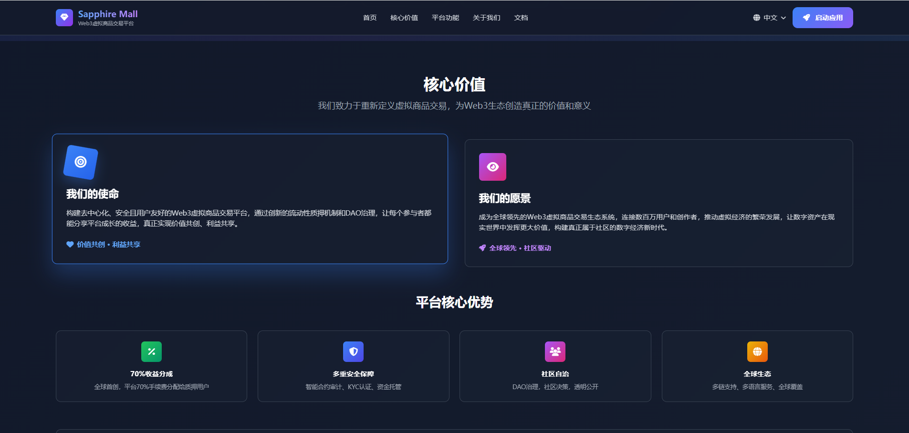
  <br /><em>官网首页 - 核心功能</em>
</p>
<p align="center">
  
  <br /><em>官网首页 - 项目愿景</em>
</p>

### 🛒 DApp 商城
<p align="center">
  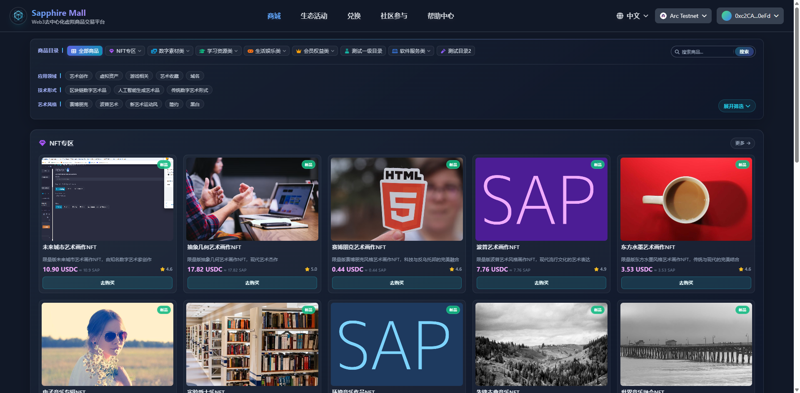
  <br /><em>商城首页 - 商品浏览与分类</em>
</p>
<p align="center">
  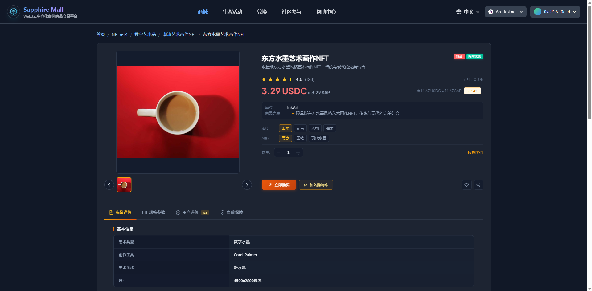
  <br /><em>商品明细 - 商品详情与购买</em>
</p>
<p align="center">
  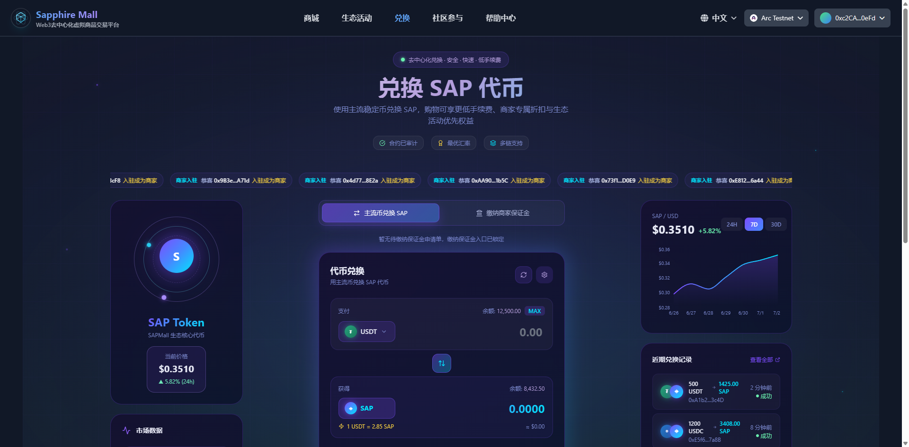
  <br /><em>代币兑换 - SAP 代币兑换</em>
</p>
<p align="center">
  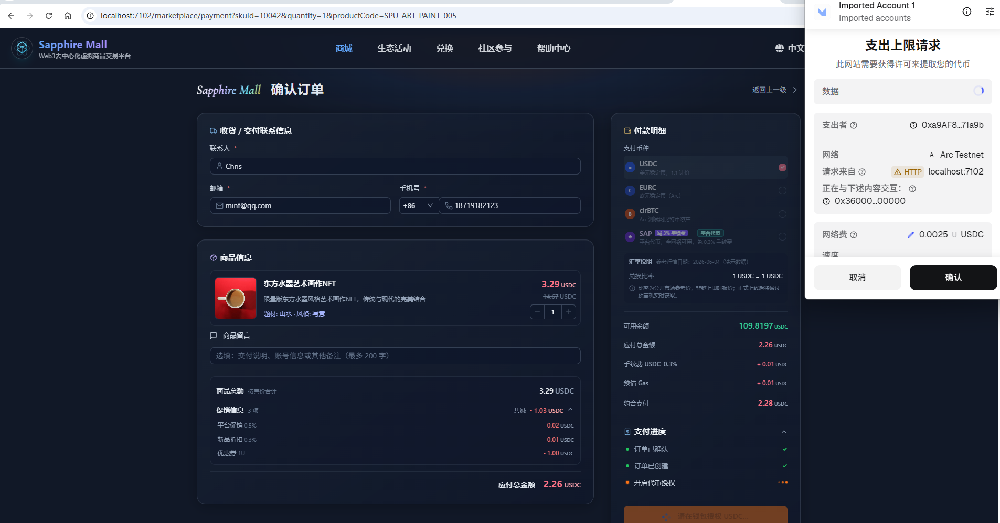
  <br /><em>钱包支付 - 链上支付流程</em>
</p>
<p align="center">
  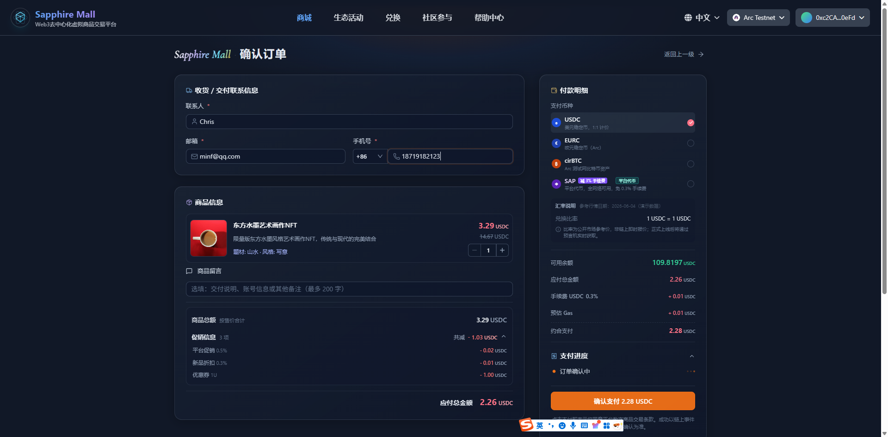
  <br /><em>订单确认 - 订单信息核实</em>
</p>
<p align="center">
  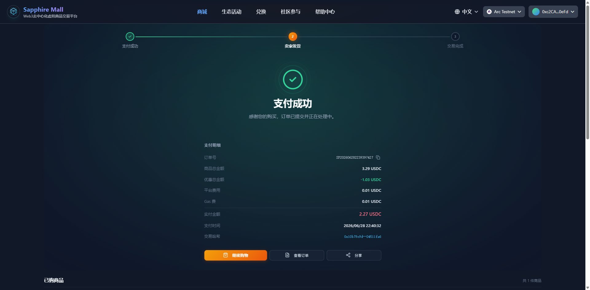
  <br /><em>订单支付成功 - 交易完成</em>
</p>

### 🏛️ DAO 治理
<p align="center">
  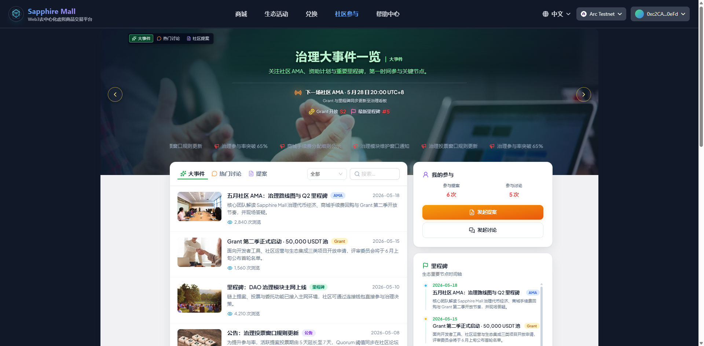
  <br /><em>社区参与首页 - 提案与讨论</em>
</p>
<p align="center">
  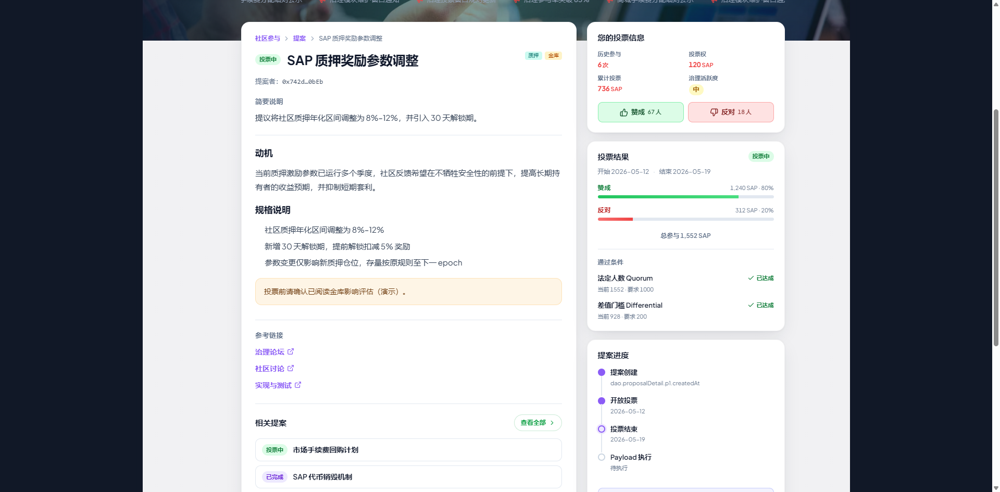
  <br /><em>提案治理 - 链上投票</em>
</p>
<p align="center">
  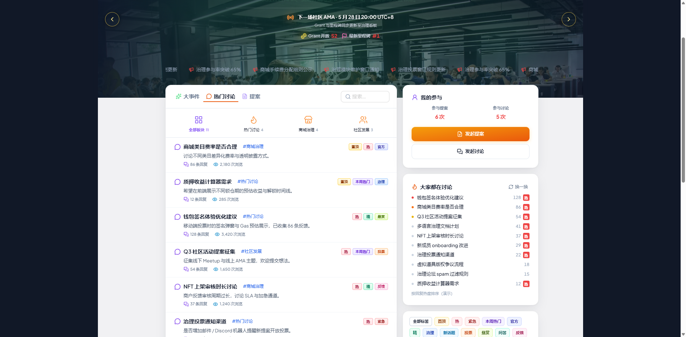
  <br /><em>社区讨论 - 话题交流</em>
</p>
<p align="center">
  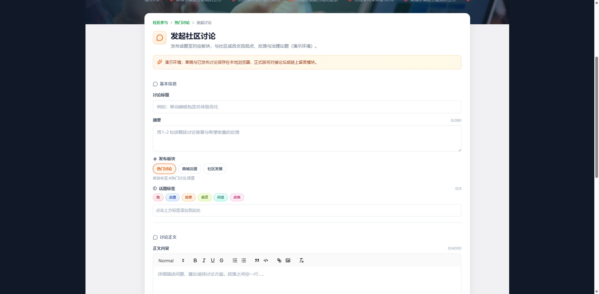
  <br /><em>讨论明细 - 帖子详情</em>
</p>

### 🎯 生态活动
<p align="center">
  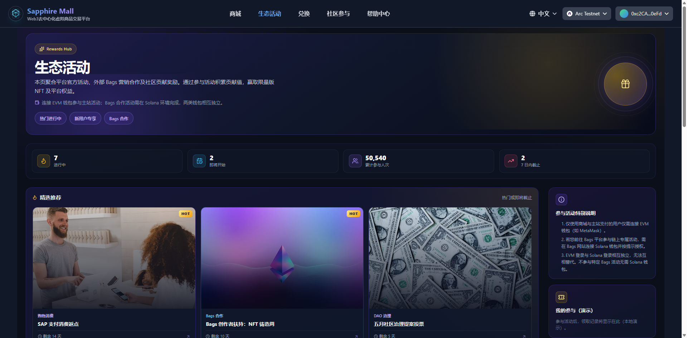
  <br /><em>生态活动首页 - Bags 活动聚合</em>
</p>

### 📚 帮助中心
<p align="center">
  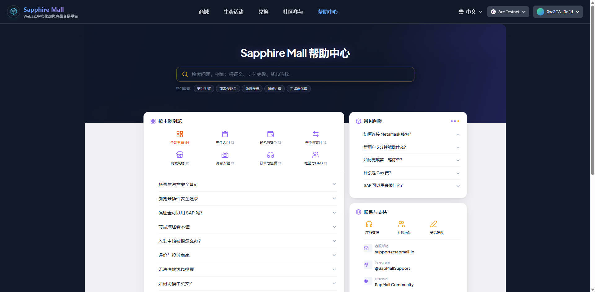
  <br /><em>帮助中心 - 使用指南</em>
</p>
<p align="center">
  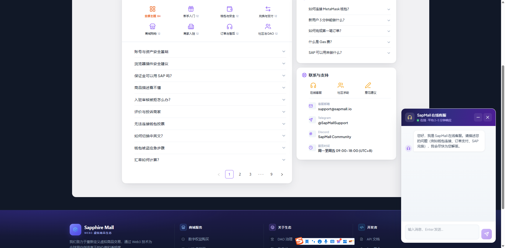
  <br /><em>在线客服 - 实时支持</em>
</p>

### ⚙️ 管理后台
<p align="center">
  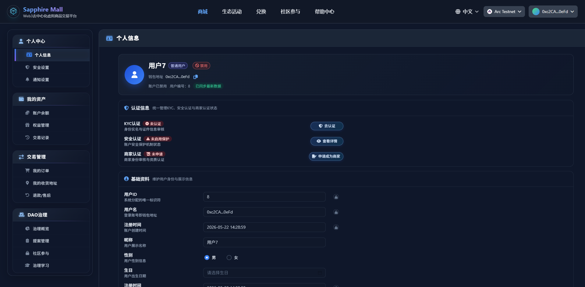
  <br /><em>后台管理 - 运营控制台</em>
</p>
<p align="center">
  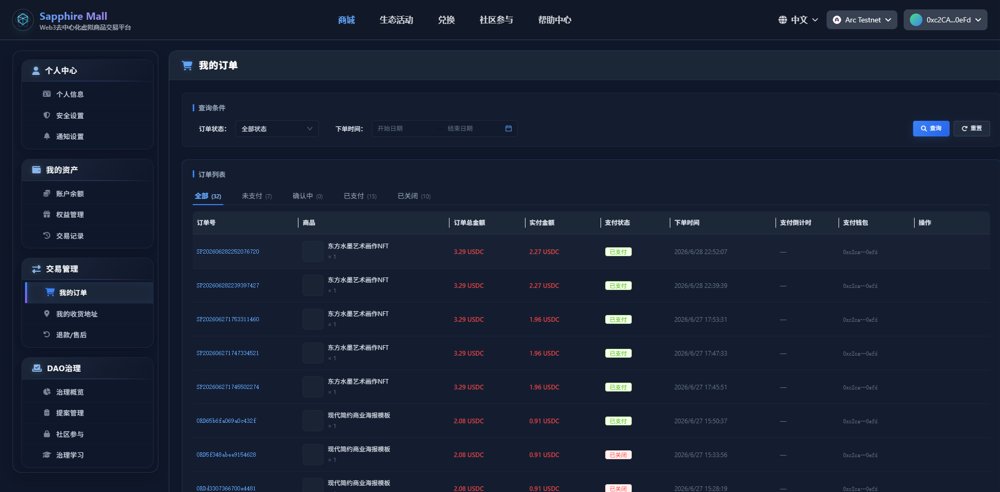
  <br /><em>后台管理 - 订单管理</em>
</p> 
