# Sapphire Mall - Web3 Virtual Goods Trading Platform

<div align="center">


**🌐 Multi-language Support | [English](README_EN.md) | [中文](README.md)**

[](https://web3js.org/)
[](https://ethereum.org/)
[](LICENSE)
[](https://github.com/your-username/sapmall)

</div>

---

## 📋 Project Overview

**Sapphire Mall** is a decentralized community-driven virtual goods trading platform. The platform is built on blockchain technology with community governance at its core, implementing a fully decentralized decision-making system through DAO mechanisms. The platform uses the self-issued ERC20 token SAP as the ecosystem token, incentivizing community participation through liquidity pools and staking mechanisms, creating a Web3 virtual goods trading ecosystem that is jointly governed and benefited by community members.

### 🌟 Core Features

- **🏛️ Decentralized Governance**: Fully decentralized community governance system based on DAO mechanisms
- **👥 Community-Driven**: Jointly decided, built, and benefited by community members
- **🎯 Virtual Goods Specialization**: Focus on digital content, software tools, online services and other virtual goods trading
- **💎 Liquidity Pool Incentives**: Incentivize community participation through liquidity pools and staking mechanisms
- **💰 Revenue Sharing Mechanism**: Platform revenue automatically distributed to community contributors through smart contracts
- **🌍 Global Community**: Multi-language support, building a global decentralized community
- **🔐 Transparent On-chain Governance**: All governance decisions and revenue distribution are completely transparent and verifiable on-chain

## 🏗️ Project Structure

```
sapmall/
├── 📁 backend_service/               # Backend Service (Go + go-zero)
├── 📁 web_client/                    # Frontend Applications
│   ├── 📁 sapmall-admin/             # Admin Backend (React + TypeScript)
│   ├── 📁 sapmall-dapp/              # DApp Application (React + Web3)
│   └── 📁 sapmall-website/           # Official Website (React)
├── 📁 env/                           # Environment Configuration
│   └── 📁 dev/                       # Development Environment Docker Configuration
├── 📁 design/                        # Design Files
│   ├── 📁 prototypes/                # Prototype Design
│   └── 📁 specs/                     # Design Specifications
├── 📁 docs/                          # Project Documentation
│   ├── 📄 PRD.md                     # Product Requirements Document
│   ├── 📄 White_Paper.md             # Technical White Paper
│   ├── 📄 Tokenomics_Detailed.md     # Token Economics Model
│   ├── 📄 Roadmap.md                 # Project Roadmap
│   ├── 📄 User_Story_Map.md          # User Story Map
│   └── 📄 Metrics_Framework.md       # Metrics Framework
├── 📁 promit/                        # AI Agent Prompts
├── 📁 pic/                           # Image Resources
├── 📄 docker-compose.yml             # Docker Compose File
├── 📄 generate_favicon.py           # Icon Generation Tool
└── 📄 README.md                      # Project Description
```

## 🎨 Design Prototypes

The project includes complete Web3 virtual goods trading platform interface prototypes with modern design style:

### 🎯 Design Features
- **Responsive Design**: Perfect adaptation for desktop, tablet and mobile
- **Dark Theme**: Visual style consistent with Web3 applications
- **Interactive Effects**: Smooth user interaction experience
- **Component-based**: Reusable UI component system
- **Multi-language**: Complete Chinese and English bilingual support

### 📱 Main Pages

| Page | Function Description | File Path |
|------|---------------------|-----------|
| 🏠 **Official Website Homepage** | Platform introduction, data display, quick access | `design/prototypes/index.html` |
| 🛒 **DApp Main Interface** | Product browsing, token exchange, staking management | `design/prototypes/dapp.html` |
| ⚙️ **Admin Backend** | User management, product review, system configuration | `design/prototypes/admin.html` |
| 📊 **Data Display** | Real-time data, statistical charts, platform overview | `design/prototypes/homepage.html` |
| 👤 **User Management** | KYC review, permission assignment, data analysis | `design/prototypes/admin/user-management.html` |

## 🚀 Quick Start

### 1. One-Click Development Environment Setup

#### Method 1: Complete Container Environment (Recommended for Production Testing)
```bash
# Navigate to environment configuration directory
cd env/dev

# One-click startup of all services (Supports Docker/Podman)
./start_local_dev_env.sh
```

#### Method 2: Local Development Environment (Recommended for Development Debugging)
```bash
# Navigate to environment configuration directory
cd env/dev

# Start local development environment
./start_local_dev.sh
```

#### Environment Requirements
- **Container Runtime**: Docker or Podman
- **Node.js**: Version 18+
- **Go**: Version 1.19+
- **Port Requirements**: Ensure the following ports are not occupied
  - 3004-3006 (Frontend services)
  - 8080, 7101-7103 (Nginx proxy)
  - 8888-8889 (Backend API)
  - 3306 (MySQL), 6379 (Redis), 2379 (etcd)

### 2. Access Services

#### Unified Entry Point (Recommended)
Access through Nginx proxy with intelligent routing and load balancing:

| Service | Access URL | Description |
|---------|------------|-------------|
| 🏠 **Official Website** | http://localhost:7103 | Project website and introduction |
| 🛒 **DApp Application** | http://localhost:7102 | Web3 virtual goods trading platform |
| ⚙️ **Admin Backend** | http://localhost:7101 | Platform management and data statistics |
| 🔧 **Backend API** | http://localhost:7101/api/ | RESTful API endpoints |
| 📚 **API Documentation** | http://localhost:7101/swagger-ui/ | Swagger API documentation |

#### Direct Access (Development Debugging)
Bypass Nginx proxy and access services directly:

| Service | Access URL | Description |
|---------|------------|-------------|
| 🏠 **Official Website** | http://localhost:3006 | React application |
| 🛒 **DApp Application** | http://localhost:3005 | React + Web3 application |
| ⚙️ **Admin Backend** | http://localhost:3004 | React + TypeScript application |
| 🔧 **Backend API** | http://localhost:8888/api/ | Go + go-zero API |
| 📚 **API Documentation** | http://localhost:8888/swagger-ui/ | Swagger UI |

### 3. Intelligent Routing Explanation

The project adopts intelligent routing design, supporting multiple access methods:

#### Routing Priority
1. **IDE Development Instance** (Priority) - Supports hot reload, suitable for development debugging
2. **Container Instance** (Backup) - Production environment configuration, suitable for testing

#### Routing Configuration
- **Backend Service**: IDE instance(8889) → Container instance(8888)
- **Admin Backend**: IDE instance(3004) → Container instance(3001)
- **DApp Application**: IDE instance(3005) → Container instance(3002)
- **Official Website**: IDE instance(3006) → Container instance(3003)

### 4. Management Commands

#### Start/Stop Services
```bash
# Start complete environment
./start_local_dev_env.sh

# Stop all services
./stop_local_dev_env.sh

# Restart services
./restart_local_dev_env.sh

# Check service status
./status.sh
```

#### View Logs
```bash
# View Nginx proxy logs
podman logs -f sapmall-nginx

# View backend service logs
podman logs -f sapmall-backend_service

# View MySQL logs
podman logs -f sapmall-mysql

# View frontend application logs
podman logs -f sapmall-admin
podman logs -f sapmall-dapp
podman logs -f sapmall-website
```

#### Container Debugging
```bash
# Enter backend service container
podman exec -it sapmall-backend_service bash

# Enter MySQL container
podman exec -it sapmall-mysql bash

# Enter frontend application container
podman exec -it sapmall-admin sh
```

### 5. View Design Prototypes
```bash
# Open official website homepage
open design/prototypes/index.html

# Open DApp main interface
open design/prototypes/dapp.html

# Open admin backend
open design/prototypes/admin.html
```

### 6. Browse Project Documentation
- 📋 **Product Requirements**: [PRD.md](docs/PRD.md) - Detailed product requirements document
- 📖 **Technical White Paper**: [White_Paper.md](docs/White_Paper.md) - Technical architecture and innovations
- 💰 **Token Economics**: [Tokenomics_Detailed.md](docs/Tokenomics_Detailed.md) - Complete economic model
- 🗺️ **Project Roadmap**: [Roadmap.md](docs/Roadmap.md) - Development plans and milestones
- 👥 **User Stories**: [User_Story_Map.md](docs/User_Story_Map.md) - User scenarios and requirements
- 📊 **Metrics Framework**: [Metrics_Framework.md](docs/Metrics_Framework.md) - Evaluation system

## 💰 Token Economics Model

### SAP Token Basic Information
- **Token Standard**: ERC-20
- **Token Name**: Sapphire Mall Token
- **Token Symbol**: SAP
- **Total Supply**: 100,000,000 SAP
- **Token Type**: Utility Token

### Core Mechanisms
- **Liquidity Mining**: Users provide liquidity to receive mining rewards
- **Fee Sharing**: 70% of platform fees distributed to liquidity providers
- **DAO Governance**: SAP holders can participate in platform major decision voting
- **Deflation Mechanism**: Multiple burn mechanisms maintain token scarcity

## 🛠️ Technical Architecture

### Frontend Technology Stack
- **Framework**: React 18 + TypeScript
- **State Management**: Redux Toolkit + RTK Query
- **UI Framework**: Tailwind CSS + Headless UI
- **Internationalization**: react-i18next
- **Web3 Integration**: Wagmi + Viem + TanStack Query
- **Wallet Connection**: Web3Modal v3 + ConnectKit

### Smart Contract Technology
- **Development Framework**: Hardhat + TypeScript
- **Contract Language**: Solidity 0.8.19+
- **Security Tools**: Slither + Mythril + OpenZeppelin
- **Upgrade Mechanism**: OpenZeppelin Upgrades
- **Multi-signature Management**: Gnosis Safe

### Backend Services
- **API Service**: Go + go-zero framework + gRPC
- **Database**: MySQL 8.0+ + Redis + MongoDB
- **Blockchain Interaction**: go-ethereum + custom RPC client
- **File Storage**: IPFS + Pinata + Alibaba Cloud OSS
- **Microservice Architecture**: go-zero microservices + etcd service discovery

## 🤖 AI Development Best Practices

This project actively adopts AI-assisted development and has established a complete AI development workflow and best practices system.

### 🎯 AI Agent Usage Guide

#### English Guide
We have configured specialized AI Agents for project development, including:

1. **Product Manager Agent** (`promit/PM_Web3_Agent_Prompt.md`)
   - Focuses on Web3 product requirement analysis and product planning
   - Develops product roadmaps and feature priorities
   - Writes detailed product requirements documents (PRD)
   - Designs user stories and user journeys

2. **UI/UX Designer Agent** (`promit/UIUX_Designer_Web3_Agent_Prompt.md`)
   - Focuses on Web3 interface design and user experience
   - Supports multi-platform prototype creation (desktop, mobile, mini-program)
   - Uses HTML + Tailwind CSS + FontAwesome tech stack
   - Generates pixel-perfect high-fidelity prototypes

3. **Smart Contract Engineer Agent** (`promit/Smart_Contract_Engineer_Agent_Prompt.md`)
   - Focuses on smart contract development and security auditing
   - Supports multi-chain development (Ethereum, Layer2, BSC, Solana, etc.)
   - Follows latest security standards and best practices
   - Uses Solidity/Vyper/Rust and other tech stacks

4. **Frontend Developer Agent** (`promit/Web_Client_Web3_Agent_Prompt.md`)
   - Focuses on Web3 frontend application development
   - Uses React + TypeScript + Web3 tech stack
   - Implements wallet connection and blockchain interaction
   - Builds responsive and user-friendly interfaces

5. **Backend Developer Agent** (`promit/Backend_Engineer_Agent_Prompt.md`)
   - Focuses on backend services and API development
   - Uses Go + microservice architecture
   - Implements blockchain data indexing and processing
   - Builds highly available and scalable services

### 📝 Prompt Engineering Best Practices

#### English Guide
1. **Clear Role Definition**: Define clear roles and responsibilities for each Agent
2. **Structured Prompts**: Use clear formatting and hierarchical structure to organize prompts
3. **Context Management**: Provide sufficient background information and project context
4. **Iterative Optimization**: Continuously optimize prompt content based on actual usage results
5. **Version Control**: Version control prompts and record improvement history


### 🔧 Code Generation Best Practices

#### English Guide
1. **Code Review**: All AI-generated code must undergo manual review
2. **Test Coverage**: Write complete test cases for generated code
3. **Security Checks**: Pay special attention to security-related code and conduct specialized audits
4. **Performance Optimization**: Conduct performance analysis and optimization of generated code
5. **Documentation**: Write clear documentation and comments for generated code

### 🧪 AI-Assisted Testing Strategy

#### English Guide
1. **Automated Test Generation**: Use AI to generate unit tests, integration tests, and end-to-end tests
2. **Boundary Condition Testing**: AI helps identify and test boundary conditions and edge cases
3. **Performance Testing**: Use AI to generate performance test scripts and load testing
4. **Security Testing**: AI-assisted security vulnerability scanning and penetration testing
5. **Regression Testing**: Automated regression testing to ensure new features don't affect existing functionality

## 📊 Project Metrics

### Target Users
- **Monthly Active Users (MAU)**: Target 10,000+ users (within 6 months)
- **Daily Active Users (DAU)**: Target 2,000+ users
- **User Retention Rate**: 7-day retention > 40%, 30-day retention > 20%

### Business Goals
- **Total Transaction Volume**: Monthly transaction target $1M
- **Token Exchange Volume**: Daily exchange volume > $50K
- **Total Staking Volume**: Liquidity pool TVL > $5M
- **Platform Revenue**: Monthly revenue > $20K

### North Star Metric
**Monthly Liquidity Staking Active Users** - Reflects platform core value and user trust

## 🤝 Contributing

Welcome to participate in project development! Please follow these steps:

1. **Fork** the project repository
2. **Create feature branch**: `git checkout -b feature/AmazingFeature`
3. **Commit changes**: `git commit -m 'Add some AmazingFeature'`
4. **Push to branch**: `git push origin feature/AmazingFeature`
5. **Open Pull Request**

### Development Standards
- Follow TypeScript coding standards
- Use Chinese descriptions for commit messages
- New features must include test cases
- Important changes require updating related documentation

## 📄 License

This project is licensed under the MIT License - see the [LICENSE](LICENSE) file for details.

## 📞 Contact Us

- **Project Repository**: [https://github.com/your-username/sapmall](https://github.com/your-username/sapmall)
- **Issue Feedback**: [Issues](https://github.com/your-username/sapmall/issues)
- **Discussion**: [Discussions](https://github.com/your-username/sapmall/discussions)

---

<div align="center">

**🌐 Multi-language Support | [English](README_EN.md) | [中文](README.md)**

**Sapphire Mall** - Building the Future of Web3 Virtual Goods Trading Platform 🚀

</div>

## 🖼️ Project Screenshots

The following are main page screenshots of the project for quick preview on GitHub:

<p align="center">
  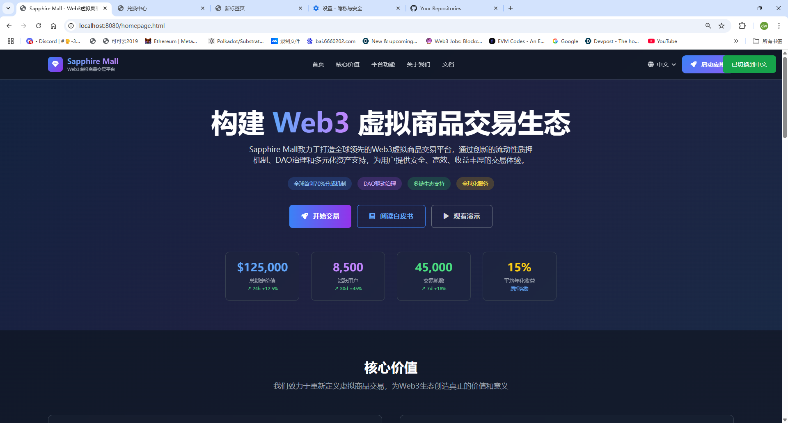
  <br /><em>Homepage (Chinese) 01</em>
</p>
<p align="center">
  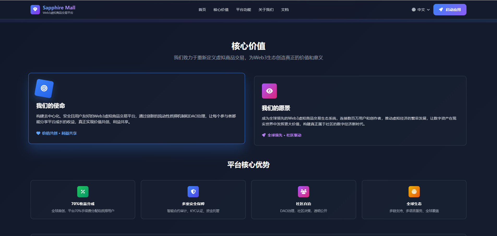
  <br /><em>Homepage (Chinese) 02</em>
</p>
<p align="center">
  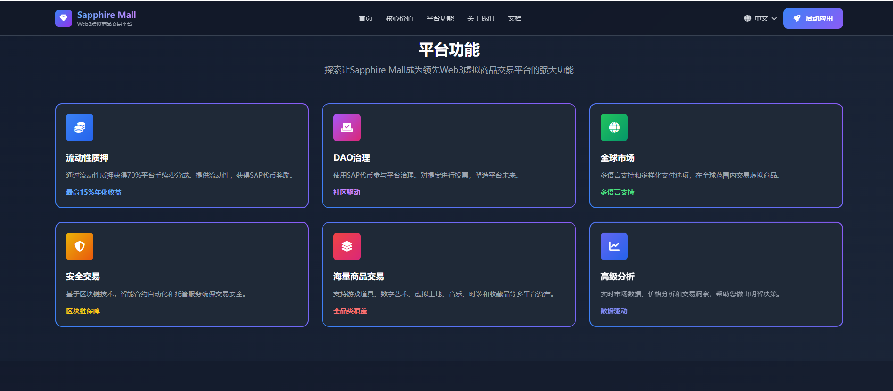
  <br /><em>Homepage (Chinese) 03</em>
</p>
<p align="center">
  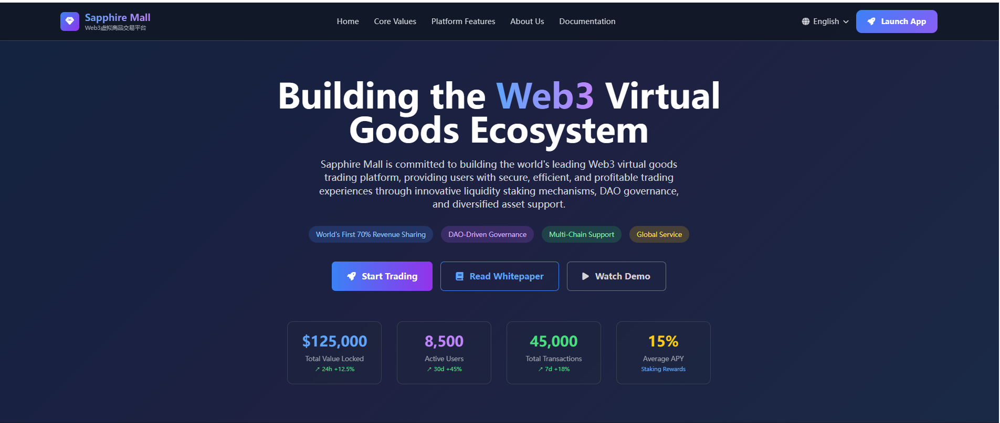
  <br /><em>Homepage (English) 01</em>
</p>
<p align="center">
  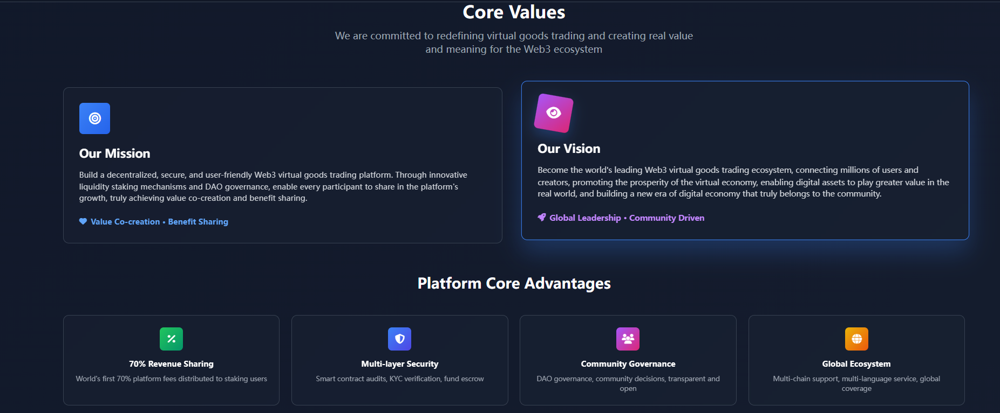
  <br /><em>Homepage (English) 02</em>
</p>
<p align="center">
  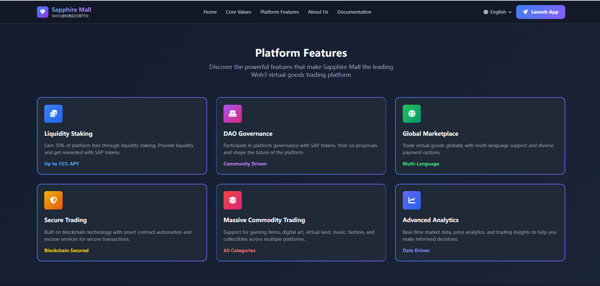
  <br /><em>Homepage (English) 03</em>
</p>
<p align="center">
  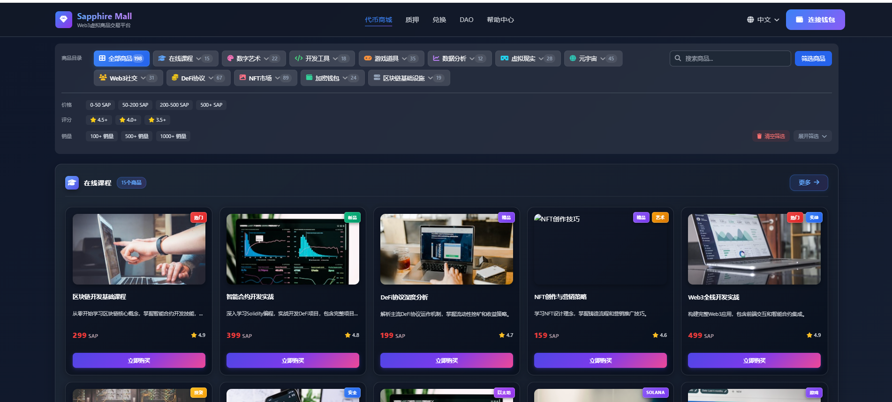
  <br /><em>DApp Mall Homepage (Chinese)</em>
</p>
<p align="center">
  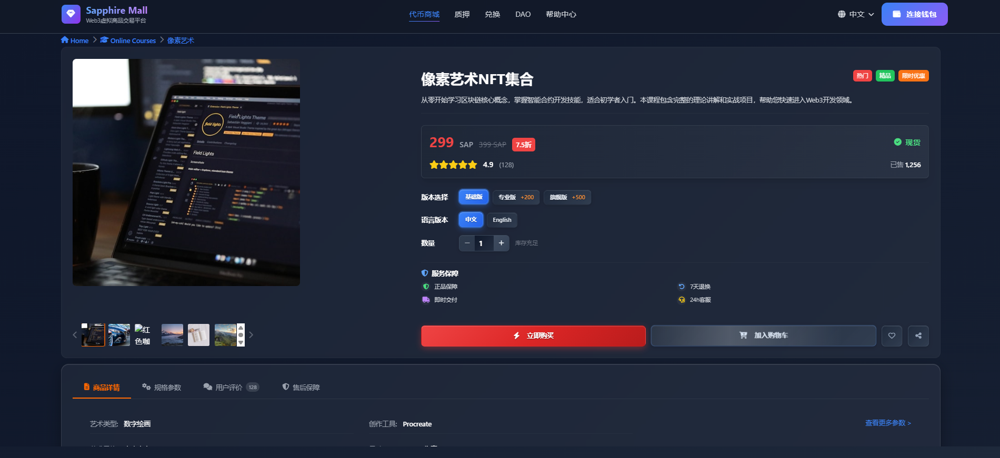
  <br /><em>DApp Product Detail</em>
</p>
<p align="center">
  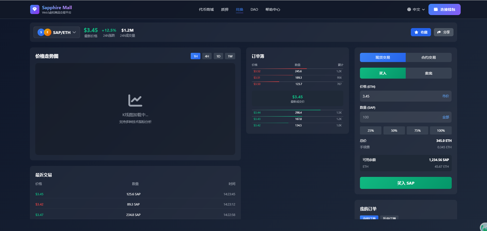
  <br /><em>DApp Exchange (Chinese)</em>
</p>
<p align="center">
  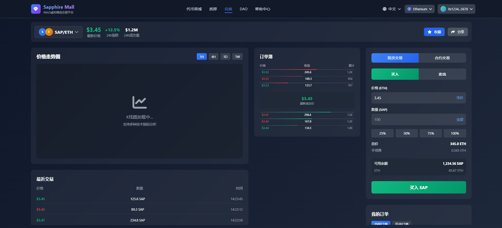
  <br /><em>DApp Staking (Chinese)</em>
</p>
<p align="center">
  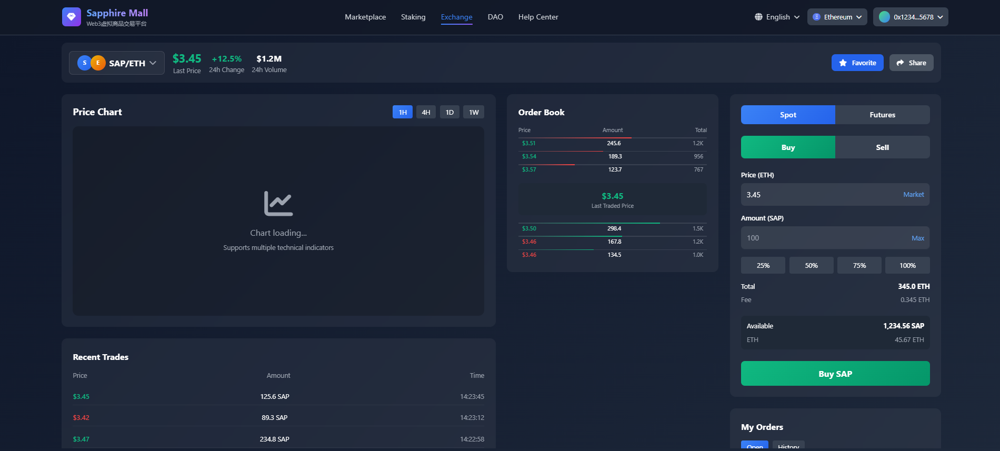
  <br /><em>DApp Staking (English)</em>
</p>
<p align="center">
  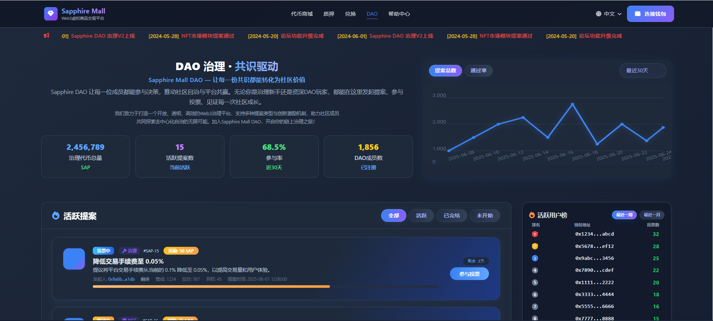
  <br /><em>DAO Homepage</em>
</p>
<p align="center">
  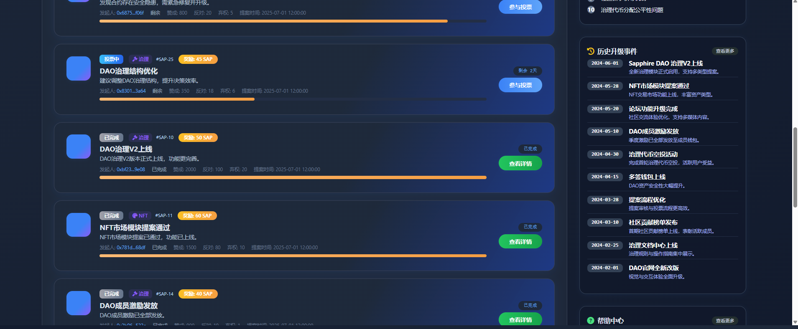
  <br /><em>DAO Voting</em>
</p>
<p align="center">
  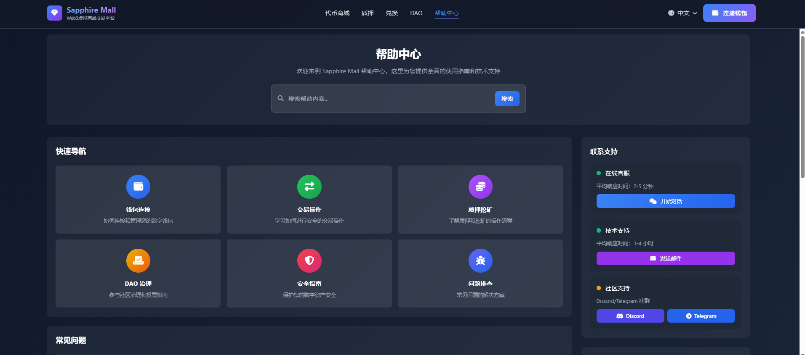
  <br /><em>Help Center</em>
</p>
<p align="center">
  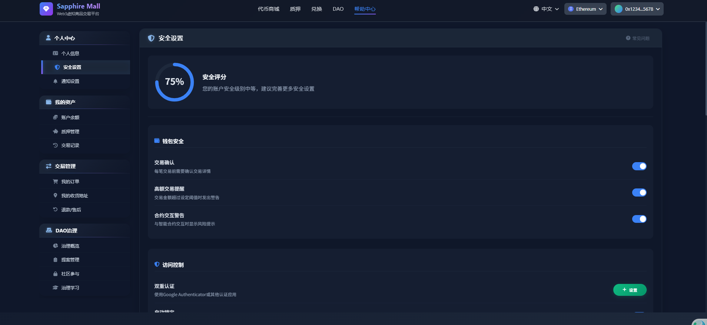
  <br /><em>Admin - Regular User Management 01</em>
</p>
<p align="center">
  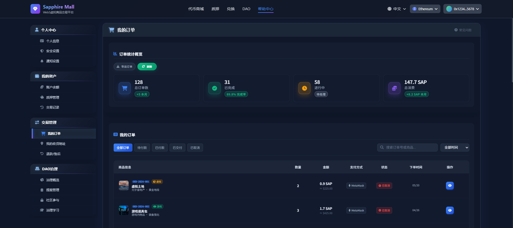
  <br /><em>Admin - Regular User Management 02</em>
</p>
<p align="center">
  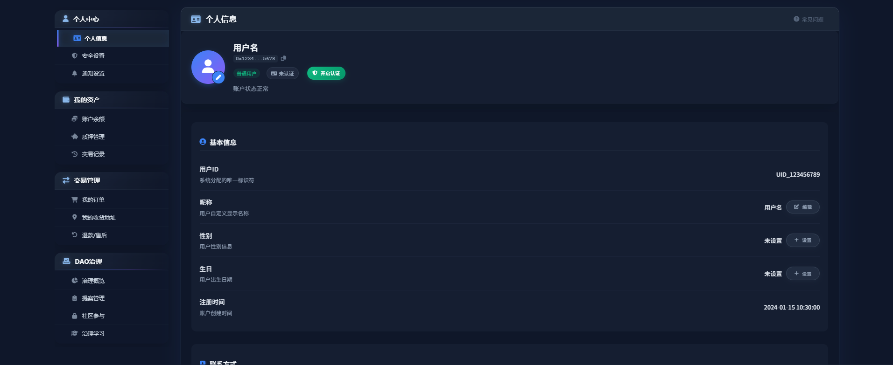
  <br /><em>Admin - Regular User</em>
</p>
<p align="center">
  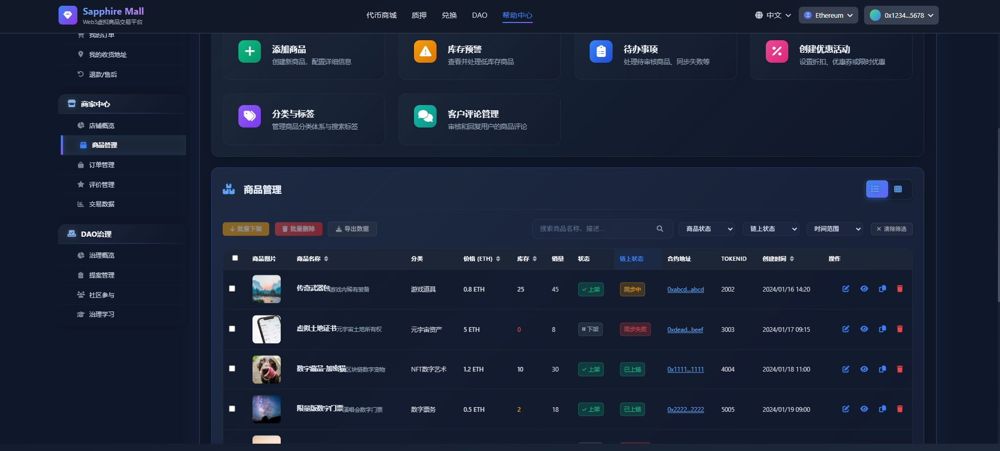
  <br /><em>Admin - Merchant User Management 01</em>
</p>
<p align="center">
  
  <br /><em>Admin - Merchant User Management 02</em>
</p>
<p align="center">
  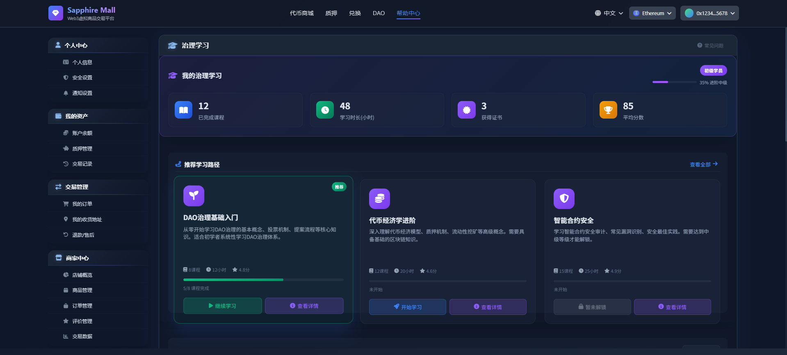
  <br /><em>Admin - Merchant User Management 02-03</em>
</p>
<p align="center">
  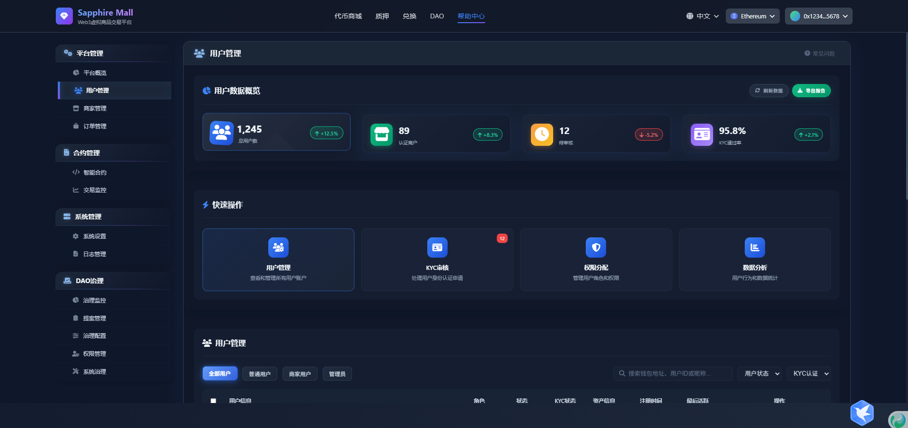
  <br /><em>Admin - Merchant & System Admin Management 03</em>
</p> 