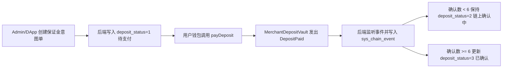
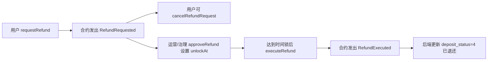

# Sapphire Mall 合约系统整体架构设计稿

## 1. 整体架构概览

本系统采用“链下业务编排 + 链上关键事实上链”的混合架构。后端负责业务状态机、风控、参数中心与权限编排，合约负责资产托管、关键状态迁移证明与事件输出。

当前优先落地模块为商家保证金，后续在同一架构下扩展商品上架、订单支付、结算分账等能力。

### 1.1 架构分层

- **应用层**：`sapmall-admin` / `sapmall-dapp`，负责用户交互与钱包签名发起。
- **业务层**：`backend_service`，负责意图单、风控决策、状态机推进与监听回写。
- **合约层**：`contract` 工程，负责保证金托管与后续交易相关核心规则。
- **治理层**：多签 + TimelockController，负责参数变更、权限操作、升级治理。

### 1.2 技术基线

- Solidity `0.8.28`
- Hardhat `3.x` + viem
- OpenZeppelin `5.x`
- 升级策略：`UUPS`

### 1.3 当前已确认业务约束（保证金）

- 部署网络：先 `Sepolia`，后续多链扩展。
- USDT（Sepolia）：`0x323e78f944A9a1FcF3a10efcC5319DBb0bB6e673`
- 金额单位：统一按 `18 decimals`，由后端换算。
- `intentId`：`mdi_<uuid>` 模式，严格唯一。
- 链上确认：`6` 个确认后从“确认中”转“已确认”。
- 退款：先申请，时间锁默认 `7` 天（可调），支持用户主动撤销申请。

---

## 2. 合约清单与依赖关系

### 2.1 核心合约清单

#### V1（本期实现）

- `MerchantDepositVault`：商家保证金主合约（资产托管、退款时间锁、事件输出）。

#### V2+（规划中）

- `ProductRegistry`：商品上架/下架/变更摘要上链。
- `PaymentRouter`：订单支付入口与支付意图幂等控制。
- `SettlementVault`：平台结算与分账执行。

### 2.2 治理与基础设施合约

- `TimelockController`：治理延时执行。
- `Proxy` + `UUPSImplementation`：可升级部署模型。
- `AccessControl` 角色体系：`DEFAULT_ADMIN_ROLE` / `OPERATOR_ROLE` / `PAUSER_ROLE` / `UPGRADER_ROLE`。

### 2.3 依赖关系（逻辑）

- `MerchantDepositVault` 依赖：
  - ERC20 标准代币（USDT/后续白名单币种）
  - OpenZeppelin 安全组件（Pausable/ReentrancyGuard/SafeERC20）
  - Timelock 治理权限
- 后端监听依赖：
  - 合约事件 `DepositPaid/Refund*`
  - `sys_user_deposit` 与 `sys_chain_event` 数据表
  - 断点续扫（Redis）

---

## 3. 合约详细设计

### 3.1 模块 A：MerchantDepositVault（已冻结）

#### 3.1.1 职责边界

- **负责**：保证金收取、退款申请与执行窗口、风险开关、关键事件。
- **不负责**：商家资质审核、风控规则判定、链下复杂业务状态。

#### 3.1.2 核心状态

- `deposits[intentId]`：记录支付人与金额、支付状态、退款状态、解锁时间。
- `allowedTokens[token]`：白名单币种。
- `blacklist[user]`：黑名单。
- 全局参数：`requiredAmount18`、`refundLockPeriodSec`、`emergencyMode`。

#### 3.1.3 核心函数（设计签名）

- `payDeposit(intentId, token, amount18)`
- `requestRefund(intentId, reasonHash)`
- `cancelRefundRequest(intentId)`
- `approveRefund(intentId, unlockAt)`
- `executeRefund(intentId)`
- `setAllowedToken(token, allowed)`
- `setRequiredAmount(amount18)`
- `setRefundLockPeriod(seconds)`
- `pause()/unpause()`
- `setBlacklist(user, banned)`
- `emergencyWithdraw(...)`

#### 3.1.4 事件协议（最小字段）

- `DepositPaid(intentId, payer, token, amount18)`
- `RefundRequested(intentId, payer)`
- `RefundRequestCanceled(intentId, payer)`
- `RefundApproved(intentId, unlockAt)`
- `RefundExecuted(intentId, to, amount18)`

#### 3.1.5 链下状态映射

后端状态枚举：

- `0 初始化`
- `1 待支付`
- `2 链上确认中`
- `3 已确认`
- `4 已退还`
- `5 失败`（链上失败/风控拒绝/参数异常）
- `6 已过期`

### 3.2 模块 B：ProductRegistry（规划）

- 商品最小摘要上链（`productId`、`contentHash`、`version`、`status`）。
- 事件驱动后台索引，支持审计追踪与版本回溯。
- 保留与支付模块的商品可售状态联动接口。

### 3.3 模块 C：PaymentRouter（规划）

- 订单支付意图幂等（`paymentIntentId` 唯一）。
- 多币种支付白名单与金额规则校验。
- 与保证金状态联动（例如商家未满足保证金条件时限制支付能力）。

### 3.4 模块 D：SettlementVault（规划）

- 结算批次执行与事件化回执。
- 分账比例参数化（平台/商家/其他角色）。
- 异常中断、暂停与恢复能力。

---

## 4. 安全设计

### 4.1 合约安全控制

- **重入防护**：资金入口与退款执行统一 `ReentrancyGuard`。
- **权限最小化**：治理、操作、暂停、升级角色分离。
- **参数边界校验**：地址、金额、时间窗口、状态迁移合法性检查。
- **代币安全兼容**：统一 `SafeERC20`，规避非标准 ERC20 风险。
- **幂等约束**：`intentId` 严格唯一，避免重复收款。

### 4.2 治理与升级安全

- 治理模型：`多签 + TimelockController` 双层。
- 升级模型：`UUPS`，`_authorizeUpgrade` 仅 Timelock 可执行。
- 高风险操作（升级、紧急提取、全局参数修改）必须经过延时窗口。

### 4.3 监听与数据安全

- 后端采用“事件落库 + 业务回写”双轨处理。
- 监听具备断点续扫、重试、幂等去重能力。
- 任何失败回写都可重放恢复，不依赖单次监听成功。

---

## 5. 合约交互流程图

### 5.1 保证金缴纳与确认流程

### 5.2 退款申请与执行流程

---

## 6. 部署策略（结合当前系统背景）

### 6.1 环境策略

- **阶段 1（当前）**：`Sepolia` 部署与联调（保证金主链路）。
- **阶段 2（扩展）**：以太坊主网 / 其他 EVM 链复制部署。
- **阶段 3（跨范式）**：接入 Solana，通过 adapter 做业务事件语义统一。

### 6.2 部署步骤

1. 部署治理组件：多签、Timelock。
2. 部署 `MerchantDepositVault` 实现合约。
3. 部署 UUPS 代理并初始化参数：
   - `requiredAmount18`
   - `refundLockPeriodSec = 604800`
   - 白名单 `USDT_SEPOLIA`
4. 分配角色到 Timelock/运营地址。
5. 后端配置链参数并开启监听：
   - `chainId`
   - `contractAddress`
   - `startBlock`
   - `confirmations = 6`
6. 联调验证：
   - 支付事件 -> 状态从 `2` 到 `3`
   - 退款事件 -> 状态到 `4`

### 6.3 发布与回滚策略

- 参数变更通过 Timelock 排队执行，保留观察窗口。
- 合约升级采用灰度策略：先测试网、再主网。
- 回滚策略：
  - 功能级：暂停关键入口（`pause`）
  - 系统级：回退到上一个实现版本（UUPS 升级回退）
  - 数据级：后端基于事件重放修复状态

### 6.4 当前固定常量

- `USDT_SEPOLIA = 0x323e78f944A9a1FcF3a10efcC5319DBb0bB6e673`
- `CONFIRMATIONS_REQUIRED = 6`
- `REFUND_LOCK_DEFAULT_SECONDS = 604800`
- `INTENT_ID_PATTERN = ^mdi_[0-9a-fA-F-]{36}$`

