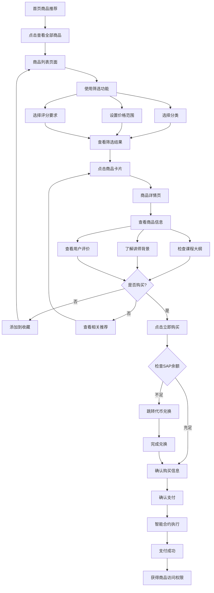
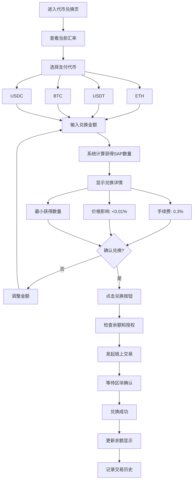
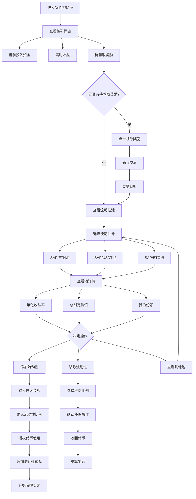
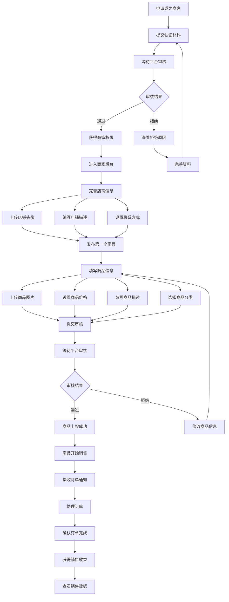
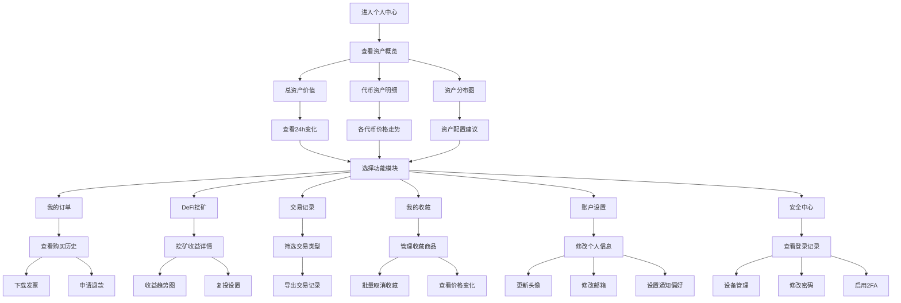
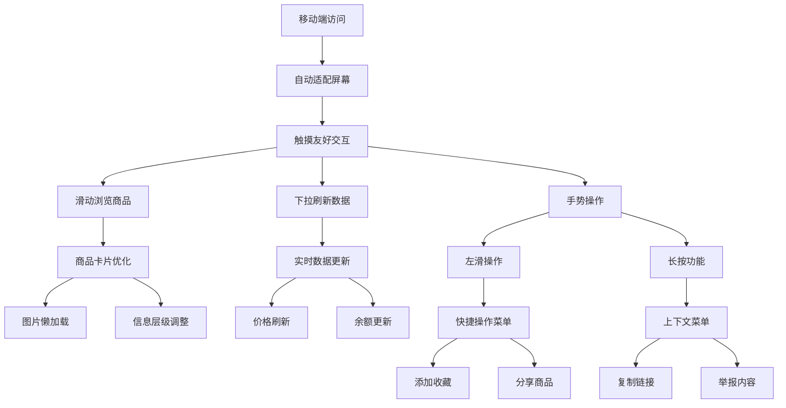
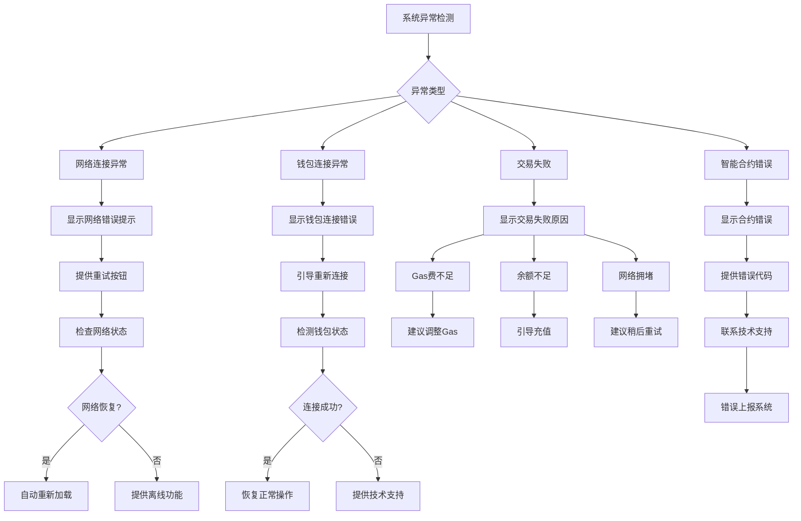

# Sapphire Mall 用户操作流程图

## 流程概述

本文档描述了Sapphire Mall平台的主要用户操作流程，涵盖新用户入门、商品购买、DeFi挖矿、商家运营等核心场景。

## 1. 新用户入门流程

```mermaid
flowchart TD
    A[访问首页] --> B{是否已连接钱包?}
    B -->|否| C[点击"连接钱包"]
    B -->|是| D[浏览平台功能]
    
    C --> E[选择钱包类型]
    E --> F[MetaMask/WalletConnect]
    F --> G[授权连接]
    G --> H[钱包连接成功]
    H --> D
    
    D --> I[查看入门指南]
    I --> J[Step 1: 了解平台价值]
    J --> K[Step 2: 代币兑换说明]
    K --> L[Step 3: 购物/投资介绍]
    L --> M[选择下一步操作]
    
    M --> N[开始购物]
    M --> O[参与DeFi挖矿]
    M --> P[兑换SAP代币]
```

## 2. 商品购买流程



## 3. 代币兑换流程



## 4. DeFi流动性挖矿流程



## 5. 商家入驻和运营流程



## 6. 用户个人中心操作流程



## 7. 移动端适配流程



## 8. 异常处理流程



## 流程优化建议

### 1. 用户体验优化
- **减少步骤**: 合并相似操作，简化流程
- **智能提示**: 根据用户行为提供个性化建议
- **快捷操作**: 提供常用功能的快捷入口
- **状态保存**: 保存用户操作进度，避免重复输入

### 2. 性能优化
- **预加载**: 预测用户下一步操作，提前加载内容
- **缓存策略**: 合理缓存用户数据和偏好设置
- **异步处理**: 耗时操作异步执行，避免界面卡顿
- **增量更新**: 只更新变化的数据部分

### 3. 安全优化
- **交易确认**: 重要操作需要二次确认
- **风险提示**: 高风险操作显著提醒用户
- **会话管理**: 自动检测异常登录行为
- **数据加密**: 敏感信息端到端加密

### 4. 可访问性优化
- **键盘导航**: 支持完整的键盘操作
- **屏幕阅读**: 兼容屏幕阅读器软件
- **对比度**: 确保文字和背景对比度充足
- **字体大小**: 支持字体大小调整

---

*本流程图将根据用户反馈和产品迭代持续优化更新。* 