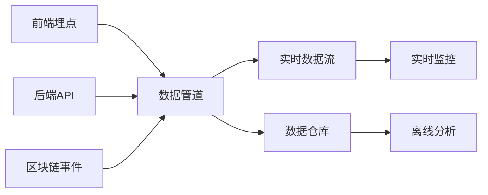

# Sapphire Mall 产品评估指标框架 (Metrics Framework)

## 1. 指标框架概述

### 1.1 文档信息
| 版本 | 日期 | 修改内容 | 作者 |
|------|------|----------|------|
| v1.0 | 2025-06-01 | 初始版本创建 | 产品经理 |
| v2.0 | 2025-06-01 | 根据PRD v3.0更新：质押收益为核心，用户角色分层，多语言指标 | 产品经理 |

### 1.2 指标框架目标
建立科学、全面的产品评估指标体系，通过数据驱动的方式监控产品健康度、用户满意度和业务目标达成情况，重点关注流动性质押收益机制的成功和用户角色体系的运行效果，为产品迭代和运营决策提供可靠依据。

### 1.3 指标设计原则
- **价值导向性**: 指标围绕用户价值创造（质押收益）和平台价值（生态健康）设计
- **可衡量性**: 所有指标都有明确的计算方法和数据来源
- **可行动性**: 指标变化能够指导具体的产品和运营行动
- **相关性**: 指标与业务目标和用户价值直接相关
- **平衡性**: 涵盖短期和长期、定量和定性、用户和商业价值
- **及时性**: 能够实时或准实时反映产品和业务状况
- **国际化**: 支持多语言用户的行为差异分析

## 2. 北极星指标定义

### 2.1 北极星指标
**月度流动性质押活跃用户数 (Monthly Liquidity Staking Active Users)**

### 2.2 选择依据

**为什么选择月度流动性质押活跃用户数作为北极星指标：**

1. **业务核心性**
   - 质押功能是平台的核心收益机制，直接关联用户价值创造
   - 体现了用户对平台的长期价值认知和信任度

2. **生态健康度**
   - 质押用户数量反映平台的长期价值和用户信任度
   - 质押行为创建了用户与平台的利益共同体

3. **收益驱动力**
   - 质押用户为平台提供流动性，获得手续费分成收益
   - 形成平台与用户的双赢机制

4. **可持续性**
   - 质押机制创造了平台与用户的共赢模式
   - 质押收益吸引更多用户，形成正向循环

5. **增长引擎**
   - 质押收益吸引更多用户参与，推动生态发展
   - 流动性增加提升整体交易体验

### 2.3 目标设定

| 阶段 | 时间 | 质押活跃用户目标 | 关键驱动因素 |
|------|------|-----------------|--------------|
| **MVP阶段** | 2025年11月 | 1,500 | 质押功能上线，基础收益吸引力 |
| **成长阶段** | 2026年2月 | 4,000 | 收益优化，用户体验提升 |
| **扩展阶段** | 2026年8月 | 8,000 | 多链部署，功能完善 |
| **成熟阶段** | 2027年2月 | 12,000 | 生态成熟，全球化运营 |

### 2.4 质押指标分解

**质押活跃用户拆解维度：**

| 维度 | 指标 | 计算方法 | 目标值 |
|------|------|----------|--------|
| **用户获取** | 新增质押用户数 | 当月首次质押用户数 | 月增长20%+ |
| **用户留存** | 质押用户留存率 | 持续质押用户数/上月质押用户数 | 85%+ |
| **用户深度** | 平均质押金额 | 总质押金额/质押用户数 | 月度提升5%+ |
| **用户活跃** | 质押操作频次 | 月度质押操作次数/质押用户数 | 2.5次/用户/月 |

**辅助北极星指标：**

| 指标名称 | 定义 | 目标值(2026年2月) | 监控频率 |
|----------|------|------------------|----------|
| 质押总价值(TVL) | 所有质押资产的总价值 | $5,000,000 | 实时 |
| 平均质押APY | 质押年化收益率 | 8-15% | 日 |
| 质押资金利用率 | 实际质押金额/总流动性 | 70%+ | 日 |
| 新用户质押转化率 | 新用户30天内开始质押比例 | 25%+ | 周 |

## 3. HEART指标体系详述

### 3.1 HEART框架说明
HEART是Google开发的用户体验指标框架，分别代表：
- **H**appiness (愉悦度)
- **E**ngagement (参与度) 
- **A**doption (采用度)
- **R**etention (留存度)
- **T**ask success (任务成功度)

### 3.2 Happiness (愉悦度)

#### 3.2.1 核心指标

**净推荐值 (NPS - Net Promoter Score)**
- **定义**: 用户推荐平台给他人的意愿度
- **计算公式**: NPS = 推荐者比例% - 批评者比例%
- **目标值**: NPS > 50 (优秀水平)
- **采集方式**: 产品内调研 + 邮件调研
- **多语言维度**: 分别统计中英文用户的NPS差异

**用户满意度评分 (CSAT)**
- **定义**: 用户对平台整体满意度评价
- **计算公式**: 满意和非常满意用户占比
- **目标值**: CSAT > 80%
- **采集方式**: 产品内弹窗调研
- **细分维度**: 按用户角色（普通/认证/管理员）分别统计

**质押收益满意度**
- **定义**: 质押用户对收益率和收益体验的满意度
- **计算公式**: 对质押收益满意用户占比
- **目标值**: > 85%
- **采集方式**: 质押用户专项调研

#### 3.2.2 辅助指标

| 指标名称 | 计算方法 | 目标值 | 监控频率 |
|----------|----------|--------|----------|
| 商品评分平均值 | 所有商品评分加权平均 | > 4.2/5.0 | 日 |
| 负面反馈率 | 负面评价数/总评价数 | < 10% | 周 |
| 客诉解决时效 | 平均客诉处理时间 | < 24小时 | 日 |
| 质押收益申诉率 | 收益相关申诉数/质押用户数 | < 1% | 周 |
| 语言使用满意度 | 各语言版本用户满意度对比 | 差异 < 5% | 月 |

### 3.3 Engagement (参与度)

#### 3.3.1 核心指标

**日活跃用户数 (DAU)**
- **定义**: 每日访问平台并完成至少一次有意义操作的用户数
- **有意义操作**: 浏览商品、搜索、兑换代币、交易、质押操作、DAO投票
- **目标值**: Month 6: 800, Month 12: 2,500, Month 24: 5,000

**月活跃用户数 (MAU)**
- **定义**: 每月访问平台并完成至少一次有意义操作的用户数
- **目标值**: Month 6: 5,000, Month 12: 15,000, Month 24: 30,000

**用户平均会话时长**
- **定义**: 用户单次访问平台的平均停留时间
- **目标值**: > 10分钟
- **计算方式**: 总会话时长 / 会话次数

**质押用户平均会话深度**
- **定义**: 质押用户单次访问的平均页面浏览数
- **目标值**: > 8页面/会话（高于普通用户）
- **计算方式**: 质押用户总页面浏览数 / 会话次数

#### 3.3.2 功能参与度指标

| 功能模块 | 参与度指标 | 计算方法 | 目标值 |
|----------|------------|----------|--------|
| **代币兑换** | 兑换渗透率 | 兑换用户数/MAU | 65% |
| **流动性质押** | 质押渗透率 | 质押用户数/MAU | 25% |
| **商品浏览** | 浏览深度 | 平均每用户商品浏览数 | 20个/月 |
| **商品购买** | 购买转化率 | 购买用户数/商品浏览用户数 | 10% |
| **DAO治理** | 治理参与率 | 投票用户数/SAP持有者数 | 30% |
| **多语言使用** | 语言切换率 | 使用语言切换功能用户数/MAU | 15% |

#### 3.3.3 用户角色参与度

| 用户角色 | 核心参与指标 | 计算方法 | 目标值 |
|----------|--------------|----------|--------|
| **普通用户** | 后台模块使用率 | 使用4个后台模块用户数/普通用户总数 | 85% |
| **普通用户** | 质押参与率 | 参与质押的普通用户数/普通用户总数 | 30% |
| **普通用户** | DAO参与率 | 参与治理投票的普通用户数/普通用户总数 | 20% |
| **认证商户** | 商家中心使用率 | 使用商家中心功能用户数/认证商户总数 | 90% |
| **认证商户** | 商品发布活跃度 | 月度发布商品的认证商户数/认证商户总数 | 60% |
| **认证商户** | 订单处理效率 | 24小时内处理订单的商户比例 | 95% |
| **系统管理员** | 管理操作效率 | 平均审核响应时间 | < 24小时 |
| **系统管理员** | 平台监控活跃度 | 日均登录管理后台次数 | 3次/天 |

### 3.4 Adoption (采用度)

#### 3.4.1 核心指标

**新用户激活率**
- **定义**: 新注册用户在7天内完成关键行为的比例
- **关键行为**: 连接钱包 + 完成首次兑换或购买或质押
- **目标值**: > 30%
- **计算公式**: 7天内完成激活用户数 / 新注册用户数

**质押功能采用率**
- **定义**: 用户开始使用质押功能的比例
- **计算方法**: 开始质押的用户数 / 符合条件的总用户数
- **目标值**: 新用户30天内质押率 > 25%

**KYC认证采用率**
- **定义**: 用户完成KYC认证成为认证用户的比例
- **计算方法**: 完成KYC用户数 / 活跃用户数
- **目标值**: > 30%

**多语言功能采用率**
- **定义**: 用户使用多语言切换功能的比例
- **计算方法**: 使用语言切换用户数 / 总用户数
- **目标值**: > 15%

#### 3.4.2 新功能采用指标

| 功能名称 | 目标采用率 | 监控期 | 成功标准 |
|----------|------------|--------|----------|
| 代币兑换 | 80% | 上线后4周 | 新用户80%在首周完成兑换 |
| 流动性质押 | 25% | 上线后8周 | 活跃用户25%开始质押 |
| 商品发布 | 60% | 上线后12周 | 60%的认证用户发布商品 |
| DAO治理 | 30% | 上线后6周 | SAP持有者30%参与投票 |
| 语言切换 | 15% | 上线后4周 | 15%用户尝试语言切换 |
| KYC认证 | 30% | 上线后16周 | 30%活跃用户完成认证 |

### 3.5 Retention (留存度)

#### 3.5.1 核心指标

**用户留存率**
- **次日留存**: 新用户注册后第2天再次访问的比例
  - 目标值: > 45%
- **7日留存**: 新用户注册后第7天再次访问的比例
  - 目标值: > 30%
- **30日留存**: 新用户注册后第30天再次访问的比例
  - 目标值: > 20%

**质押用户留存**
- **定义**: 开始质押用户的持续参与情况
- **7日质押留存**: > 70%
- **30日质押留存**: > 60%
- **90日质押留存**: > 50%

**购买用户留存**
- **定义**: 完成首次购买用户的后续留存情况
- **7日购买留存**: > 55%
- **30日购买留存**: > 35%

**认证用户留存**
- **定义**: 完成KYC认证用户的活跃度
- **30日认证用户留存**: > 75%
- **商品发布持续性**: 认证用户月均发布商品数 > 2个

#### 3.5.2 留存分析维度

| 用户分群 | 留存定义 | 30日留存目标 | 监控重点 |
|----------|----------|--------------|----------|
| 普通用户 | 继续访问平台 | 20% | 功能使用习惯培养 |
| 购买用户 | 继续购买商品 | 35% | 购买体验优化 |
| 质押用户 | 继续参与质押 | 60% | 收益率竞争力 |
| 认证用户 | 继续发布商品 | 75% | 销售收益满意度 |
| 中文用户 | 各功能留存对比 | 与英文用户差异<5% | 本地化体验 |
| 英文用户 | 各功能留存对比 | 与中文用户差异<5% | 国际化体验 |

#### 3.5.3 质押用户深度留存分析

| 质押金额区间 | 留存率目标 | 流失风险因素 | 留存策略 |
|--------------|------------|--------------|----------|
| < $1,000 | 45% | 收益金额较小 | 教育收益复投价值 |
| $1,000 - $10,000 | 65% | 收益率波动 | 稳定收益预期管理 |
| > $10,000 | 80% | 安全性担忧 | 强化安全保障宣传 |

### 3.6 Task Success (任务成功度)

#### 3.6.1 核心任务成功指标

**代币兑换成功率**
- **定义**: 兑换交易成功完成的比例
- **计算公式**: 成功兑换次数 / 发起兑换次数
- **目标值**: > 95%

**商品购买成功率**
- **定义**: 购买流程成功完成的比例
- **计算公式**: 成功订单数 / 发起购买次数
- **目标值**: > 98%

**流动性操作成功率**
- **定义**: 流动性添加/移除操作成功率
- **计算公式**: 成功操作次数 / 发起操作次数
- **目标值**: > 96%

#### 3.6.2 任务完成时间指标

| 核心任务 | 完成时间定义 | 目标时间 | P95时间 |
|----------|--------------|----------|---------|
| 用户注册 | 从开始到钱包连接成功 | < 3分钟 | < 5分钟 |
| 代币兑换 | 从选择代币到交易确认 | < 2分钟 | < 5分钟 |
| 商品购买 | 从选择商品到支付完成 | < 3分钟 | < 8分钟 |
| 商品发布 | 从开始发布到审核提交 | < 10分钟 | < 20分钟 |

#### 3.6.3 错误率指标

| 操作类型 | 错误率定义 | 目标错误率 | 关键错误类型 |
|----------|------------|------------|--------------|
| 代币兑换 | 交易失败率 | < 5% | Gas费不足、滑点过大 |
| 支付处理 | 支付失败率 | < 2% | 余额不足、网络问题 |
| 商品上传 | 上传失败率 | < 3% | 文件格式、大小限制 |
| DeFi操作 | 合约交互失败率 | < 4% | 合约错误、权限问题 |

## 4. 功能级评估指标

### 4.1 代币兑换模块指标

#### 4.1.1 使用指标
| 指标名称 | 计算方法 | 目标值 | 业务意义 |
|----------|----------|--------|----------|
| 兑换量 | 每日/月兑换的代币数量 | 月增长20% | 反映支付需求 |
| 兑换用户数 | 进行兑换的独立用户数 | DAU的60% | 用户参与度 |
| 平均兑换金额 | 总兑换金额/兑换次数 | $100 | 用户购买力 |
| 兑换频次 | 用户平均兑换次数/月 | 2.5次 | 用户粘性 |

#### 4.1.2 效率指标
| 指标名称 | 计算方法 | 目标值 | 优化方向 |
|----------|----------|--------|----------|
| 兑换完成率 | 成功兑换/发起兑换 | >95% | 提升成功率 |
| 平均确认时间 | 兑换交易平均确认时间 | <30秒 | 降低等待时间 |
| Gas费效率 | 平均Gas费/兑换金额 | <2% | 降低交易成本 |
| 滑点控制 | 实际滑点/预期滑点 | <110% | 提升价格准确性 |

### 4.2 商品管理模块指标

#### 4.2.1 商品供给指标
| 指标名称 | 计算方法 | 目标值 | 业务意义 |
|----------|----------|--------|----------|
| 商品总数 | 平台上架商品总数 | Month 6: 100 | 商品丰富度 |
| 新增商品数 | 每月新上架商品数 | 月增长15% | 供给增长 |
| 商品审核通过率 | 通过审核/提交审核 | >85% | 内容质量 |
| 商品存活率 | 30天后仍在售商品比例 | >70% | 商品质量 |

#### 4.2.2 商品质量指标
| 指标名称 | 计算方法 | 目标值 | 质量维度 |
|----------|----------|--------|----------|
| 商品平均评分 | 所有商品评分加权平均 | >4.2/5.0 | 用户满意度 |
| 商品评价率 | 有评价商品/已售商品 | >60% | 用户参与度 |
| 商品退款率 | 退款订单/总订单 | <5% | 商品质量 |
| 重复购买率 | 重复购买用户/总购买用户 | >25% | 商品价值 |

### 4.3 交易系统模块指标

#### 4.3.1 交易规模指标
| 指标名称 | 计算方法 | 目标值 | 业务意义 |
|----------|----------|--------|----------|
| 订单数量 | 每日/月成功订单数 | 月增长25% | 交易活跃度 |
| 订单金额 | 每日/月订单总金额 | 月增长30% | 业务规模 |
| 客单价 | 平均订单金额 | $50 | 用户价值 |
| 订单频次 | 用户平均下单次数/月 | 2次 | 用户粘性 |

#### 4.3.2 交易效率指标
| 指标名称 | 计算方法 | 目标值 | 效率维度 |
|----------|----------|--------|----------|
| 支付成功率 | 成功支付/发起支付 | >98% | 支付可靠性 |
| 订单处理时间 | 下单到交付平均时间 | <5分钟 | 处理效率 |
| 转化率 | 下单用户/商品浏览用户 | >8% | 购买转化 |
| 购物车放弃率 | 未完成订单/加入购物车 | <70% | 流程优化 |

### 4.4 DeFi模块指标

#### 4.4.1 流动性指标
| 指标名称 | 计算方法 | 目标值 | 业务意义 |
|----------|----------|--------|----------|
| 总锁仓价值(TVL) | 所有流动性池资产总价值 | Month 6: $50K | 资金规模 |
| 流动性提供者数量 | 活跃LP用户数 | Month 6: 50 | 参与度 |
| 平均流动性金额 | TVL/LP用户数 | $1000 | 用户投入 |
| 流动性留存率 | 30天后仍提供流动性用户比例 | >60% | 用户粘性 |

#### 4.4.2 挖矿效率指标
| 指标名称 | 计算方法 | 目标值 | 效率维度 |
|----------|----------|--------|----------|
| 年化收益率(APR) | 年化挖矿奖励率 | >8% | 收益竞争力 |
| 奖励分发准确率 | 正确分发/总分发 | >99.5% | 系统可靠性 |
| 奖励提取率 | 已提取奖励/可提取奖励 | >80% | 用户活跃度 |
| 复投率 | 复投用户/获得奖励用户 | >40% | 长期参与 |

## 5. 指标监测计划

### 5.1 实时监控指标 (1分钟级别)

**系统健康指标**
- 网站可用性 (目标: >99.5%)
- API响应时间 (目标: <500ms)
- 错误率 (目标: <0.1%)
- 并发用户数

**交易核心指标**
- 实时GMV
- 交易成功率
- 支付成功率
- 代币兑换成功率

### 5.2 每日监控指标

**用户行为指标**
- DAU/MAU
- 新用户注册数
- 用户留存率
- 平均会话时长

**业务核心指标**
- 日GMV
- 订单数量和金额
- 商品浏览和购买转化
- DeFi参与情况

### 5.3 每周监控指标

**产品健康度**
- 用户满意度调研
- 功能使用情况分析
- 新功能采用率
- 用户反馈分析

**运营效果**
- 获客成本和渠道效果
- 内容质量和审核效率
- 客服满意度
- 社区活跃度

### 5.4 每月监控指标

**业务回顾**
- 月度GMV达成情况
- 北极星指标分解分析
- 用户生命周期价值
- 竞品对比分析

**产品迭代**
- 功能使用深度分析
- 用户行为模式变化
- A/B测试结果总结
- 产品路线图调整建议

## 6. 数据收集和分析

### 6.1 数据源规划

#### 6.1.1 前端埋点数据
**页面浏览事件**
```javascript
// 页面访问埋点
track('page_view', {
  page_name: 'product_list',
  user_id: 'user_123',
  session_id: 'session_456',
  timestamp: '2024-12-19T10:00:00Z'
});
```

**用户交互事件**
```javascript
// 交互行为埋点
track('user_action', {
  action_type: 'button_click',
  element_id: 'buy_now_button',
  product_id: 'product_789',
  user_id: 'user_123'
});
```

**交易相关事件**
```javascript
// 交易事件埋点
track('transaction', {
  event_type: 'purchase_completed',
  order_id: 'order_101112',
  amount: 100,
  currency: 'SAP',
  product_ids: ['product_789']
});
```

#### 6.1.2 后端业务数据
**MySQL数据库表设计**
- 用户表：用户基本信息、钱包地址、注册时间、KYC状态
- 订单表：订单详情、支付状态、交易金额、交易哈希
- 商品表：商品信息、价格、销量、评分、IPFS哈希
- 交易表：代币兑换记录、流动性操作记录
- 流动性表：LP代币信息、奖励记录、质押状态

**GORM模型事件监听**
- 数据库操作日志
- 用户行为记录
- 业务流程追踪

#### 6.1.3 区块链数据
**智能合约事件监听**
- 代币兑换事件
- 商品购买事件
- 流动性添加/移除事件
- 挖矿奖励分发事件

### 6.2 数据处理流程

#### 6.2.1 数据收集流程


#### 6.2.2 数据质量保证
- **数据验证**: 格式检查、范围验证、逻辑一致性
- **去重处理**: 防止重复计算
- **异常检测**: 识别和处理异常数据
- **数据补全**: 处理缺失数据

### 6.3 分析工具和平台

#### 6.3.1 实时监控平台
- **Prometheus**: go-zero内置metrics采集
- **Grafana**: 实时指标监控仪表板
- **Jaeger**: go-zero内置链路追踪
- **etcd**: 服务发现和配置监控
- **自建Dashboard**: 核心业务指标展示

#### 6.3.2 数据分析平台
- **Google Analytics**: 网站流量和用户行为分析
- **Mixpanel**: 用户行为漏斗分析
- **自建BI**: 业务数据分析和报告

#### 6.3.3 A/B测试平台
- **Optimizely**: 功能和界面A/B测试
- **自建测试框架**: 产品功能实验

## 7. 指标预警和响应

### 7.1 预警机制设计

#### 7.1.1 预警级别定义
| 级别 | 影响程度 | 响应时间 | 通知方式 |
|------|----------|----------|----------|
| **P0-紧急** | 影响核心功能 | 5分钟内 | 电话+短信+邮件 |
| **P1-重要** | 影响用户体验 | 30分钟内 | 短信+邮件+IM |
| **P2-一般** | 影响运营指标 | 2小时内 | 邮件+IM |
| **P3-提醒** | 趋势性问题 | 24小时内 | 邮件 |

#### 7.1.2 核心指标预警阈值

| 指标 | 预警阈值 | 级别 | 可能原因 |
|------|----------|------|----------|
| 网站可用性 | <99% | P0 | 服务器故障、网络问题 |
| 交易成功率 | <95% | P0 | 合约问题、网络拥堵 |
| DAU下降 | >20% | P1 | 产品问题、竞品冲击 |
| 转化率下降 | >30% | P1 | 用户体验、价格问题 |
| 用户投诉增加 | >50% | P2 | 产品缺陷、服务问题 |

### 7.2 响应流程

#### 7.2.1 预警响应SOP
1. **问题确认** (5分钟内)
   - 验证预警真实性
   - 评估影响范围
   - 确定问题级别

2. **初步响应** (15分钟内)
   - 通知相关团队
   - 启动应急处理
   - 制定临时解决方案

3. **问题解决** (根据级别)
   - 实施解决方案
   - 监控指标恢复
   - 验证问题解决

4. **复盘总结** (24小时内)
   - 分析问题根因
   - 优化预警机制
   - 更新应急预案

### 7.3 持续优化机制

#### 7.3.1 指标体系迭代
- **月度回顾**: 评估指标有效性
- **季度优化**: 调整指标权重和目标
- **年度升级**: 重新设计指标体系

#### 7.3.2 数据驱动决策
- **假设验证**: 通过A/B测试验证产品假设
- **用户洞察**: 基于数据分析用户行为模式
- **产品优化**: 数据指导产品功能迭代

---

*本指标框架将随着产品发展和业务需求变化持续迭代优化，确保始终能够有效衡量和指导产品成功。* 