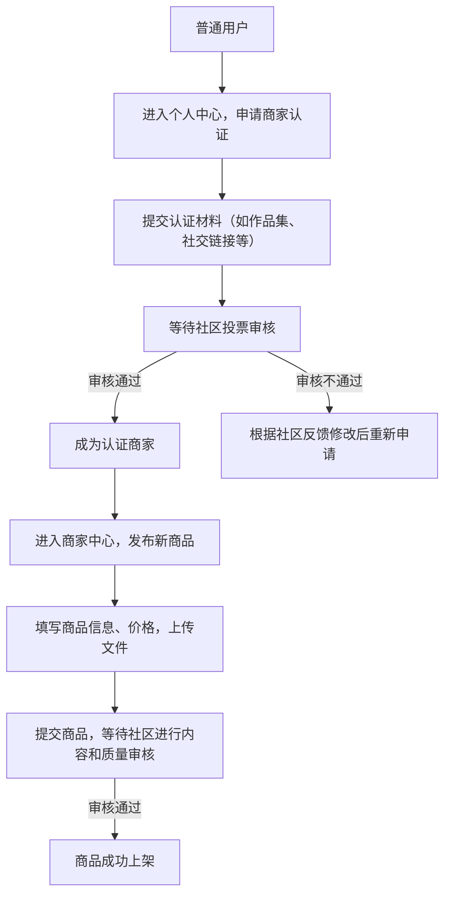
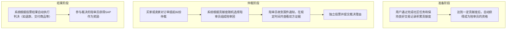
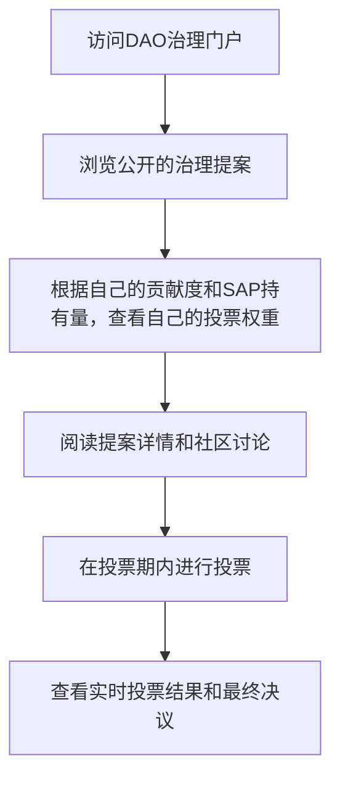
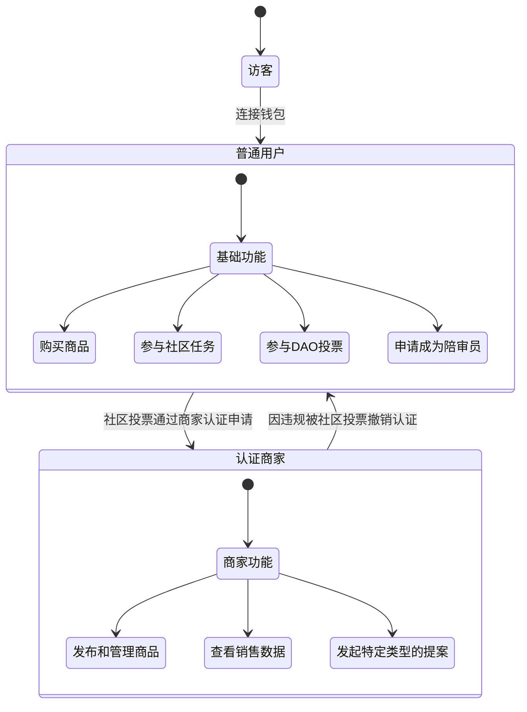
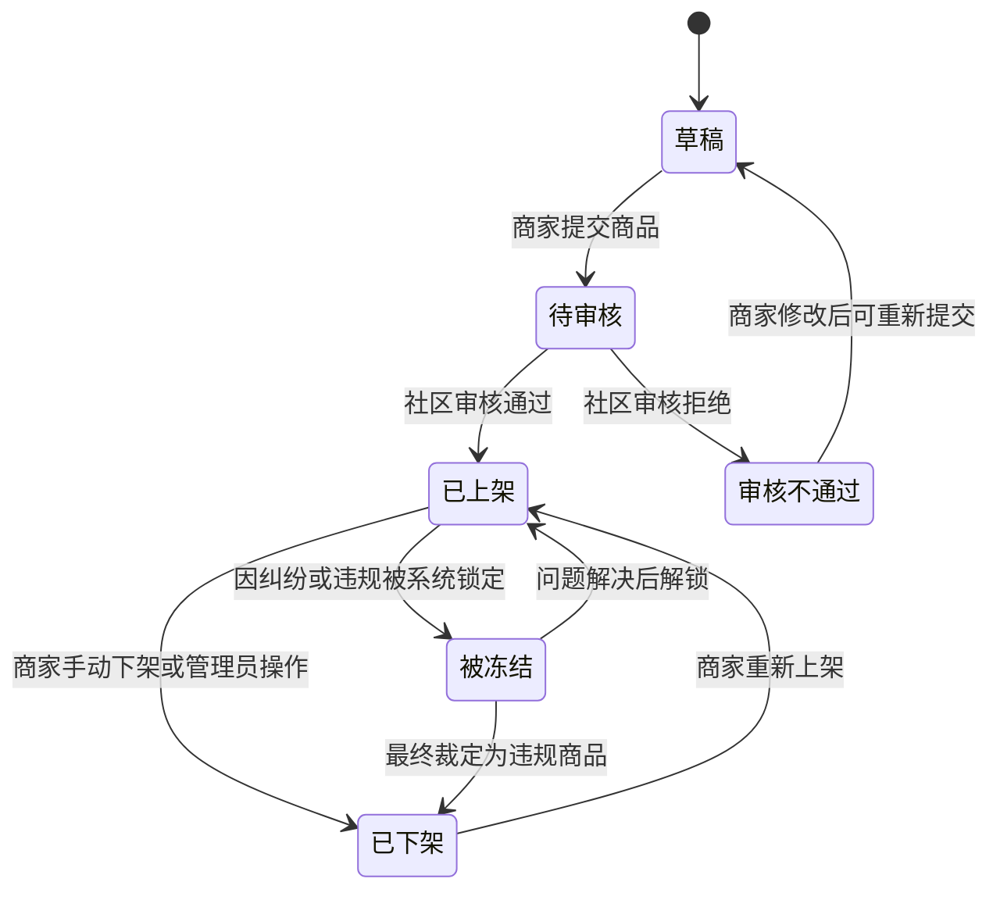
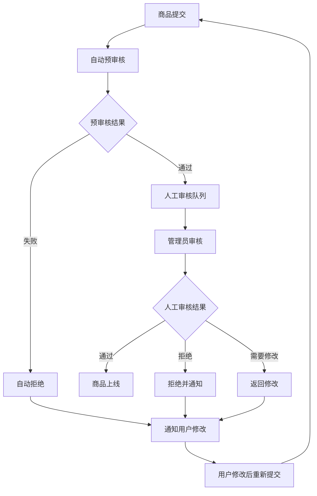

# Sapphire Mall 产品需求文档 (PRD)

## 1. 文档信息

### 1.1 版本历史
| 版本 | 日期 | 修改内容 | 作者 |
|------|------|----------|------|
| v0.1.0 | 2025-06-01 | 初始版本创建 | 产品经理 |
| v0.2.0 | 2025-06-01 | 架构优化：移除DeFi挖矿，增加DAO治理，多语言支持 | 产品经理 |
| v0.3.0 | 2025-06-01 | 完善用户模型，增加流动性质押收益，完善官网数据展示 | 产品经理 |
| v0.4.0 | 2025-07-21 | 重构产品定位，移除质押和流动性设计，聚焦虚拟商品交易与DAO治理 | 产品经理 |


### 1.2 文档目的
本文档详细描述Sapphire Mall（蓝宝石区块链电商系统）的产品需求、功能规格和实现要求，为设计、开发、测试团队提供完整的产品指导。

### 1.3 相关文档引用
- 产品路线图: `docs/Roadmap.md`
- 用户故事地图: `docs/User_Story_Map.md`
- 指标框架: `docs/Metrics_Framework.md`
- 产品白皮书: `docs/White_Paper.md`

## 2. 产品概述

### 2.1 业务背景
随着区块链技术和Web3理念的快速发展，数字资产和虚拟商品的交易需求日益增长。传统电商平台在虚拟商品流通、资产确权、交易透明度、清结算、纠纷处理、商品审核等方面存在诸多局限，难以满足新一代用户对数字经济的高效、安全、公平和去中心化的需求。

当前虚拟商品交易市场面临的主要挑战包括：
- **流通效率低下**: 传统平台需要多重中介，交易流程复杂冗长
- **资产确权困难**: 缺乏可信的数字资产所有权证明机制
- **交易透明度不足**: 分账规则不透明，创作者收益缺乏保障
- **支付方式局限**: 对加密货币支持不友好，兑换成本高昂
- **治理参与缺失**: 用户无法参与平台重大决策，缺乏社区治理机制
- **收益机制单一**: 用户资产无法获得持续收益，缺乏激励机制
- **商家资金压力大**:传统电商需要对订单进行清结算，周期慢
- **纠纷争议处理不透明**:传统电商的纠纷处理完全依托于中心化的处理机制，公平性难以
- **持续性的收益确实**：传统电商只是基于买卖双方的交易需求，而本平台可以通过深度参与平台电商活动（比如商品审核、纠纷解决等）持续获取SAP收益
- ...

在此背景下，Sapphire Mall应运而生，致力于构建一个专注虚拟商品交易的Web3平台，通过合约集成稳定币支付，实现点对点的极致购物体验，所有用户深度参与的下一代电商平台

### 2.2 产品名称与定位
**产品名称**: Sapphire Mall（蓝宝石区块链电商系统，简称Sapphire Mall）

**产品定位**: Sapphire Mall是一个专注于虚拟商品交易的创新型Web3电商平台。平台以其原生ERC20代币SAP作为核心的价值流通和社区治理媒介，同时全面支持稳定币（如USDT, USDC）作为主流支付方式，致力于为全球用户提供一个安全、透明、高效的去中心化交易环境。

**核心特色**:
- **Web3原生电商**: 基于区块链技术构建的新一代电商平台
- **虚拟商品专精**: 专注于数字内容、软件工具、在线服务等虚拟商品交易
- **Web3原生电商**: 基于区块链技术构建，确保交易的透明与不可篡改。
- **虚拟商品专精**: 专注于数字内容、软件工具、在线服务等实用性虚拟商品的交易。
- **双币支付系统**: 支持主流稳定币和平台原生SAP代币进行支付，满足不同用户偏好。
- **社区驱动的纠纷处理**: 引入创新的陪审员机制，由社区成员参与解决交易纠纷，确保公平公正。
- **深度DAO治理**: SAP持有者不仅能对平台重大决策投票，还能参与社区贡献任务（如商品审核、纠纷仲裁）并获得激励。
- **贡献激励**: 用户通过对平台的积极贡献（如审核、仲裁、推广）可以获得SAP代币奖励，形成良性生态循环。
- **多语言支持**: 支持中英文双语，面向全球用户
- **多角色权限**: 支持普通用户、认证商家、平台管理员等不同角色
- **其他各类审核机制不透明**:

### 2.3 产品愿景与使命
**愿景**: 成为全球领先的Web3虚拟商品交易平台，通过DAO治理实现社区自治，用户通过深度参与内容创作、商品审核、纠纷处理，推动数字经济创新发展。

**使命**: 提供一个安全、透明、高效的虚拟商品交易环境，通过社区驱动的治理和激励机制，赋能全球创造者和消费者。

### 2.4 产品价值主张与独特卖点(USP)
- **实用虚拟商品交易**: 区别于OpenSea的纯NFT交易，提供实际可用的虚拟商品
- **社区驱动的公平仲裁**: 创新的陪审员制度，解决传统电商平台纠纷处理不透明的痛点。
- **贡献即价值**: 用户的每一次有效贡献（审核、仲裁）都能转化为实实在在的代币激励。
- **稳定币支付**: 提供法币世界熟悉的稳定币支付选项，降低新用户进入门槛。
- **DAO治理参与**: SAP持有者可参与平台重大决策投票
- **透明链上结算**: 所有交易记录不可篡改，保障交易透明度
- **多语言体验**: 中英文双语支持，面向全球用户
- **分层用户体系**: 支持不同角色用户的差异化功能和权限

### 2.5 目标平台列表
- **Web端**: 主要部署平台，支持桌面浏览器
- **移动端Web**: 响应式设计，支持移动浏览器访问
- **区块链网络**: 
  - 主网：以太坊主网
  - 测试网：Sepolia测试网络（开发阶段）
  - 支持网络切换：Ethereum、Polygon、BSC
- **语言支持**：
  - 中文（简体）
  - English

### 2.6 产品核心假设
1. 虚拟商品市场需求持续增长，用户愿意使用加密货币购买
2. 社区驱动的纠纷处理机制能有效、公正地解决交易争议。
3. 贡献激励模型能有效激励用户参与平台治理和日常运营（如商品审核）。
4. DAO治理机制能够增强用户参与度和平台粘性
5. 多语言支持能够扩大用户群体，提升国际化程度
6. 分层用户体系能够满足不同用户的差异化需求
7. 新手友好的设计能够降低Web3用户准入门槛

### 2.7 商业模式概述
- **主要收入**: 交易手续费（对每笔成功交易收取一定比例的费用）、商家服务费（如商品推荐、广告位等增值服务）。
- **代币机制**: SAP代币作为平台治理和激励的核心，用于投票、支付特定服务、以及作为社区贡献的奖励。
- **收益分配**: 平台收入的一部分将注入社区金库，由DAO决定其用途，例如用于生态发展、回购销毁SAP或奖励社区贡献者。
- **治理机制**: DAO治理不仅限于重大决策，还包括日常运营规则的制定与修改。
- **融资计划**: 通过代币公募和私募进行初期融资。


### 2.8 代币经济模型（Tokenomics）

#### 2.8.1 SAP代币基本信息
- **代币标准**: ERC-20
- **代币名称**: Sapphire Mall Token
- **代币符号**: SAP
- **总供应量**: 1,000,000,000 SAP (10亿)
- **合约地址**: `[部署后公布]`
- **代币类型**: 治理代币 & 实用代币

#### 2.8.2 代币分配方案

| 分配对象 | 数量 | 比例 | 锁仓与释放规则 |
|---|---|---|---|
| **社区激励** | 400,000,000 SAP | 40% | TGE不释放，之后48个月线性释放，用于奖励社区贡献者（审核、仲裁、内容创作等） |
| **生态基金** | 200,000,000 SAP | 20% | TGE释放10%，剩余部分在24个月内线性释放，用于市场推广、合作、开发者激励 |
| **团队** | 150,000,000 SAP | 15% | 锁仓12个月，之后36个月线性释放 |
| **投资者** | 150,000,000 SAP | 15% | 根据轮次和协议确定（例如：锁仓6个月，之后24个月线性释放） |
| **社区金库** | 100,000,000 SAP | 10% | 由DAO治理决定其使用，用于平台长期发展和生态建设 |

#### 2.8.3 代币核心功用 (Utility)

1.  **治理投票**: SAP是参与平台DAO治理的唯一凭证，持有者可以对平台费率、功能更新、金库使用等关键决策进行投票。
2.  **支付媒介**: 用户可选择使用SAP代币支付商品，并可能享受交易费折扣。
3.  **成为陪审员**: 用户需质押一定数量的SAP代币，才能获得成为纠纷处理陪审员的资格。
4.  **商家保证金**: 认证商家需要质押SAP作为信誉保证金，保证服务质量。
5.  **社区任务激励**: 完成平台发布的任务（如商品审核、内容翻译、市场推广）可获得SAP奖励。

#### 2.8.4 代币价值捕获与通缩机制

-   **价值捕获**:
    -   平台交易手续费的一部分将进入社区金库，由DAO投票决定用于回购SAP、奖励贡献者或投资生态项目，从而增加SAP的需求。
    -   所有需要质押SAP的场景（如商家保证金、陪审员资格）都会减少市场的流通供应量。
-   **通缩机制**:
    -   **回购与销毁**: DAO可以投票决定，使用社区金库的部分资金从二级市场回购SAP并进行销毁。
    -   **特定费用销毁**: 部分特定操作（如创建高级商家店铺）可能会收取SAP并直接销毁。

#### 2.8.5 治理机制设计

-   **DAO治理框架**: 基于Snapshot和Aragon等成熟方案，实现链下投票与链上执行相结合。
-   **提案与投票**: 任何持有超过特定数量SAP的用户都可以发起提案。投票权重与持有的SAP数量成正比。
-   **社区金库管理**: 社区金库由多签钱包管理，其任何资金动用都必须经过DAO的投票批准。

#### 2.8.6 风险控制

-   **治理攻击防护**: 设置合理的提案门槛和投票通过率，引入时间锁（Time Lock）机制，防止恶意提案被迅速执行。
-   **经济模型风险**: 定期由社区和专家评估代币经济模型的健康度，并通过治理进行调整。
-   **安全审计**: 所有核心智能合约都将经过多家知名安全公司的审计。


## 3. 用户研究

### 3.1 用户角色模型

#### 3.1.1 普通用户（基础角色）
**定义**: 持有钱包地址，完成钱包连接的基础用户

**权限功能**:
- 浏览商品和平台信息
- 使用稳定币或SAP代币购买商品
- 参与DAO治理投票（需持有SAP）
- 参与社区讨论
- 购买平台商品
- 查看个人交易历史和资产信息

**使用限制**:
- 无法发布商品
- 无法执行平台管理操作
- 投票权重基于SAP持有量

**典型用户画像**:
- 年龄: 20-50岁
- 职业: 投资者、Web3爱好者、数字资产持有者
- 技能: 基础的区块链操作能力
- 动机: 购买独特的虚拟商品、参与社区共建、通过贡献获得收益

#### 3.1.2 认证用户（商家角色）
**定义**: 通过KYC认证，获得商品发布权限的用户

**权限功能**:
- 包含普通用户的所有功能
- 发布和管理虚拟商品
- 设置商品价格和库存
- 查看商品销售数据和收益统计
- 管理商品评价和客户反馈
- 作为陪审员参与纠纷仲裁
- 发布社区任务

**认证要求**:
- 身份验证（KYC）
- 缴纳商家保证金（100 SAP）
- 同意商家服务协议
- 提供商家资质证明

**典型用户画像**:
- 年龄: 25-45岁
- 职业: 内容创作者、软件开发者、设计师、教育机构
- 技能: 专业技能 + 基础区块链操作
- 动机: 在一个公平透明的平台销售自己的数字产品、获得加密货币收入、建立Web3品牌声誉

#### 3.1.3 平台管理员（管理角色）
**定义**: 平台官方指定的管理人员，具有平台管理权限

**权限功能**:
- 包含认证用户的所有功能
- 审核商品发布申请
- 处理用户投诉和争议
- 执行紧急暂停操作
- 管理平台参数设置
- 查看平台全局数据和统计
- 发起平台治理提案
- 管理平台公告和通知

**管理权限分级**:
- **超级管理员**: 拥有所有管理权限
- **商品管理员**: 专门负责商品审核和管理
- **客服管理员**: 处理用户投诉和客服问题
- **技术管理员**: 负责技术维护和紧急操作

**典型用户画像**:
- 年龄: 28-40岁
- 职业: 平台运营人员、技术人员、客服人员
- 技能: 专业运营能力 + 深度区块链理解
- 动机: 维护平台稳定运行、提升用户体验、推动生态发展

### 3.2 目标用户画像

#### 3.2.1 人口统计特征
**用户画像1: Web3探索者/新手 (Alex)**
- **人口统计**: 22岁，大学生，对加密货币和NFT有基本了解，但交易经验不多。
- **行为习惯**: 活跃于Twitter和Discord，关注KOL，喜欢尝试新DApp，但对复杂的DeFi操作感到畏惧。
- **核心需求与痛点**: 想要购买一些酷的、实用的数字商品（比如游戏皮肤、软件插件），但害怕被骗；希望有一个简单、安全、支持稳定币支付的平台。
- **动机与目标**: 探索Web3世界，以低风险的方式参与其中，购买到心仪的虚拟商品。

**用户画像2: 数字内容创作者/商家 (Maria)**
- **人口统计**: 35岁，独立设计师，有自己的在线课程和设计素材。
- **行为习惯**: 在多个传统平台销售作品，但对高昂的平台抽成和不透明的审核规则感到不满。
- **核心需求与痛点**: 寻找一个抽成更低、结算更快、规则更透明的销售渠道；希望自己的作品能被全球用户看到；担心交易纠纷难以解决。
- **动机与目标**: 增加收入，降低对传统平台的依赖，建立自己在Web3领域的品牌，并与一个公平的社区共同成长。

**用户画像3: 社区治理者/贡献者 (Ben)**
- **人口统计**: 40岁，资深加密货币投资者，对DAO和社区治理有浓厚兴趣。
- **行为习惯**: 深度参与多个DeFi和DAO项目，喜欢分析项目机制，并积极在社区提出建议。
- **核心需求与痛点**: 希望找到一个真正由社区驱动的项目，自己的贡献能够被认可并获得回报；厌倦了中心化团队掌控一切的“伪DAO”。
- **动机与目标**: 成为社区的核心成员，通过自己的专业知识（如审核商品、作为陪审员）帮助平台成长，并从中获得可观的SAP代币奖励，实现个人价值与平台发展的统一。

#### 3.2.2 行为习惯与偏好
- 活跃于社交媒体和加密货币社区
- 对新技术接受度高，但期望简单易用的界面
- 关注平台治理参与和社区建设
- 重视资产收益和投资回报
- 倾向于在线消费虚拟商品和服务
- 重视多语言支持和国际化体验

#### 3.2.3 核心需求与痛点
**全球加密货币用户痛点**:
- **Web3探索者**: 担心交易安全，害怕复杂的钱包操作和Gas费；平台界面对新手不友好。
- **内容创造者**: 传统平台抽成高，审核慢且标准不一；交易纠纷处理不公，耗时耗力。
- **社区治理者**: 很多项目的DAO名存实亡，社区贡献得不到应有回报；平台发展方向由少数人决定。

**内容创造者痛点**:
- 传统平台抽成过高，收益被中间商分割
- 缺乏透明的分账和结算机制
- 希望扩大作品的全球销售渠道
- 需要多语言支持触达更多用户
- 商品审核流程复杂且不透明

#### 3.2.4 动机与目标
- **便利性**: 简化虚拟商品购买流程，多语言体验
- **收益性**: 通过对社区的贡献（审核、仲裁等）获得SAP代币奖励。
- **参与性**: 通过DAO治理参与平台重大决策
- **透明性**: 享受区块链带来的透明可信交易
- **全球化**: 通过多语言支持扩大市场覆盖

### 3.3 用户场景分析

#### 3.3.1 核心使用场景详述
**场景1: 创作者Maria发布并销售自己的设计模板**
- Maria完成商家认证，并质押了少量SAP作为保证金。
- 她上传了自己的设计模板，填写了中英文描述和价格（以USDC计价）。
- 社区审核员（由质押SAP的活跃用户担任）快速审核通过了她的商品。
- 新手用户Alex浏览平台，发现了Maria的模板，他使用钱包里的USDC轻松完成了购买。
- 交易完成后，扣除少量平台手续费，大部分USDC立即到达Maria的钱包。

**场景2: 认证用户发布商品销售**
- 用户完成KYC认证成为商家
- 上传数字商品（支持中英文描述）
- 设置SAP价格并支付上架费
- 商品通过平台审核后上线销售
- 获得销售收益的链上自动分账

**场景2: 用户Alex与商家Maria产生交易纠纷**
- Alex购买后发现模板文件有损坏，与Maria沟通未果，于是向平台提起仲裁申请。
- 系统随机从陪审员池中抽取了3位陪审员（包括Ben）来审理此案。
- Alex和Maria分别提交了证据。Ben和其他陪审员审查后，投票认定商家责任更大。
- 系统根据投票结果，自动将Alex支付的USDC退还给他，并从Maria的保证金中扣除一部分作为对Alex的补偿和对陪审员的奖励。

**场景3: 社区贡献者Ben通过参与治理获得收益**
- Ben质押了足够的SAP，成为了社区陪审员和高级商品审核员。
- 他每天会花一些时间审核新上架的商品，并参与了几次交易仲裁。
- 每一次有效的审核和公正的裁决，系统都会自动向他的地址发送SAP代币奖励。
- 他还发现了一个关于优化审核奖励机制的提案，并投票表示支持。

**场景4: 用户参与DAO治理**
- SAP持有者收到治理提案通知
- 查看提案详情（支持中英文）
- 参与社区讨论和投票
- 投票结果自动执行

**场景5: 平台管理员处理紧急情况**
- 管理员发现恶意商品或异常交易
- 执行紧急暂停相关功能
- 启动争议处理流程
- 发布平台公告说明情况
- 修复问题后恢复正常运行

#### 3.3.2 边缘使用场景考量
- 网络切换时的用户体验优化
- 多语言环境下的客服支持
- 跨时区的DAO治理参与
- 移动端用户的简化操作流程
- 大额交易的风险控制和审核

## 4. 市场与竞品分析

### 4.1 市场规模与增长预测
- **虚拟商品市场**: 预计2024年达到1950亿美元
- **Web3电商市场**: 潜力巨大，但仍处于早期，缺乏成熟的、专注于实用虚拟商品的平台。
- **全球电商多语言需求**: 75%的消费者更愿意用母语购物
- **DAO治理参与度**: Web3项目中80%用户关注治理参与
- **增长趋势**: 虚拟商品和DeFi质押市场预计年增长率25%+

### 4.2 行业趋势分析
- **实用性虚拟商品兴起**: 从纯收藏向实用功能转变
- **贡献激励模型（X-to-Earn）**: Play-to-Earn, Contribute-to-Earn等模型被验证是有效的用户激励和社区增长手段。
- **DAO治理普及**: Web3项目普遍引入社区治理机制
- **多语言国际化**: 全球化平台必备功能
- **用户体验重视度提升**: Web3应用更注重易用性

### 4.3 竞争格局分析

#### 4.3.1 直接竞争对手详析

**G2A, Kinguin**
- **优势**: 在游戏CDKey等虚拟商品领域拥有庞大用户基础和知名度。
- **劣势**: 中心化平台，存在高手续费、欺诈、账户被封等风险；交易不透明，纠纷处理依赖平台客服。

**传统电商平台 (如淘宝虚拟商品、Fiverr)**
- **优势**: 用户基数巨大，使用门槛低。
- **劣势**: 高平台抽成，结算周期长，规则不透明，对加密货币不友好。

**OpenSea (作为参照)**
- **优势**: Web3领域绝对的领导者，品牌效应强。
- **劣势**: 专注于NFT收藏品和艺术品，对实用性虚拟商品支持不足；交易费用高昂。

### 4.4 竞品功能对比矩阵

| 功能特性 | Sapphire Mall | G2A / Kinguin | Fiverr | OpenSea |
|---|---|---|---|---|
| **核心业务** | 实用虚拟商品 | 游戏Key/软件 | 技能服务 | NFT收藏品 |
| **支付方式** | 加密货币 (稳定币/SAP) | 法币 | 法币 | 加密货币 (ETH等) |
| **交易手续费** | 较低 (DAO可调) | 高 | 高 (20%+) | 较高 (2.5%) |
| **结算速度** | 即时 (链上) | 慢 (数天) | 慢 (14天+) | 即时 (链上) |
| **纠纷处理** | 社区陪审员制度 | 中心化客服 | 中心化客服 | 较弱 |
| **社区治理** | 深度DAO治理 | 无 | 无 | 弱 |
| **贡献者激励** | ✅ | ❌ | ❌ | ❌ |

### 4.5 市场差异化策略
1.  **赛道定位**: 专注于传统电商平台和NFT市场之间的巨大空白——实用性虚拟商品。
2.  **治理与激励**: 以社区驱动的治理和贡献激励为核心护城河，建立高粘性、高参与度的社区。
3.  **公平与透明**: 通过区块链和社区仲裁，从根本上解决传统虚拟商品交易的信任问题。
4.  **低门槛**: 支持稳定币支付，降低Web2用户进入的门槛。

## 5. 产品功能需求

### 5.1 功能架构与模块划分

```mermaid
graph TB
    A[Sapphire Mall平台] --> B[用户与账户模块]
    A --> C[商品管理模块]
    A --> D[交易与支付模块]
    A --> E[社区与治理模块]
    A --> F[系统与支持模块]

    B --> B1[钱包连接/注册]
    B --> B2[商家认证]
    B --> B3[用户画像与信誉]
    B --> B4[个人中心]

    C --> C1[商品发布]
    C --> C2[社区审核]
    C --> C3[商品管理]
    C --> C4[商品搜索与发现]

    D --> D1[订单系统]
    D --> D2[支付网关 (稳定币/SAP)]
    D --> D3[交易历史]
    D --> D4[纠纷处理系统]

    E --> E1[DAO治理门户]
    E --> E2[社区任务中心]
    E --> E3[陪审员系统]
    E --> E4[社区论坛]

    F --> F1[多语言支持]
    F --> F2[帮助中心与文档]
    F --> F3[平台数据展示]
    F --> F4[管理后台]
    
    G --> G1[提案创建]
    G --> G2[投票参与]
    G --> G3[治理执行]
    
    H --> H1[语言切换]
    H --> H2[多语言内容]
    H --> H3[本地化适配]
    
    I --> I1[钱包连接]
    I --> I2[网络切换]
    I --> I3[资产管理]
    
    J --> J1[数据统计]
    J --> J2[实时展示]
    J --> J3[数据分析]
    
    K --> K1[用户管理]
    K --> K2[商品审核]
    K --> K3[系统配置]
    K --> K4[紧急操作]
```

### 5.2 核心功能详述

#### 5.2.1 用户与账户模块

**功能描述**: 为用户提供安全的账户管理、清晰的角色身份以及流畅的认证体验。

**用户价值**: 保障账户安全，明确用户在平台中的角色与权益，激励用户通过认证解锁更多功能。

**功能点1: 钱包连接与用户识别**
- **功能描述**: 作为用户，我想要通过连接我的Web3钱包（如MetaMask）来登录和使用平台。
- **功能逻辑**: 用户点击“连接钱包”按钮，选择钱包类型，授权连接。系统通过钱包地址识别用户，如果是首次连接，则自动创建新用户档案。
- **验收标准**: 用户可以顺畅地连接和断开钱包；平台能准确识别并加载用户数据。

**功能点2: 商家认证流程**
- **功能描述**: 作为希望销售商品的用户，我想要完成商家认证，以获得发布商品的权限。
- **功能逻辑**: 用户在个人中心提交认证申请，可能需要提供社交媒体链接、过往作品集等证明。社区或平台团队审核通过后，用户需质押指定数量的SAP作为保证金，完成认证。
- **验收标准**: 认证流程清晰引导；用户可随时查看认证状态；认证成功后，商家身份有明确标识。

**交互要求**:
- 清晰的角色标识和权限说明
- 便捷的认证申请流程
- 认证进度实时跟踪
- 权限升级引导

**数据需求**:
- 用户基础信息
- KYC认证材料
- 角色权限配置
- 认证审核记录

**技术依赖**:
- 身份认证服务
- 文件存储系统
- 权限管理框架
- 审核工作流系统

**验收标准**:
- KYC认证成功率 > 95%
- 认证审核时间 < 48小时
- 权限控制准确率 100%
- 用户权限升级流程完整

#### 5.2.2 商品管理与交易模块

**功能描述**: 为商家提供易用的商品管理工具，为买家提供流畅、安全的购物体验。

**用户价值**: 赋能创作者轻松变现，让消费者放心购买虚拟商品。

**功能点1: 商品发布与社区审核**
- **功能描述**: 作为认证商家，我想要上传我的虚拟商品，并提交给社区进行审核。
- **功能逻辑**: 商家填写商品信息（支持中英文）、定价（可用稳定币或SAP）、上传商品文件（存储于IPFS）。提交后，商品进入社区审核池，由活跃的社区贡献者进行审核。
- **验收标准**: 商品发布流程顺畅；审核标准清晰；商家可以追踪审核进度。

**功能点2: 双币支付系统**
- **功能描述**: 作为买家，我希望能用主流稳定币（USDT/USDC）或平台的SAP代币来支付订单。
- **功能逻辑**: 在结算页面，用户可以选择支付币种。系统会根据所选币种调用相应的智能合约完成支付。使用SAP支付可能享受手续费折扣。
- **验收标准**: 用户可以成功使用稳定币和SAP完成支付；交易记录准确无误。

**功能点3: 订单与交易历史**
- **功能描述**: 作为用户，我想要查看我所有的购买和销售记录。
- **功能逻辑**: 个人中心提供完整的订单历史，包括商品信息、交易金额、时间、状态等。数据直接从链上索引，确保真实可信。
- **验收标准**: 交易历史数据准确、完整，并能与区块链浏览器数据对应。

**交互要求**:
- 醒目的数据卡片设计
- 动态数字滚动效果
- 趋势图表可视化
- 移动端适配优化

**数据需求**:
- 实时交易数据
- 用户活跃度统计
- 商品上架数据
- 流动性池数据
- 收益分配记录

**技术依赖**:
- 区块链数据索引
- 实时数据流处理
- 数据可视化组件
- 缓存优化系统

**验收标准**:
- 数据更新延迟 < 5分钟
- 数据准确率 > 99.9%
- 页面加载时间 < 2秒
- 支持多语言数字格式
- 移动端显示完美

#### 5.2.3 社区与治理模块

**功能描述**: 构建一个由社区驱动的、公平透明的治理与激励生态。

**用户价值**: 让用户成为平台的主人，通过贡献获得回报，共同推动平台发展。

**功能点1: DAO治理门户**
- **功能描述**: 作为SAP持有者，我想要参与平台重大决策的投票。
- **功能逻辑**: 集成Snapshot等治理工具，用户可浏览提案、参与讨论并根据持有的SAP数量进行投票。
- **验收标准**: 投票流程透明、公正；投票结果能被有效执行。

**功能点2: 社区贡献任务中心**
- **功能描述**: 作为用户，我想要通过完成平台发布的任务（如审核商品、翻译内容）来赚取SAP奖励。
- **功能逻辑**: 平台或社区发布带有SAP奖励的任务，用户领取并完成后提交证明，审核通过后自动获得奖励。
- **验收标准**: 任务系统清晰易用；奖励发放及时准确。

**功能点3: 社区驱动的纠纷处理系统**
- **功能描述**: 当交易发生纠纷时，我希望能由社区组成的陪审团来进行公正的裁决。
- **功能逻辑**: 买卖双方可发起仲裁申请。系统从质押了SAP的陪审员池中随机选择成员组成陪审团。陪审团根据双方证据进行投票，系统根据结果自动执行判决（如退款、赔付保证金），并奖励陪审员。
- **验收标准**: 仲裁流程高效、透明；判决结果能被强制执行。

**交互要求**:
- 直观的质押操作界面
- 实时收益和APY显示
- 收益提取确认界面
- 质押历史和统计

**数据需求**:
- 流动性池数据
- 用户质押记录
- 收益计算数据
- 手续费分配记录
- APY历史数据

**技术依赖**:
- 流动性池智能合约
- 质押奖励合约
- 收益分配算法
- 实时数据同步

**验收标准**:
- 收益计算准确率 100%
- 质押操作成功率 > 99%
- 收益提取实时到账
- APY计算准确无误
- 支持所有主要交易对

#### 5.2.4 系统与支持模块

**功能描述**: 提供平台基础支持功能，确保用户获得良好体验。

**用户价值**: 提升平台易用性和可信度。

**功能点1: 平台数据展示**
- **功能描述**: 我想在官网首页看到核心数据，如总交易额(GMV)、活跃用户数、社区金库总额、已处理纠纷数等。
- **功能逻辑**: 前端从链上和后端服务获取数据并进行可视化展示。
- **验收标准**: 数据准确、更新及时。

**功能点2: 多语言支持**
- **功能描述**: 我希望能切换中英文界面。
- **功能逻辑**: 提供全局语言切换功能，所有界面元素和内容支持双语。
- **验收标准**: 语言切换流畅，翻译准确。

**功能点3: 管理后台**
- **功能描述**: 平台管理员需要一个后台来管理用户、审核内容、处理紧急事务。
- **功能逻辑**: 根据不同管理员角色（运营、客服、技术）提供定制化的操作界面和权限。
- **验收标准**: 权限控制严格，功能满足运营需求。

**交互要求**:
- 固定顶部导航栏
- 清晰的功能分组
- 平滑的页面过渡
- 响应式移动端适配
- 状态变化及时反馈

**数据需求**:
- 用户钱包状态
- 当前网络信息
- 用户权限等级
- 导航菜单配置

**技术依赖**:
- 前端路由管理
- 钱包状态管理
- 网络检测API
- 用户权限系统

**验收标准**:
- 导航响应时间 < 0.5秒
- 钱包连接成功率 > 98%
- 网络切换成功率 > 95%
- 移动端适配完美
- 个人中心功能完整

#### 5.2.5 商品管理与交易模块

**功能描述**:
作为认证用户，我想要发布和管理我的虚拟商品，作为普通用户，我想要浏览和购买平台上的商品。

**用户价值**:
- 为创作者提供销售渠道
- 为用户提供丰富的商品选择
- 保障交易安全和透明
- 提供完整的交易体验

**功能逻辑与规则**:
1. **商品发布**（认证用户）:
   - 商品信息：标题、描述、价格、分类、标签
   - 支持中英文双语描述
   - 商品文件上传（IPFS存储）
   - 设置库存和销售限制
   - 缴纳上架费（商品价值的5%）

2. **商品审核**（平台管理员）:
   - 自动审核：检查基础规范
   - 人工审核：内容合规性检查
   - 审核周期：24小时内完成
   - 审核结果：通过/拒绝/需要修改

3. **商品展示**:
   - 商品列表页：网格/列表视图
   - 商品详情页：完整信息展示
   - 搜索功能：标题、分类、标签搜索
   - 筛选功能：价格、分类、评分筛选
   - 排序功能：价格、评分、销量、时间

4. **购买流程**:
   - 选择商品 → 确认订单 → SAP支付 → 获得访问权
   - 支付确认：智能合约托管
   - 自动分账：平台费5% + 创作者95%
   - 即时交付：数字商品立即交付

5. **评价系统**:
   - 购买后可评价：1-5星评分 + 文字评价
   - 评价展示：支持中英文显示
   - 评价统计：平均评分、评价数量
   - 评价审核：防止恶意评价

**交互要求**:
- 直观的商品发布向导
- 丰富的商品展示页面
- 便捷的搜索和筛选
- 流畅的购买流程
- 完善的评价系统

**数据需求**:
- 商品基础信息
- 商品文件存储
- 用户购买记录
- 评价和评分数据
- 销售统计数据

**技术依赖**:
- IPFS文件存储
- 智能合约支付
- 搜索引擎
- 审核工作流
- 自动分账系统

**验收标准**:
- 商品发布成功率 > 98%
- 审核完成时间 < 24小时
- 搜索响应时间 < 2秒
- 支付成功率 > 99%
- 商品交付时间 < 1分钟

#### 5.2.6 后台管理系统模块

**功能描述**:
作为平台的不同角色用户，我需要一个功能完整、权限清晰的后台管理系统，以便高效地管理我的资产、业务和平台操作。

**用户价值**:
- 提供角色化的管理界面
- 统一的数据查看和操作入口
- 高效的业务管理工具
- 完善的权限控制体系

###### 5.2.5.1 普通用户后台

**主菜单结构**:

```
普通用户后台
├── 个人中心
│   ├── 个人信息
│   ├── 账户设置
│   └── 安全中心
├── 我的资产
│   ├── 资产概览
│   └── 交易历史
├── 我的贡献
│   ├── 任务中心
│   ├── 仲裁案件
│   └── 贡献历史
└── DAO治理
    ├── 治理门户
    └── 我的投票
```

**个人中心模块**:
- **个人信息页面**:
  - 用户头像、昵称、邮箱、手机号管理
  - 个人简介和偏好设置
  - 账户等级和认证状态
  - 实名认证入口（升级为认证商户）
- **账户设置页面**:
  - 密码修改和安全问题设置
  - 邮箱绑定和验证
  - 钱包地址管理
  - 语言和时区设置
- **安全中心页面**:
  - 二次验证设置（2FA）
  - 登录设备管理
  - 安全日志查看
  - 异常登录提醒
- **通知设置页面**:
  - 邮件通知偏好
  - 站内消息设置
  - 推送通知管理
  - 营销信息订阅

**我的资产模块**:
- **资产概览页面**: 展示用户钱包中与平台相关的代币余额（SAP、USDT等）。
- **交易历史页面**: 筛选并展示用户的购买、销售、奖励收入等所有链上交易记录。

**交易管理模块**:
- **收货地址页面**:
  - 收货地址列表管理
  - 添加/编辑/删除地址
  - 默认地址设置
  - 地址验证功能
- **我的订单页面**:
  - 订单列表（全部/待付款/已完成/已取消）
  - 订单详情查看
  - 订单状态跟踪
  - 重新购买功能
- **退款/售后页面**:
  - 退款申请提交
  - 售后服务申请
  - 处理进度跟踪
  - 客服沟通记录

**我的贡献模块**:
- **任务中心页面**: 浏览并申领社区发布的各类贡献任务。
- **仲裁案件页面**: 如果用户是陪审员，在此处理分配到的纠纷案件。
- **贡献历史页面**: 记录用户所有的贡献活动（完成的任务、参与的仲裁）和获得的奖励。

**DAO治理模块**:
- **治理门户页面**: 访问所有公开的治理提案。
- **我的投票页面**: 查看自己参与过的投票历史。

##### 5.2.6.2 认证商户后台（5个主模块）

**主菜单结构**:

```
认证商户后台
├── 个人中心（继承普通用户功能）
├── 我的资产（继承普通用户功能）
├── 交易管理（继承普通用户功能）
├── DAO治理
│   ├── 治理概览
│   ├── 提案管理
│   ├── 商家治理
│   └── 社区参与
└── 商家中心
    ├── 商品管理
    ├── 订单管理
    ├── 评价管理
    └── 交易数据
```

**DAO治理模块**（认证商家）:
- **治理概览页面**:
  - 商家投票权重展示（增强权重）
  - 治理贡献度统计
  - 商家信誉分数与贡献度
  - 参与的商家专属提案
- **提案管理页面**:
  - 浏览、筛选、搜索所有治理提案
  - **发起商家相关提案**（例如，关于特定商品分类的规则调整）
  - 跟踪自己发起和参与投票的提案状态
- **商家治理页面**:
  - 参与对平台级规则（如商家认证标准、手续费率）的投票
  - 作为候选人参与商家委员会选举
- **社区参与页面**:
  - 查看和参与社区活动
  - 对新申请认证的商家进行投票

**商家中心模块**:
- **商品管理页面**:
  - 列表展示：商品信息、价格、库存、销量、社区审核状态、操作
  - 新增/编辑商品：支持中英文，设置价格（SAP/USDT），上传商品文件（IPFS），设置分类标签
  - 商品状态管理：上架/下架
  - 查看社区审核意见
- **订单管理页面**:
  - 列表展示：订单号、商品信息、买家、价格、支付状态、纠纷状态
  - 查看订单详情
  - 订单搜索和筛选
  - 导出销售记录
- **评价管理页面**:
  - 查看和回复用户评价
  - 对恶意评价提起申诉
- **交易数据页面**:
  - 销售数据概览：销售额、订单数、收入
  - 销售趋势图表
  - 商品销售排行榜
  - 收入明细

##### 5.2.6.3 系统管理员后台

**主菜单结构**:

```
系统管理员后台
├── 平台概览
│   ├── 核心数据监控
│   └── 系统状态
├── 用户与商户管理
│   ├── 用户列表
│   └── 商户管理
├── 内容与交易管理
│   ├── 商品审核
│   ├── 订单监控
│   ├── 评价管理
│   └── 举报处理
├── 社区与治理
│   ├── 任务管理
│   ├── 纠纷仲裁管理
│   ├── 提案管理
│   └── 治理参数配置
└── 系统设置
    ├── 平台参数配置
    ├── 合约管理
    ├── 操作日志
    └── 权限管理
```

**平台概览模块**:
- **核心数据监控页面**: 实时监控平台关键指标（DAU, MAU, 交易量, 平台收入, 活跃贡献者数等）。
- **系统状态页面**: 查看区块链网络状态、智能合约健康度、服务器资源使用情况。

**用户与商户管理模块**:
- **用户列表页面**: 查看、搜索、筛选所有用户，管理用户状态（正常/封禁）。
- **商户管理页面**: 查看、搜索、筛选所有认证商户，处理商户认证申请的最终复核，管理商户信誉分。

**内容与交易管理模块**:
- **商品审核页面**: 查看社区审核结果，对有争议的商品进行最终裁定。
- **订单监控页面**: 监控异常订单，处理支付失败等问题。
- **评价管理页面**: 处理商家对恶意评价的申诉。
- **举报处理页面**: 处理用户对商品、用户、评价的举报。

**社区与治理模块**:
- **任务管理页面**: 发布官方社区贡献任务，审核任务完成情况，发放奖励。
- **纠纷仲裁管理页面**: 监控仲裁案件流程，处理极端或无法解决的纠纷，管理陪审员库。
- **提案管理页面**: 审核提案合规性，管理紧急提案，监控提案执行。
- **治理参数配置页面**: 设置和调整DAO治理的核心参数（如投票权重、提案门槛、社区贡献度算法等）。

**系统设置模块**:
- **平台参数配置页面**: 管理平台手续费率、支付网关等。
- **合约管理页面**: 监控核心智能合约运行状态，计划和执行合约升级。
- **操作日志页面**: 审计所有管理员的操作记录。
- **权限管理页面**: 管理不同管理员角色的权限。

**交互要求**: 
- 清晰的角色权限界面区分
- 直观的数据可视化展示
- 便捷的批量操作功能
- 完善的搜索和筛选
- 响应式移动端适配

**数据需求**:
- 用户角色和权限数据
- 业务操作记录数据
- 统计分析数据
- 系统配置数据
- 审计日志数据

**技术依赖**:
- 角色权限管理系统
- 数据可视化组件
- 实时数据同步
- 审计日志系统
- 安全认证机制

**验收标准**:
- 角色权限控制准确率 100%
- 页面加载时间 < 3秒
- 数据更新延迟 < 5分钟
- 操作响应时间 < 1秒
- 移动端适配完美
- 安全审计完整覆盖

### 5.3 次要功能描述

#### 5.3.1 帮助中心与客服系统
- 多语言FAQ系统，解答用户常见问题。
- 提供图文并茂的操作指南和视频教程。
- 集成在线客服支持，处理用户个性化问题。
- 建立问题工单系统，跟踪和管理复杂问题。

#### 5.3.2 通知与消息系统
- **站内信**: 用于接收系统公告、交易状态变更、社区任务提醒、纠纷案件通知和治理投票提醒。
- **邮件通知**: 用于关键操作的二次确认（如修改密码）、安全警报和可选的活动订阅。

#### 5.3.3 数据分析与报表（针对商户和管理员）
- **商户**: 提供商品销售统计、收入分析、用户评价分析等。
- **管理员**: 提供平台整体运营数据、用户行为分析、交易数据监控、社区贡献度分析和治理效果评估。

### 5.4 未来功能储备 (Backlog)
- **NFT商品支持**: 扩展支持NFT作为一种特殊的虚拟商品进行交易。
- **移动端原生应用**: 开发iOS和Android原生应用，提升移动用户体验。
- **Layer 2网络集成**: 探索和集成主流的Layer 2解决方案，以降低交易成本和提高速度。
- **高级DAO治理**: 引入委托投票、子DAO等更复杂的治理结构。
- **AI智能推荐**: 利用AI技术为用户推荐可能感兴趣的商品和社区任务。
- **社交功能增强**: 增加用户关注、私信、商品分享等社交元素。
- **订阅制服务**: 允许创作者推出基于订阅的付费内容或服务。

## 6. 用户流程与交互设计指导

### 6.1 核心用户旅程地图

#### 6.1.1 新用户首次体验流程

```mermaid
graph TD
    A[访问官网] --> B[浏览平台介绍和核心价值]
    B --> C[点击"进入应用"]
    C --> D[连接钱包]
    D --> E[浏览商品市场]
    E --> F{发现感兴趣的商品?}
    F -- 是 --> G[使用USDT或SAP双币支付购买]
    F -- 否 --> H[探索社区任务中心]
    G --> I[购买成功，获得商品访问权]
    H --> J[完成一个简单任务，获得SAP奖励]
```

#### 6.1.2 创作者成为认证商家并发布商品流程



#### 6.1.3 用户参与社区驱动的纠纷仲裁流程



#### 6.1.4 用户参与DAO治理流程



### 6.2 关键流程详述与状态转换图

#### 6.2.1 用户角色状态转换



#### 6.2.2 商品状态转换



#### 6.2.3 商品审核流程



### 6.3 对设计师 (UI/UX Agent) 的界面原型参考说明和要求

#### 6.3.1 官网首页设计要求

**导航栏设计**:
- 固定顶部，包含：Sapphire Mall Logo、首页、核心业务、文档、联系我们
- 右侧：语言切换下拉（🇨🇳 中文 / 🇺🇸 English）+ Launch DApp按钮（突出显示）
- 移动端适配：汉堡菜单折叠主导航，语言切换和Launch DApp保持可见
- Launch DApp按钮设计：渐变色背景，明显区分于其他导航项

**Hero区域设计**:
- 主标题："Web3虚拟商品交易平台"（支持中英文切换）
- 副标题：强调"质押收益 + DAO治理 + 多语言支持"
- CTA按钮：主要为"Launch DApp"（大号按钮），次要为"了解更多"
- 背景：现代化区块链风格，体现科技感

**平台数据展示区域**:
- **数据卡片设计**：6个核心指标卡片，3列2行布局（移动端单列）
  - 总交易额：突出显示，使用大字号
  - 商品数量：实时更新数字
  - 活跃用户：月活数据
  - 总质押量：显示TVL和趋势
  - 平台收益：累计手续费收入
  - 质押APY：年化收益率，突出显示
- **数据可视化**：
  - 数字滚动动画效果
  - 增长趋势小图标（↗️ ↘️）
  - 实时更新时间戳
  - 支持中英文数字格式切换

**核心业务介绍区域**:
- **商品发布与交易**：强调虚拟商品专精定位
- **流动性质押收益**：突出质押获得手续费分成
- **代币兑换**：简化的兑换流程说明
- **DAO治理**：社区参与和决策权
- 每个功能配有图标和简明说明

#### 6.3.2 DApp主页设计要求

**导航栏设计**:
- 包含：Sapphire Mall Logo、商品列表、流动性池、代币兑换、DAO治理、帮助中心
- 右侧布局（从左到右）：语言切换 → 钱包连接 → 个人中心
- **语言切换**：
  - 下拉菜单，显示国旗 + 语言名称
  - 位置：钱包连接按钮左侧
  - 移动端：集成到汉堡菜单顶部
- **钱包连接状态显示**：
  - 未连接：显示"连接钱包"按钮（蓝色背景）
  - 已连接：显示地址（0x1234...5678格式）+ 当前网络标识
  - 网络图标：Ethereum/Polygon/BSC的对应图标
- **网络切换功能**：
  - 钱包地址右侧显示网络下拉箭头
  - 点击展开支持的网络列表（Ethereum, Polygon, BSC）
  - 显示网络名称和图标
  - 切换时显示loading状态
- **个人中心入口**：
  - 钱包地址右侧的圆形用户头像图标
  - 点击显示下拉菜单：资产概览、交易历史、质押收益、设置
  - 或直接跳转到个人中心页面

#### 6.3.3 流动性池页面设计

**质押操作界面**:
- **交易对选择**：卡片式布局，显示SAP/ETH、SAP/USDT、SAP/USDC
- **数据展示**：每个交易对显示TVL、APY、我的质押量
- **操作按钮**：添加流动性、质押LP、提取收益
- **收益统计**：实时收益、累计收益、预估年收益

**收益管理界面**:
- **收益概览卡片**：总质押量、总收益、当前APY
- **收益明细**：按交易对分类显示收益情况
- **操作选项**：提取收益、自动复投、增加质押、减少质押
- **历史记录**：质押历史、收益历史、提取记录

#### 6.3.4 商品页面设计

**商品列表页**:
- **搜索栏**：支持商品名称、分类、标签搜索
- **筛选侧边栏**：价格范围、分类、评分、语言
- **排序选项**：价格、评分、销量、发布时间
- **商品卡片**：商品图片、标题（双语）、价格（SAP）、评分、销量
- **视图切换**：网格视图、列表视图

**商品详情页**:
- **商品信息**：详细描述（支持中英文切换）、价格、库存
- **创作者信息**：认证商家徽章、创作者名称、其他商品
- **评价系统**：平均评分、评价列表、写评价功能
- **购买流程**：立即购买按钮、支付确认、交付状态

#### 6.3.5 DAO治理页面设计

**提案列表**:
- **提案卡片**：标题（双语）、状态标签、投票进度条、截止时间
- **筛选选项**：提案状态（进行中、已结束、待执行）
- **投票权重显示**：用户当前SAP持有量和投票权重

**提案详情页**:
- **提案信息**：完整标题和描述（支持中英文）
- **投票选项**：赞成、反对、弃权，显示实时票数
- **投票界面**：选择投票选项、确认投票权重、签名确认
- **讨论区域**：社区讨论、评论回复（支持双语）

#### 6.3.6 个人中心设计

**资产概览**:
- **总资产价值**：代币余额总计（SAP、ETH、USDT等）
- **质押资产**：各交易对的质押数量和价值
- **累计收益**：质押收益、销售收益（认证用户）
- **资产分布饼状图**：可视化资产配置

**交易历史**:
- **分类标签**：购买记录、兑换记录、质押记录、收益记录
- **记录列表**：时间、类型、金额、状态、交易哈希链接
- **导出功能**：支持导出Excel/CSV格式

**商品管理**（认证用户）:
- **我的商品**：商品列表、销售统计、库存管理
- **销售数据**：销售额、订单量、评价统计
- **商品操作**：编辑商品、下架商品、查看详情

### 6.4 交互设计规范与原则建议

#### 6.4.1 Web3交互规范

**钱包连接交互**:
- 首次连接：显示钱包选择模态框（MetaMask、WalletConnect、Coinbase Wallet）
- 连接过程：加载状态和进度提示
- 连接失败：错误信息和重试选项，提供帮助链接
- 网络切换：友好的提示和一键切换，显示Gas费预估

**区块链交易交互**:
- 交易确认：清晰显示Gas费、交易详情、预估完成时间
- 交易进行中：实时状态更新和进度条，提供取消选项
- 交易完成：成功提示和交易哈希链接，相关数据自动刷新
- 交易失败：错误原因和解决建议，重试选项

**质押操作交互**:
- 质押前：清晰显示APY、风险提示、预期收益计算
- 质押中：实时显示质押状态、累积收益、操作选项
- 收益管理：简单明了的提取/复投操作，手续费显示

#### 6.4.2 国际化交互原则

**语言切换体验**:
- 即时切换：无需页面刷新，平滑过渡动画
- 状态保持：保存用户语言偏好到本地存储
- 视觉反馈：切换过程的loading状态和完成提示
- 一致性：所有页面的语言切换位置和样式统一

**多语言数据展示**:
- 数字格式：根据语言调整数字、日期、货币格式
- 文本长度：考虑中英文长度差异，预留足够空间
- 文化适配：时区自动转换、节日信息本地化

**多语言用户引导**:
- 新手教程：支持双语视频和图文指导
- 错误提示：提供详细的多语言说明和解决方案
- 帮助文档：完整的双语FAQ和操作指南

#### 6.4.3 用户角色体验原则

**角色权限可视化**:
- 清晰的角色标识：普通用户、认证用户、管理员的视觉区分
- 功能权限提示：无权限功能显示升级引导
- 认证进度：KYC认证状态的进度条和步骤指引

**认证用户专属体验**:
- 商家标识：认证商家的特殊徽章和标识
- 专属功能：商品管理、销售数据、商家治理的专门界面
- 商家支持：专门的商家帮助中心和客服通道

### 7. 非功能需求

#### 7.1 性能需求

- **响应时间**: 
  - 核心交易流程（如商品购买、支付确认）的端到端响应时间应小于 3 秒。
  - DAO 提案提交和投票操作的界面响应时间应小于 2 秒。
  - 纠纷仲裁案件的创建和证据提交响应时间应小于 3 秒。
  - 后台管理系统的数据查询和报表生成时间应在 5 秒内完成。
- **并发量**: 
  - 系统应支持至少 1,000 用户同时在线浏览和交易。
  - 支付网关和智能合约应能处理至少 100 TPS (每秒交易数) 的并发支付请求。
  - DAO 治理模块应能承受在热门提案期间至少 500 人同时投票。
- **稳定性**: 
  - 核心服务可用性需达到 99.9%。
  - 支付和交易流程在网络波动或高负载下应具备容错和重试机制。
- **资源使用率**: 
  - 优化前端资源加载，确保 DApp 在主流浏览器和移动设备上流畅运行。
  - 后端服务应有效管理数据库连接和内存使用，避免资源泄漏。

#### 7.2 安全需求

- **数据加密**: 
  - 用户密码、支付信息、个人身份信息等敏感数据在传输和存储过程中必须全程加密。
  - 商家认证资料需加密存储，并设有严格的访问控制策略。
- **认证授权**: 
  - 实施基于角色的访问控制 (RBAC)，严格区分普通用户、认证商家、社区仲裁员和平台管理员的权限。
  - 钱包连接和签名操作需有明确的用户提示和授权步骤。
- **隐私保护**: 
  - 遵守相关数据保护法规（如 GDPR），明确告知用户数据收集和使用范围。
  - 用户的交易历史和个人偏好等隐私数据默认不公开，除非用户主动分享。
- **防攻击策略**: 
  - **智能合约安全**: 所有智能合约（支付、DAO、仲裁）必须经过至少两轮专业的安全审计，防范重入、溢出、权限滥用等常见漏洞。
  - **前端安全**: 防范 XSS, CSRF 等常见 Web 攻击。
  - **后端安全**: 部署防火墙、入侵检测系统，防范 SQL 注入、DDoS 攻击。
  - **交易安全**: 引入交易风控机制，监测异常交易行为和欺诈活动。

#### 7.3 可用性与可访问性标准

- **易用性**: 
  - 界面设计应简洁直观，核心操作路径不超过三步。
  - 为新用户提供清晰的引导流程（Onboarding），帮助其快速了解平台核心功能。
  - 错误提示信息应友好、清晰，并提供解决方案建议。
- **可访问性**: 
  - 遵循 WCAG 2.1 AA 标准，确保色觉障碍、视力受损等用户也能无障碍使用。
  - 提供键盘导航支持，所有交互元素均可通过键盘操作。

#### 7.4 合规性要求

- **反洗钱 (AML)**: 针对大额交易和可疑活动建立监控和报告机制。
- **地区法规**: 遵守目标市场的法律法规，特别是关于虚拟资产交易和电子商务的规定。

#### 7.5 数据统计与分析需求

- **埋点需求**: 
  - **用户行为**: 跟踪用户注册、登录、浏览、搜索、购买、评价、参与治理等关键行为路径。
  - **交易数据**: 记录商品上架、销售额、交易量、客单价、支付成功率等核心交易指标。
  - **社区治理**: 统计提案数量、投票参与率、仲裁案件数量、仲裁成功率、贡献度积分获取与消耗等。
- **核心指标**: 
  - **GMV (商品交易总额)**
  - **活跃用户数 (DAU/MAU)**
  - **商家增长率**
  - **DAO 投票参与率**
  - **用户留存率**

### 8. 技术架构考量

#### 8.1 技术栈建议

- **前端**: React / Next.js, Ethers.js / Viem, WalletConnect / Web3Modal。
- **后端**: Go / Node.js, PostgreSQL / MySQL。
- **智能合约**: Solidity, Hardhat / Foundry, OpenZeppelin Contracts。
- **去中心化存储**: IPFS / Arweave 用于存储商品元数据和数字内容。
- **区块链网络**: 兼容 EVM 的公链或 Layer 2 解决方案，以平衡安全性、成本和性能。

#### 8.2 系统集成需求

- **支付网关**: 集成稳定可靠的加密货币支付服务，支持 SAP 和主流稳定币（如 USDT, USDC）支付。
- **钱包服务**: 支持 MetaMask, Trust Wallet 等主流浏览器钱包和移动钱包。
- **链上数据索引**: 使用 The Graph 或类似的索引服务，高效查询链上交易和治理数据。
- **通知服务**: 集成邮件和 App 内推送服务，用于交易状态、社区动态和治理通知。

#### 8.3 技术依赖与约束

- **智能合约可升级性**: 核心合约应采用可升级模式（如 UUPS 或 Transparent Proxy），以便于未来迭代和修复漏洞。
- **数据一致性**: 必须确保链上状态和后端数据库状态的最终一致性，设计好同步和校对机制。
- **Gas 费用优化**: 智能合约设计需充分考虑 Gas 效率，降低用户交易成本。

#### 8.4 数据模型建议

- **核心实体**: 
  - `User`: 用户基础信息、钱包地址、社区贡献度、信誉分。
  - `MerchantProfile`: 商家认证信息、店铺资料。
  - `Product`: 商品信息、元数据（IPFS链接）、价格、库存、状态（待审核、已上架、已下架）。
  - `Order`: 订单详情、买家、卖家、价格、支付状态、商品交付状态。
  - `Review`: 评价信息、评分、内容。
  - `Dispute`: 纠纷案件信息、原告、被告、争议焦点、状态。
  - `Arbitration`: 仲裁信息、陪审团成员、投票结果、最终裁决。
  - `DAOProposal`: 治理提案详情、发起人、投票期、状态、结果。
  - `DAOVote`: 投票记录、投票人、投票选项、投票权重。
  - `CommunityTask`: 社区任务、奖励、参与者、完成状态。

**分区策略**:
- **交易表**: 按月分区（基于created_at）
- **投票表**: 按年分区（基于created_at）
- **日志表**: 按月分区，保留12个月数据

**备份策略**:
- **全量备份**: 每日凌晨2点全量备份
- **增量备份**: 每2小时增量备份
- **binlog备份**: 实时binlog备份到OSS
- **数据保留**: 全量备份保留30天，增量备份保留7天

#### 8.4.4 MongoDB文档存储
- **多语言内容**: 商品描述、帮助文档、公告内容
- **审核记录**: KYC文档、商品审核意见
- **用户行为**: 访问日志、操作记录
- **分析数据**: 统计报表、用户画像

### 9. 验收标准汇总

#### 9.1 功能验收标准矩阵

| 功能模块 | 验收标准 | 测试方法 | 成功指标 |
|---|---|---|---|
| **商家认证** | 提交的资料能被后台正确接收和处理，审核流程状态转换正确。 | 单元测试、集成测试 | 认证流程通过率 > 95%，审核周期 < 48小时。 |
| **商品发布与管理** | 商家可以成功上架、编辑、下架商品，商品信息在前端正确展示。 | 端到端测试 | 商品上架成功率 > 99%。 |
| **双币支付** | 用户可选择 SAP 或稳定币完成支付，交易记录准确无误。 | 集成测试、性能测试 | 支付成功率 > 99%，交易确认时间 < 30秒。 |
| **社区审核** | 社区成员可对新商品进行审核投票，审核结果能正确影响商品状态。 | 功能测试 | 社区审核参与率 > 10% 的活跃用户。 |
| **纠纷仲裁** | 用户可发起纠纷，仲裁员可参与投票，裁决结果能被系统正确执行。 | 端到端测试 | 仲裁流程完整性 100%，仲裁员投票参与率 > 50%。 |
| **DAO 治理** | 用户可创建提案、投票，投票权重（基于贡献度）计算准确。 | 端到端测试 | 投票成功率 > 99%，投票权重计算准确率 100%。 |
| **贡献度与信誉分** | 用户参与社区活动（审核、仲裁、治理）后，贡献度和信誉分正确更新。 | 集成测试 | 积分更新延迟 < 1分钟。 |

#### 9.2 性能验收标准

| 性能指标 | 目标值 | 测试工具 | 验收标准 |
|---|---|---|---|
| API 响应时间 | < 500ms (95th percentile) | JMeter, k6 | 核心交易和治理操作的 API 响应达标。 |
| 并发用户数 | 1,000 | LoadRunner | 在目标并发下，系统无明显性能下降或错误。 |
| 页面加载时间 | < 3s (LCP) | Lighthouse | 核心页面符合 Core Web Vitals 标准。 |
| 链上交互确认时间 | < 60s | - | 智能合约操作在目标网络上能被及时确认。 |

#### 9.3 质量验收标准

- **代码质量**: 
  - 单元测试覆盖率 > 85%。
  - 关键业务逻辑（支付、治理、仲裁）覆盖率 > 95%。
  - 通过静态代码分析工具（如 SonarQube）扫描，无高危漏洞。
- **智能合约安全**: 
  - 通过至少一家知名安全公司的审计，无高危和中危漏洞。
- **用户体验**: 
  - 用户完成核心流程（购买、参与治理）的任务成功率 > 90%。
  - 移动端和桌面端体验保持一致性和流畅性。

### 10. 产品成功指标

#### 10.1 关键绩效指标 (KPIs) 定义与目标

- **北极星指标**: **社区驱动的交易总额 (Community-Driven GMV)**
  - **定义**: 由通过社区审核机制成功上架的商品所产生的总交易额。
  - **选择依据**: 该指标直接反映了平台核心价值——即通过去中心化社区治理来保证商品质量和交易活力的能力。它结合了**交易活跃度**和**社区健康度**，是衡量平台生态系统成功的最终标准。
  - **目标**: 上线后 6 个月内，社区驱动的 GMV 达到每月 10 万美元。

- **一级指标 (驱动北极星指标)**:
  - **交易活跃度**: 
    - **月活跃用户 (MAU)**: 目标 5,000+。
    - **月交易用户数**: 目标 1,000+。
    - **平台总交易额 (Total GMV)**: 目标每月 20 万美元。
  - **社区健康度**: 
    - **月活跃治理参与者 (MAGP)**: 参与商品审核、纠纷仲裁或 DAO 投票的月活跃用户数，目标 500+。
    - **商家增长与质量**: 
      - **月新增认证商家数**: 目标 50+。
      - **社区审核通过率**: 维持在 60%-80%，反映审核机制的有效性和合理性。
    - **纠纷处理效率**: 
      - **纠纷仲裁率**: 交易纠纷需要仲裁的比例 < 1%。
      - **平均仲裁解决时长**: < 72 小时。

- **二级指标 (监控平台状态)**:
  - **用户留存**: 新用户次月留存率 > 30%。
  - **平台收入**: 平台手续费月收入 > 1 万美元。
  - **贡献度系统**: 
    - **人均月贡献度积分**: 反映用户参与社区的深度。
    - **贡献度使用率**: 贡献度被用于投票权重或兑换权益的比例。

#### 10.2 指标监测计划

- **数据来源**: 
  - **链上数据**: 通过索引服务（如 The Graph）获取所有智能合约的交互数据（交易、投票、仲裁）。
  - **后端数据库**: 记录用户信息、商品元数据、订单详情等。
  - **前端埋点**: 使用分析工具（如 Mixpanel）追踪用户在 DApp 内的关键行为。
- **监控仪表盘**: 
  - 建立一个综合性的数据仪表盘 (Dashboard)，实时展示北极星指标和各级 KPI。
  - **运营日报/周报**: 自动生成报告，分析核心指标趋势、用户行为模式和社区健康状况。
- **定期复盘**: 
  - **双周迭代会议**: 产品、开发和运营团队根据数据反馈，评估当前迭代效果，规划下一步优化方向。
  - **月度战略会议**: 审视北极星指标的进展，评估产品战略和市场策略的有效性。

---

*本PRD文档将作为Sapphire Mall产品开发的核心指导文件，所有功能开发、设计决策和测试验收都应以此文档为准。随着产品发展和市场反馈，本文档将持续更新和优化。*