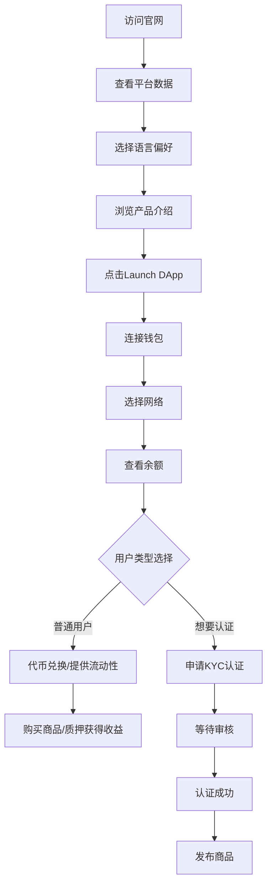
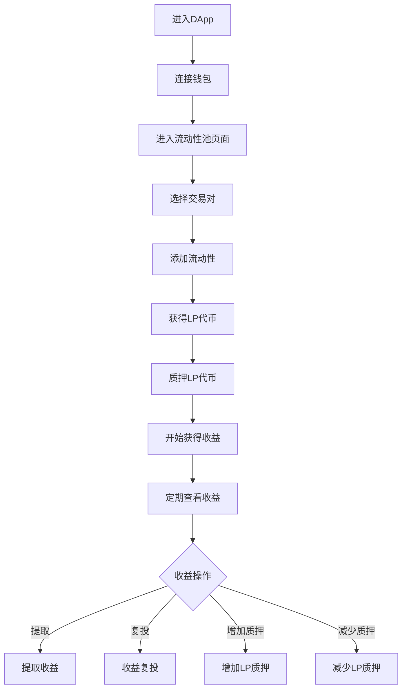
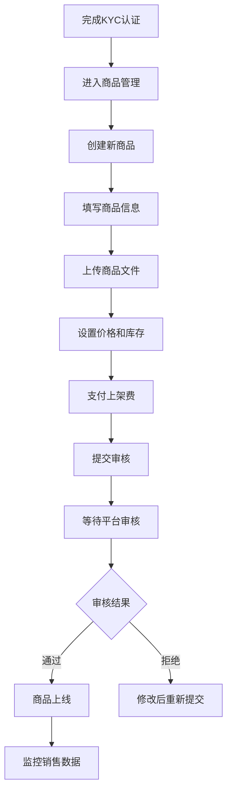
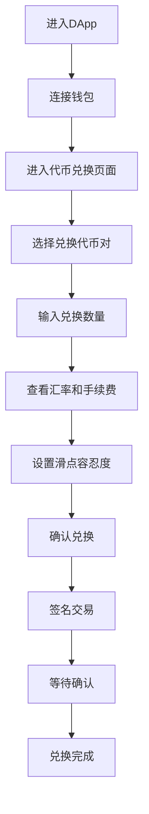
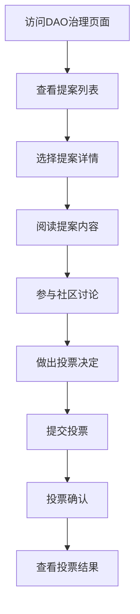
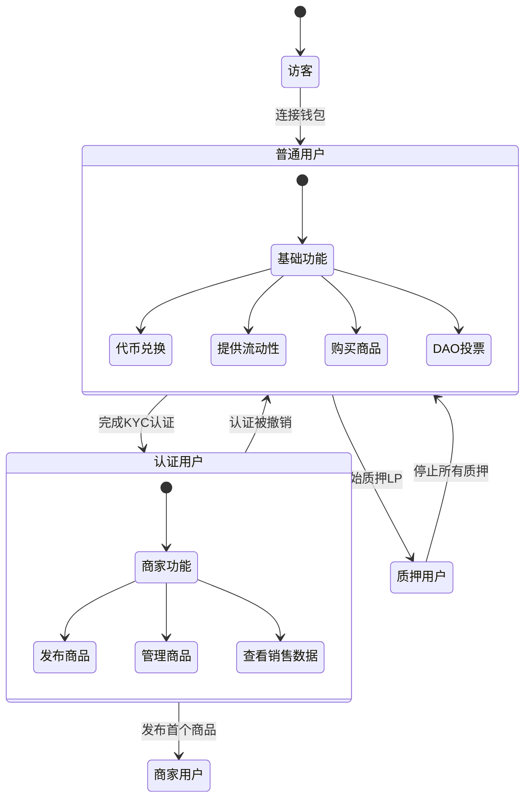
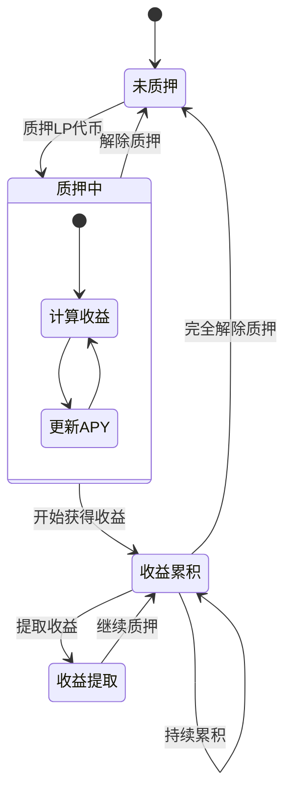
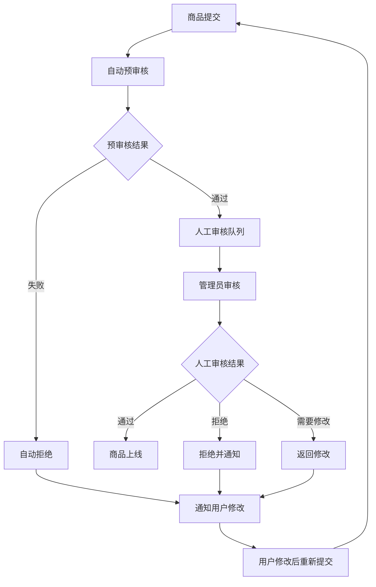

# Sapphire Mall 产品需求文档 (PRD)

## 1. 文档信息

### 1.1 版本历史
| 版本 | 日期 | 修改内容 | 作者 |
|------|------|----------|------|
| v1.0 | 2025-06-01 | 初始版本创建 | 产品经理 |
| v2.0 | 2025-06-01 | 架构优化：移除DeFi挖矿，增加DAO治理，多语言支持 | 产品经理 |
| v3.0 | 2025-06-01 | 完善用户模型，增加流动性质押收益，完善官网数据展示 | 产品经理 |

### 1.2 文档目的
本文档详细描述Sapphire Mall（蓝宝石区块链电商系统）的产品需求、功能规格和实现要求，为设计、开发、测试团队提供完整的产品指导。

### 1.3 相关文档引用
- 产品路线图: `docs/Roadmap.md`
- 用户故事地图: `docs/User_Story_Map.md`
- 指标框架: `docs/Metrics_Framework.md`
- 产品白皮书: `docs/White_Paper.md`

## 2. 产品概述

### 2.1 业务背景
随着区块链技术和Web3理念的快速发展，数字资产和虚拟商品的交易需求日益增长。传统电商平台在虚拟商品流通、资产确权、交易透明度等方面存在诸多局限，难以满足新一代用户对数字经济的高效、安全和去中心化的需求。

当前虚拟商品交易市场面临的主要挑战包括：
- **流通效率低下**: 传统平台需要多重中介，交易流程复杂冗长
- **资产确权困难**: 缺乏可信的数字资产所有权证明机制
- **交易透明度不足**: 分账规则不透明，创作者收益缺乏保障
- **支付方式局限**: 对加密货币支持不友好，兑换成本高昂
- **治理参与缺失**: 用户无法参与平台重大决策，缺乏社区治理机制
- **收益机制单一**: 用户资产无法获得持续收益，缺乏激励机制

在此背景下，Sapphire Mall应运而生，致力于构建一个专注虚拟商品交易的Web3平台，通过平台发行的SAP代币、流动性池机制和质押收益系统，实现便捷的代币兑换、透明的交易体验和持续的资产收益。

### 2.2 产品名称与定位
**产品名称**: Sapphire Mall（蓝宝石区块链电商系统，简称Sapphire Mall）

**产品定位**: Sapphire Mall是一个专注于虚拟商品交易的创新型区块链电商平台。平台以自发行的ERC20代币SAP为核心流通媒介，通过流动性池提供便捷的代币兑换服务，引入流动性质押收益机制，并建立DAO治理系统，打造集购物、资产流通、收益获取、社区治理于一体的Web3虚拟商品生态。

**核心特色**:
- **Web3原生电商**: 基于区块链技术构建的新一代电商平台
- **虚拟商品专精**: 专注于数字内容、软件工具、在线服务等虚拟商品交易
- **流动性池兑换**: 通过流动性池提供便捷的代币兑换服务
- **质押收益机制**: 流动性提供者可获得平台手续费分成收益
- **DAO治理参与**: SAP持有者可参与平台重大决策投票
- **多语言支持**: 支持中英文双语，面向全球用户
- **多角色权限**: 支持普通用户、认证商家、平台管理员等不同角色

### 2.3 产品愿景与使命
**愿景**: 成为全球领先的Web3虚拟商品交易平台，通过DAO治理实现社区自治，通过质押收益激励生态参与，推动数字经济创新发展。

**使命**: 为用户提供安全、透明、高效的虚拟商品交易环境，通过区块链技术实现资产确权，通过流动性池机制提升资产流动性，通过质押收益机制激励生态建设。

### 2.4 产品价值主张与独特卖点(USP)
- **实用虚拟商品交易**: 区别于OpenSea的纯NFT交易，提供实际可用的虚拟商品
- **流动性池兑换**: 通过去中心化流动性池提供便捷的代币兑换服务
- **质押收益机制**: 流动性提供者可获得平台手续费分成的持续收益
- **一键兑换支付**: 支持主流ERC20代币一键兑换SAP完成支付
- **DAO治理参与**: SAP持有者可参与平台重大决策投票
- **透明链上结算**: 所有交易记录不可篡改，保障交易透明度
- **多语言体验**: 中英文双语支持，面向全球用户
- **分层用户体系**: 支持不同角色用户的差异化功能和权限

### 2.5 目标平台列表
- **Web端**: 主要部署平台，支持桌面浏览器
- **移动端Web**: 响应式设计，支持移动浏览器访问
- **区块链网络**: 
  - 主网：以太坊主网
  - 测试网：Sepolia测试网络（开发阶段）
  - 支持网络切换：Ethereum、Polygon、BSC
- **语言支持**：
  - 中文（简体）
  - English

### 2.6 产品核心假设
1. 虚拟商品市场需求持续增长，用户愿意使用加密货币购买
2. 流动性池机制能够提供稳定的代币兑换服务
3. 质押收益机制能够有效激励用户提供流动性
4. DAO治理机制能够增强用户参与度和平台粘性
5. 多语言支持能够扩大用户群体，提升国际化程度
6. 分层用户体系能够满足不同用户的差异化需求
7. 新手友好的设计能够降低Web3用户准入门槛

### 2.7 商业模式概述
- **主要收入**: 商品上架费用（5%）、代币兑换手续费（0.3%）
- **代币机制**: SAP代币作为平台流通媒介，由平台官方发行
- **收益分配**: 平台手续费的70%分配给流动性提供者，30%归平台运营
- **治理机制**: DAO治理参与平台重大决策
- **融资计划**: 代币公募方式进行初期融资

## 3. 用户研究

### 3.1 用户角色模型

#### 3.1.1 普通用户（基础角色）
**定义**: 持有钱包地址，完成钱包连接的基础用户

**权限功能**:
- 浏览商品和平台信息
- 进行代币兑换操作
- 提供流动性并获得质押收益
- 参与DAO治理投票（需持有SAP代币）
- 购买平台商品
- 查看个人交易历史和资产信息

**使用限制**:
- 无法发布商品
- 无法执行平台管理操作
- 投票权重基于SAP持有量

**典型用户画像**:
- 年龄: 20-50岁
- 职业: 投资者、Web3爱好者、数字资产持有者
- 技能: 基础的区块链操作能力
- 动机: 资产增值、获得质押收益、参与生态治理

#### 3.1.2 认证用户（商家角色）
**定义**: 通过KYC认证，获得商品发布权限的用户

**权限功能**:
- 包含普通用户的所有功能
- 发布和管理虚拟商品
- 设置商品价格和库存
- 查看商品销售数据和收益统计
- 管理商品评价和客户反馈
- 参与商家专属的治理提案

**认证要求**:
- 身份验证（KYC）
- 缴纳商家保证金（100 SAP）
- 同意商家服务协议
- 提供商家资质证明

**典型用户画像**:
- 年龄: 25-45岁
- 职业: 内容创作者、软件开发者、设计师、教育机构
- 技能: 专业技能 + 基础区块链操作
- 动机: 扩大销售渠道、获得更高收益、建立品牌影响力

#### 3.1.3 平台管理员（管理角色）
**定义**: 平台官方指定的管理人员，具有平台管理权限

**权限功能**:
- 包含认证用户的所有功能
- 审核商品发布申请
- 处理用户投诉和争议
- 执行紧急暂停操作
- 管理平台参数设置
- 查看平台全局数据和统计
- 发起平台治理提案
- 管理平台公告和通知

**管理权限分级**:
- **超级管理员**: 拥有所有管理权限
- **商品管理员**: 专门负责商品审核和管理
- **客服管理员**: 处理用户投诉和客服问题
- **技术管理员**: 负责技术维护和紧急操作

**典型用户画像**:
- 年龄: 28-40岁
- 职业: 平台运营人员、技术人员、客服人员
- 技能: 专业运营能力 + 深度区块链理解
- 动机: 维护平台稳定运行、提升用户体验、推动生态发展

### 3.2 目标用户画像

#### 3.2.1 人口统计特征
**主要用户群体1: 全球加密货币爱好者/投资者**
- 年龄: 25-45岁
- 性别: 男性为主(70%)，女性占30%
- 地理分布: 全球，重点为北美、欧洲、亚洲发达地区
- 收入水平: 中高收入群体
- 教育背景: 大学及以上学历
- 语言: 英语为主，中文用户占重要比例

**主要用户群体2: 多元化内容创造者**
- 年龄: 20-40岁
- 性别: 较为均衡
- 职业: 设计师、艺术家、程序员、课程讲师
- 收入来源: 创作收入为主或兼职创作
- 语言需求: 中英文双语创作者

#### 3.2.2 行为习惯与偏好
- 活跃于社交媒体和加密货币社区
- 对新技术接受度高，但期望简单易用的界面
- 关注平台治理参与和社区建设
- 重视资产收益和投资回报
- 倾向于在线消费虚拟商品和服务
- 重视多语言支持和国际化体验

#### 3.2.3 核心需求与痛点
**全球加密货币用户痛点**:
- 现有虚拟商品购买流程复杂，需要多次兑换
- 持有的代币缺乏实际应用场景和收益机会
- 希望参与平台治理但缺乏途径
- 语言障碍影响使用体验
- 寻求稳定的被动收益来源

**内容创造者痛点**:
- 传统平台抽成过高，收益被中间商分割
- 缺乏透明的分账和结算机制
- 希望扩大作品的全球销售渠道
- 需要多语言支持触达更多用户
- 商品审核流程复杂且不透明

#### 3.2.4 动机与目标
- **便利性**: 简化虚拟商品购买流程，多语言体验
- **收益性**: 通过质押获得持续的被动收益
- **参与性**: 通过DAO治理参与平台重大决策
- **透明性**: 享受区块链带来的透明可信交易
- **全球化**: 通过多语言支持扩大市场覆盖

### 3.3 用户场景分析

#### 3.3.1 核心使用场景详述
**场景1: 普通用户提供流动性获得收益**
- 用户持有ETH和SAP代币
- 将代币添加到SAP/ETH流动性池
- 获得LP代币并开始质押
- 持续获得平台手续费分成收益
- 定期查看收益并选择复投或提取

**场景2: 认证用户发布商品销售**
- 用户完成KYC认证成为商家
- 上传数字商品（支持中英文描述）
- 设置SAP价格并支付上架费
- 商品通过平台审核后上线销售
- 获得销售收益的链上自动分账

**场景3: 全球用户购买虚拟商品**
- 英语用户持有USDT，想购买中文在线课程
- 切换界面为英文，便于操作理解
- 在平台通过流动性池兑换USDT为SAP
- 直接使用SAP购买课程
- 获得课程访问权限

**场景4: 用户参与DAO治理**
- SAP持有者收到治理提案通知
- 查看提案详情（支持中英文）
- 参与社区讨论和投票
- 投票结果自动执行

**场景5: 平台管理员处理紧急情况**
- 管理员发现恶意商品或异常交易
- 执行紧急暂停相关功能
- 启动争议处理流程
- 发布平台公告说明情况
- 修复问题后恢复正常运行

#### 3.3.2 边缘使用场景考量
- 网络切换时的用户体验优化
- 多语言环境下的客服支持
- 跨时区的DAO治理参与
- 移动端用户的简化操作流程
- 大额交易的风险控制和审核

## 4. 市场与竞品分析

### 4.1 市场规模与增长预测
- **虚拟商品市场**: 预计2024年达到1950亿美元
- **DeFi质押市场**: 总锁仓价值超过500亿美元
- **全球电商多语言需求**: 75%的消费者更愿意用母语购物
- **DAO治理参与度**: Web3项目中80%用户关注治理参与
- **增长趋势**: 虚拟商品和DeFi质押市场预计年增长率25%+

### 4.2 行业趋势分析
- **实用性虚拟商品兴起**: 从纯收藏向实用功能转变
- **DeFi收益机制成熟**: 质押收益成为用户重要收入来源
- **DAO治理普及**: Web3项目普遍引入社区治理机制
- **多语言国际化**: 全球化平台必备功能
- **用户体验重视度提升**: Web3应用更注重易用性

### 4.3 竞争格局分析

#### 4.3.1 直接竞争对手详析

**OpenSea**
- 优势: 品牌知名度高、用户基数大、生态完整
- 劣势: 专注NFT艺术品、缺乏DAO治理、无质押收益、多语言支持有限
- 定价: 2.5%交易手续费
- 治理: 无DAO治理机制
- 收益: 无用户质押收益机制

**Magic Eden**
- 优势: 多链支持、用户体验好
- 劣势: 主要面向NFT收藏品、缺乏DAO功能、无质押收益
- 定价: 2%交易手续费

#### 4.3.2 间接竞争对手概述
- **传统电商平台**: 淘宝、Amazon等在虚拟商品领域
- **DeFi平台**: Uniswap、SushiSwap等DEX功能，提供质押收益
- **DAO治理平台**: Snapshot、Aragon等治理工具

### 4.4 竞品功能对比矩阵

| 功能特性 | Sapphire Mall | OpenSea | Magic Eden | Uniswap |
|----------|---------------|---------|------------|---------|
| 虚拟商品交易 | ✅ | ❌ | ❌ | ❌ |
| 流动性池兑换 | ✅ | ❌ | ❌ | ✅ |
| 质押收益机制 | ✅ | ❌ | ❌ | ✅ |
| DAO治理 | ✅ | ❌ | ❌ | ✅ |
| 多语言支持 | ✅ | ⚠️ | ⚠️ | ⚠️ |
| 用户角色分层 | ✅ | ❌ | ❌ | ❌ |
| 钱包连接 | ✅ | ✅ | ✅ | ✅ |
| 网络切换 | ✅ | ✅ | ✅ | ✅ |
| 新手友好 | ✅ | ⚠️ | ⚠️ | ❌ |

### 4.5 市场差异化策略
1. **聚焦实用虚拟商品**: 区别于纯艺术品NFT
2. **创新质押收益机制**: 提供平台手续费分成收益
3. **深度DAO治理集成**: 提供社区参与决策机制
4. **简化兑换流程**: 流动性池降低使用门槛
5. **全面多语言支持**: 真正的国际化用户体验
6. **分层用户权限**: 满足不同角色的差异化需求
7. **透明收益分配**: 链上自动分账机制

## 5. 产品功能需求

### 5.1 功能架构与模块划分

```mermaid
graph TB
    A[Sapphire Mall平台] --> B[用户管理模块]
    A --> C[商品管理模块]
    A --> D[交易系统模块]
    A --> E[流动性池模块]
    A --> F[质押收益模块]
    A --> G[DAO治理模块]
    A --> H[多语言模块]
    A --> I[钱包管理模块]
    A --> J[平台数据模块]
    A --> K[管理后台模块]
    
    B --> B1[用户注册/登录]
    B --> B2[KYC认证]
    B --> B3[角色权限管理]
    B --> B4[个人中心]
    
    C --> C1[商品发布]
    C --> C2[商品审核]
    C --> C3[商品管理]
    C --> C4[商品搜索]
    
    D --> D1[订单系统]
    D --> D2[支付处理]
    D --> D3[交易历史]
    
    E --> E1[代币兑换]
    E --> E2[流动性提供]
    E --> E3[流动性管理]
    
    F --> F1[质押操作]
    F --> F2[收益计算]
    F --> F3[收益提取]
    
    G --> G1[提案创建]
    G --> G2[投票参与]
    G --> G3[治理执行]
    
    H --> H1[语言切换]
    H --> H2[多语言内容]
    H --> H3[本地化适配]
    
    I --> I1[钱包连接]
    I --> I2[网络切换]
    I --> I3[资产管理]
    
    J --> J1[数据统计]
    J --> J2[实时展示]
    J --> J3[数据分析]
    
    K --> K1[用户管理]
    K --> K2[商品审核]
    K --> K3[系统配置]
    K --> K4[紧急操作]
```



### 5.2 核心功能详述

#### 5.2.1 用户角色与权限管理模块

**功能描述**: 
作为平台用户，我需要根据我的身份和认证状态获得相应的功能权限，以便能够安全有序地使用平台各项服务。

**用户价值**: 
- 保障平台安全性和秩序
- 提供差异化的用户体验
- 激励用户完成认证获得更多权限
- 防止恶意行为和欺诈

**功能逻辑与规则**:
1. **普通用户权限**:
   - 连接钱包即可获得基础权限
   - 可进行代币兑换、提供流动性、质押获得收益
   - 可购买商品、参与DAO投票
   - 无法发布商品

2. **认证用户权限**:
   - 需要完成KYC认证
   - 包含普通用户所有权限
   - 可发布和管理商品
   - 可查看详细销售数据
   - 参与商家专属治理提案

3. **管理员权限**:
   - 平台指定的管理人员
   - 可审核商品和用户申请
   - 可执行紧急操作
   - 可管理平台参数和配置

4. **KYC认证流程**:
   - 身份证明文件上传
   - 人脸识别验证
   - 商家资质证明（如适用）
   - 缴纳保证金（100 SAP）
   - 平台审核（24-48小时）

**交互要求**:
- 清晰的角色标识和权限说明
- 便捷的认证申请流程
- 认证进度实时跟踪
- 权限升级引导

**数据需求**:
- 用户基础信息
- KYC认证材料
- 角色权限配置
- 认证审核记录

**技术依赖**:
- 身份认证服务
- 文件存储系统
- 权限管理框架
- 审核工作流系统

**验收标准**:
- KYC认证成功率 > 95%
- 认证审核时间 < 48小时
- 权限控制准确率 100%
- 用户权限升级流程完整

#### 5.2.2 官网数据展示模块

**功能描述**:
作为访问官网的用户，我想要看到平台的关键数据指标，以便了解平台的活跃度、规模和发展状况，建立对平台的信任。

**用户价值**:
- 增强用户对平台的信任度
- 展示平台的发展活力
- 吸引新用户加入生态
- 提供透明的平台运营数据

**功能逻辑与规则**:
1. **核心数据指标**:
   - 总交易额（累计GMV）
   - 商品数量（上架商品总数）
   - 活跃用户数（月活用户）
   - 总质押量（流动性池TVL）
   - 平台总收益（累计手续费收入）
   - 质押年化收益率（APY）

2. **数据更新频率**:
   - 实时数据：总交易额、质押量
   - 每小时更新：活跃用户数、商品数量
   - 每日更新：平台收益、年化收益率
   - 历史趋势：7天、30天、90天对比

3. **数据展示方式**:
   - 突出显示核心数据卡片
   - 增长趋势图表展示
   - 实时滚动数据更新
   - 支持中英文数字格式

4. **数据来源**:
   - 链上智能合约数据
   - 平台数据库统计
   - 第三方API集成
   - 实时计算引擎

**交互要求**:
- 醒目的数据卡片设计
- 动态数字滚动效果
- 趋势图表可视化
- 移动端适配优化

**数据需求**:
- 实时交易数据
- 用户活跃度统计
- 商品上架数据
- 流动性池数据
- 收益分配记录

**技术依赖**:
- 区块链数据索引
- 实时数据流处理
- 数据可视化组件
- 缓存优化系统

**验收标准**:
- 数据更新延迟 < 5分钟
- 数据准确率 > 99.9%
- 页面加载时间 < 2秒
- 支持多语言数字格式
- 移动端显示完美

#### 5.2.3 流动性质押收益模块

**功能描述**:
作为流动性提供者，我想要将我的代币质押到流动性池中，并获得平台手续费分成的持续收益，以便实现资产的增值。

**用户价值**:
- 获得稳定的被动收益
- 提高资产利用效率
- 支持平台生态发展
- 享受手续费分成机制

**功能逻辑与规则**:
1. **质押机制**:
   - 支持SAP/ETH、SAP/USDT、SAP/USDC交易对
   - 用户提供等值的两种代币
   - 获得LP代币作为流动性证明
   - LP代币可进行质押获得收益

2. **收益计算**:
   - 收益来源：平台所有手续费的70%
   - 分配方式：按质押LP代币比例分配
   - 收益累积：每个区块实时计算收益
   - 年化收益率：动态计算APY

3. **收益提取**:
   - 随时可提取累积收益
   - 提取操作无手续费
   - 支持收益自动复投
   - 提取历史完整记录

4. **质押管理**:
   - 随时可增加或减少质押
   - 解除质押无锁定期
   - 支持部分解除质押
   - 质押状态实时显示

**交互要求**:
- 直观的质押操作界面
- 实时收益和APY显示
- 收益提取确认界面
- 质押历史和统计

**数据需求**:
- 流动性池数据
- 用户质押记录
- 收益计算数据
- 手续费分配记录
- APY历史数据

**技术依赖**:
- 流动性池智能合约
- 质押奖励合约
- 收益分配算法
- 实时数据同步

**验收标准**:
- 收益计算准确率 100%
- 质押操作成功率 > 99%
- 收益提取实时到账
- APY计算准确无误
- 支持所有主要交易对

#### 5.2.4 DApp导航与页面架构模块

**功能描述**:
作为DApp用户，我需要清晰便捷的导航系统来访问各个功能模块，并能够方便地管理我的钱包连接和个人信息。

**用户价值**:
- 快速定位和访问目标功能
- 便捷的钱包和网络管理
- 一致的用户体验
- 高效的操作流程

**功能逻辑与规则**:
1. **主导航结构**:
   - Logo + 主要功能菜单
   - 商品列表、流动性池、代币兑换、DAO治理、帮助中心
   - 右侧：语言切换 + 钱包连接 + 个人中心

2. **钱包连接状态**:
   - 未连接：显示"连接钱包"按钮
   - 已连接：显示地址简写 + 网络图标
   - 连接失败：显示重试按钮

3. **网络切换功能**:
   - 钱包地址旁显示当前网络
   - 点击展开支持的网络列表
   - 一键切换到目标网络
   - 网络切换状态提示

4. **个人中心入口**:
   - 钱包地址右侧的用户头像/图标
   - 点击进入个人中心页面
   - 包含：资产概览、交易历史、质押收益、设置等

5. **语言切换位置**:
   - 位于导航栏右侧，钱包连接左侧
   - 下拉菜单显示：🇨🇳 中文、🇺🇸 English
   - 移动端集成到汉堡菜单

**交互要求**:
- 固定顶部导航栏
- 清晰的功能分组
- 平滑的页面过渡
- 响应式移动端适配
- 状态变化及时反馈

**数据需求**:
- 用户钱包状态
- 当前网络信息
- 用户权限等级
- 导航菜单配置

**技术依赖**:
- 前端路由管理
- 钱包状态管理
- 网络检测API
- 用户权限系统

**验收标准**:
- 导航响应时间 < 0.5秒
- 钱包连接成功率 > 98%
- 网络切换成功率 > 95%
- 移动端适配完美
- 个人中心功能完整

#### 5.2.5 商品管理与交易模块

**功能描述**:
作为认证用户，我想要发布和管理我的虚拟商品，作为普通用户，我想要浏览和购买平台上的商品。

**用户价值**:
- 为创作者提供销售渠道
- 为用户提供丰富的商品选择
- 保障交易安全和透明
- 提供完整的交易体验

**功能逻辑与规则**:
1. **商品发布**（认证用户）:
   - 商品信息：标题、描述、价格、分类、标签
   - 支持中英文双语描述
   - 商品文件上传（IPFS存储）
   - 设置库存和销售限制
   - 缴纳上架费（商品价值的5%）

2. **商品审核**（平台管理员）:
   - 自动审核：检查基础规范
   - 人工审核：内容合规性检查
   - 审核周期：24小时内完成
   - 审核结果：通过/拒绝/需要修改

3. **商品展示**:
   - 商品列表页：网格/列表视图
   - 商品详情页：完整信息展示
   - 搜索功能：标题、分类、标签搜索
   - 筛选功能：价格、分类、评分筛选
   - 排序功能：价格、评分、销量、时间

4. **购买流程**:
   - 选择商品 → 确认订单 → SAP支付 → 获得访问权
   - 支付确认：智能合约托管
   - 自动分账：平台费5% + 创作者95%
   - 即时交付：数字商品立即交付

5. **评价系统**:
   - 购买后可评价：1-5星评分 + 文字评价
   - 评价展示：支持中英文显示
   - 评价统计：平均评分、评价数量
   - 评价审核：防止恶意评价

**交互要求**:
- 直观的商品发布向导
- 丰富的商品展示页面
- 便捷的搜索和筛选
- 流畅的购买流程
- 完善的评价系统

**数据需求**:
- 商品基础信息
- 商品文件存储
- 用户购买记录
- 评价和评分数据
- 销售统计数据

**技术依赖**:
- IPFS文件存储
- 智能合约支付
- 搜索引擎
- 审核工作流
- 自动分账系统

**验收标准**:
- 商品发布成功率 > 98%
- 审核完成时间 < 24小时
- 搜索响应时间 < 2秒
- 支付成功率 > 99%
- 商品交付时间 < 1分钟

#### 5.2.6 后台管理系统模块

**功能描述**:
作为平台的不同角色用户，我需要一个功能完整、权限清晰的后台管理系统，以便高效地管理我的资产、业务和平台操作。

**用户价值**:
- 提供角色化的管理界面
- 统一的数据查看和操作入口
- 高效的业务管理工具
- 完善的权限控制体系

##### 5.2.6.1 普通用户后台（个人中心）

**主菜单结构**:

```
个人中心
├── 仪表板
├── 资产管理
├── 交易管理  
├── DAO治理
└── 账户设置
```

**仪表板页面**:
- **资产概览卡片**:
  - 总资产价值（USD等值）
  - SAP代币余额
  - 质押中资产
  - 可提取收益
- **收益统计图表**:
  - 质押收益趋势图（7天/30天/90天）
  - 收益来源分布（不同交易对收益）
  - 年化收益率变化
- **最近活动时间线**:
  - 最近10条操作记录
  - 交易状态和金额
  - 时间戳和链接到详情
- **快捷操作按钮**:
  - 代币兑换
  - 添加流动性
  - 提取收益
  - 查看新提案

**资产管理页面（标签页设计）**:
- **钱包资产标签**:
  - 代币余额列表
  - 钱包地址管理
  - 网络设置
  - 安全设置
- **质押管理标签**:
  - 我的质押概览（总质押价值、各交易对分布、当前总APY、今日收益）
  - 收益明细表格（交易对 | 质押数量 | 当前APY | 今日收益 | 累计收益 | 操作）
  - 操作功能（增加质押、减少质押、提取收益、复投收益）
  - APY历史统计

**交易管理页面（标签页设计）**:
- **购买记录标签**:
  - 已购商品列表
  - 订单详情查看
  - 退款申请
  - 评价管理
- **兑换记录标签**:
  - 代币兑换历史
  - 兑换详情和状态
  - 手续费统计
- **转账记录标签**:
  - 转入转出记录
  - 交易哈希链接
  - 状态跟踪
- **收益记录标签**:
  - 质押收益明细
  - 收益提取历史
  - 复投记录

**DAO治理页面（标签页设计）**:
- **投票参与标签**:
  - 进行中的提案
  - 我的投票历史
  - 投票权重展示
- **治理统计标签**:
  - 参与度统计
  - 治理奖励
  - 社区贡献度

**账户设置页面（标签页设计）**:
- **基本信息标签**:
  - 用户信息
  - 语言偏好
  - 通知设置
- **安全设置标签**:
  - 密码管理
  - 安全验证
  - 隐私设置
- **帮助支持标签**:
  - 操作指南
  - 常见问题
  - 联系客服
  - 意见反馈

##### 5.2.6.2 认证用户后台（商家中心）

**主菜单结构**:

```
商家中心
├── 业务仪表板
├── 商品管理
├── 订单管理
├── 财务管理
├── 数据分析
├── 设置中心
└── 普通用户功能（继承个人中心所有功能）
```

**业务仪表板页面**:
- **销售概览卡片**:
  - 今日销售额、本月销售额、总销售额、订单数量
- **收入统计图表**:
  - 销售趋势图（日/周/月）
  - 收入来源分布
  - 商品销售排行
  - 利润率分析
- **商品动态**:
  - 新增商品数、待审核商品、热销商品、库存预警
- **快捷操作**:
  - 新增商品、查看订单、处理退款、回复评价

**商品管理页面（标签页设计）**:
- **商品列表标签**:
  - 商品信息表格（商品信息 | 价格 | 库存 | 销量 | 状态 | 操作）
  - 批量操作（上架/下架/删除/编辑）
  - 高级筛选（状态/分类/价格区间/发布时间）
- **新增商品标签**:
  - 商品信息表单（中英文标题、描述）
  - 价格设置（SAP计价）
  - 文件上传（IPFS存储）
  - 分类标签、库存设置、SEO优化
- **审核状态标签**:
  - 审核进度展示
  - 审核意见反馈
  - 修改建议处理
  - 重新提交功能
- **分类管理标签**:
  - 商品分类设置
  - 标签管理

**订单管理页面（标签页设计）**:
- **订单列表标签**:
  - 所有订单列表
  - 订单状态筛选
  - 订单详情查看
- **待处理订单标签**:
  - 待确认订单
  - 待发货订单
  - 紧急处理订单
- **售后处理标签**:
  - 退款申请处理
  - 争议订单处理
  - 客户投诉处理
- **订单统计标签**:
  - 订单量统计
  - 成功率分析
  - 处理时效统计

**财务管理页面（标签页设计）**:
- **收入明细标签**:
  - 收入明细表格（时间 | 订单号 | 商品 | 销售额 | 手续费 | 净收入 | 状态）
  - 时间段筛选和导出
- **提现管理标签**:
  - 可提现余额展示
  - 提现申请表单
  - 提现记录查询
  - 手续费说明
- **财务报表标签**:
  - 月度/季度/年度报表
  - 收入趋势分析
  - 成本结构分析
  - 利润率统计
- **手续费统计标签**:
  - 平台手续费明细
  - 手续费趋势分析

**数据分析页面（标签页设计）**:
- **销售分析标签**:
  - 销售趋势图表
  - 商品销售排行
  - 转化率分析
- **客户分析标签**:
  - 客户画像
  - 购买行为分析
  - 客户评价统计
- **营销分析标签**:
  - 推广效果统计
  - 流量来源分析
  - 营销ROI分析

**设置中心页面（标签页设计）**:
- **店铺信息标签**:
  - 基本信息设置
  - 认证资料管理
  - 品牌形象设置
- **交易设置标签**:
  - 收款设置
  - 物流设置
  - 自动回复设置
- **营销工具标签**:
  - 促销活动设置
  - 优惠券管理
  - 推广链接生成
- **操作日志标签**:
  - 操作历史记录
  - 登录日志
  - 系统通知

##### 5.2.6.3 平台管理员后台

**主菜单结构**:

```
管理员控制台
├── 系统仪表板
├── 用户管理
├── 商品管理
├── 交易管理
├── 流动性管理
└── 系统管理
```

**系统仪表板页面**:
- **平台概览大屏**:
  - 实时用户数、今日交易量、流动性池TVL、平台总收入、系统健康度
- **关键指标监控**:
  - 用户增长趋势、交易量变化、质押参与率、DAO活跃度、系统性能指标
- **异常告警中心**:
  - 系统异常告警、交易异常提醒、安全风险预警、性能瓶颈告警

**用户管理页面（标签页设计）**:
- **用户列表标签**:
  - 用户信息表格（用户信息 | 角色 | 状态 | 资产 | 最后活跃 | 操作）
  - 高级搜索（钱包地址/用户ID/注册时间）
  - 批量操作（禁用/启用/发送通知）
- **KYC审核标签**:
  - 待审核队列
  - 审核进度跟踪
  - 审核历史记录
  - 审核标准管理
  - 审核员分配
- **权限管理标签**:
  - 角色定义和权限分配
  - 权限继承关系
  - 特殊权限授予
  - 权限变更日志
- **用户分析标签**:
  - 用户行为分析
  - 活跃度统计
  - 用户分布分析
- **投诉处理标签**:
  - 用户投诉列表
  - 投诉处理流程
  - 处理结果跟踪

**商品管理页面（标签页设计）**:
- **商品审核标签**:
  - 待审核商品队列
  - 审核进度跟踪
  - 审核标准checklist
  - 批量审核操作
  - 审核意见模板
- **商品列表标签**:
  - 所有商品列表
  - 商品状态管理
  - 商品信息查看
- **违规处理标签**:
  - 举报处理流程
  - 违规商品下架
  - 违规用户处罚
  - 申诉处理机制
- **分类管理标签**:
  - 商品分类设置
  - 分类层级管理
- **质量监控标签**:
  - 商品质量分析
  - 用户评价监控
  - 质量标准管理

**交易管理页面（标签页设计）**:
- **交易监控标签**:
  - 实时交易流
  - 大额交易提醒
  - 异常交易识别
  - 交易成功率监控
- **订单处理标签**:
  - 异常订单处理
  - 退款审批
  - 争议解决
- **财务管理标签**:
  - 平台收入统计
  - 手续费管理
  - 分成比例设置
  - 财务报表生成
- **交易统计标签**:
  - 交易量统计
  - 趋势分析
  - 性能指标

**流动性管理页面（标签页设计）**:
- **流动性池标签**:
  - 流动性池状态
  - 池子参数设置
  - 流动性监控
- **质押监控标签**:
  - 质押状态监控
  - 用户质押行为分析
  - 异常质押检测
- **收益分配标签**:
  - 收益分配规则设置
  - 分配历史记录
  - 分配准确性验证
- **风险控制标签**:
  - 风险指标监控
  - 风险预警设置
  - 应急处理机制
- **APY管理标签**:
  - APY计算管理
  - 历史APY统计
  - APY调整记录

**系统管理页面（标签页设计）**:
- **系统配置标签**:
  - 基础参数设置
  - 手续费配置
  - 网络配置
  - 功能开关
- **安全中心标签**:
  - 安全监控仪表板
  - 风险预警管理
  - 访问日志查看
  - 权限审计
- **运维管理标签**:
  - 服务监控
  - 系统日志
  - 备份管理
  - 版本发布
- **合约管理标签**:
  - 智能合约状态
  - 合约升级管理
  - 合约参数配置
- **应急响应标签**:
  - 紧急暂停功能
  - 应急预案
  - 恢复操作
- **数据分析标签**:
  - 业务数据分析
  - 系统性能分析
  - 自定义报表
- **内容管理标签**:
  - 公告管理
  - 帮助文档
  - 多语言管理
  - 邮件模板
  - 客服工具

### 5.3 次要功能描述

#### 5.3.1 个人中心模块
- 资产概览：代币余额、质押数量、收益统计
- 交易历史：购买记录、兑换记录、质押记录
- 商品管理：我的商品、销售统计（认证用户）
- 设置中心：语言偏好、通知设置、安全设置
- 认证管理：KYC状态、认证申请、升级指引

#### 5.3.2 帮助中心与客服系统
- 多语言FAQ系统
- 操作指南和视频教程
- 在线客服支持（文字/语音）
- 问题工单系统
- 社区论坛和讨论区

#### 5.3.3 通知与消息系统
- 站内消息：系统通知、交易提醒
- 邮件通知：重要操作确认、定期报告
- 推送通知：移动端推送（未来功能）
- 治理通知：新提案、投票提醒
- 收益通知：质押收益到账提醒

#### 5.3.4 数据分析与报表
- 用户行为分析
- 商品销售统计
- 平台运营报表
- 财务收支统计
- 治理参与度分析

### 5.4 未来功能储备 (Backlog)
- NFT商品支持和交易
- 移动端原生应用开发
- 更多区块链网络支持（Layer 2）
- 高级DAO治理功能（委托投票、子DAO）
- AI智能推荐系统
- 社交功能集成（关注、分享、评论）
- 商品订阅和会员制服务
- 跨链资产桥接功能
- 高级数据分析和商业智能
- 第三方开发者API平台

## 6. 用户流程与交互设计指导

### 6.1 核心用户旅程地图

#### 6.1.1 新用户首次体验流程



#### 6.1.2 流动性质押收益用户流程



#### 6.1.3 认证用户商品发布流程



#### 6.1.4 代币兑换用户流程



#### 6.1.5 DAO治理参与流程



### 6.2 关键流程详述与状态转换图

#### 6.2.1 用户角色状态转换



#### 6.2.2 质押收益状态转换



#### 6.2.3 商品审核流程



### 6.3 对设计师 (UI/UX Agent) 的界面原型参考说明和要求

#### 6.3.1 官网首页设计要求

**导航栏设计**:
- 固定顶部，包含：Sapphire Mall Logo、首页、核心业务、文档、联系我们
- 右侧：语言切换下拉（🇨🇳 中文 / 🇺🇸 English）+ Launch DApp按钮（突出显示）
- 移动端适配：汉堡菜单折叠主导航，语言切换和Launch DApp保持可见
- Launch DApp按钮设计：渐变色背景，明显区分于其他导航项

**Hero区域设计**:
- 主标题："Web3虚拟商品交易平台"（支持中英文切换）
- 副标题：强调"质押收益 + DAO治理 + 多语言支持"
- CTA按钮：主要为"Launch DApp"（大号按钮），次要为"了解更多"
- 背景：现代化区块链风格，体现科技感

**平台数据展示区域**:
- **数据卡片设计**：6个核心指标卡片，3列2行布局（移动端单列）
  - 总交易额：突出显示，使用大字号
  - 商品数量：实时更新数字
  - 活跃用户：月活数据
  - 总质押量：显示TVL和趋势
  - 平台收益：累计手续费收入
  - 质押APY：年化收益率，突出显示
- **数据可视化**：
  - 数字滚动动画效果
  - 增长趋势小图标（↗️ ↘️）
  - 实时更新时间戳
  - 支持中英文数字格式切换

**核心业务介绍区域**:
- **商品发布与交易**：强调虚拟商品专精定位
- **流动性质押收益**：突出质押获得手续费分成
- **代币兑换**：简化的兑换流程说明
- **DAO治理**：社区参与和决策权
- 每个功能配有图标和简明说明

#### 6.3.2 DApp主页设计要求

**导航栏设计**:
- 包含：Sapphire Mall Logo、商品列表、流动性池、代币兑换、DAO治理、帮助中心
- 右侧布局（从左到右）：语言切换 → 钱包连接 → 个人中心
- **语言切换**：
  - 下拉菜单，显示国旗 + 语言名称
  - 位置：钱包连接按钮左侧
  - 移动端：集成到汉堡菜单顶部
- **钱包连接状态显示**：
  - 未连接：显示"连接钱包"按钮（蓝色背景）
  - 已连接：显示地址（0x1234...5678格式）+ 当前网络标识
  - 网络图标：Ethereum/Polygon/BSC的对应图标
- **网络切换功能**：
  - 钱包地址右侧显示网络下拉箭头
  - 点击展开支持的网络列表（Ethereum, Polygon, BSC）
  - 显示网络名称和图标
  - 切换时显示loading状态
- **个人中心入口**：
  - 钱包地址右侧的圆形用户头像图标
  - 点击显示下拉菜单：资产概览、交易历史、质押收益、设置
  - 或直接跳转到个人中心页面

#### 6.3.3 流动性池页面设计

**质押操作界面**:
- **交易对选择**：卡片式布局，显示SAP/ETH、SAP/USDT、SAP/USDC
- **数据展示**：每个交易对显示TVL、APY、我的质押量
- **操作按钮**：添加流动性、质押LP、提取收益
- **收益统计**：实时收益、累计收益、预估年收益

**收益管理界面**:
- **收益概览卡片**：总质押量、总收益、当前APY
- **收益明细**：按交易对分类显示收益情况
- **操作选项**：提取收益、自动复投、增加质押、减少质押
- **历史记录**：质押历史、收益历史、提取记录

#### 6.3.4 商品页面设计

**商品列表页**:
- **搜索栏**：支持商品名称、分类、标签搜索
- **筛选侧边栏**：价格范围、分类、评分、语言
- **排序选项**：价格、评分、销量、发布时间
- **商品卡片**：商品图片、标题（双语）、价格（SAP）、评分、销量
- **视图切换**：网格视图、列表视图

**商品详情页**:
- **商品信息**：详细描述（支持中英文切换）、价格、库存
- **创作者信息**：认证商家徽章、创作者名称、其他商品
- **评价系统**：平均评分、评价列表、写评价功能
- **购买流程**：立即购买按钮、支付确认、交付状态

#### 6.3.5 DAO治理页面设计

**提案列表**:
- **提案卡片**：标题（双语）、状态标签、投票进度条、截止时间
- **筛选选项**：提案状态（进行中、已结束、待执行）
- **投票权重显示**：用户当前SAP持有量和投票权重

**提案详情页**:
- **提案信息**：完整标题和描述（支持中英文）
- **投票选项**：赞成、反对、弃权，显示实时票数
- **投票界面**：选择投票选项、确认投票权重、签名确认
- **讨论区域**：社区讨论、评论回复（支持双语）

#### 6.3.6 个人中心设计

**资产概览**:
- **总资产价值**：代币余额总计（SAP、ETH、USDT等）
- **质押资产**：各交易对的质押数量和价值
- **累计收益**：质押收益、销售收益（认证用户）
- **资产分布饼状图**：可视化资产配置

**交易历史**:
- **分类标签**：购买记录、兑换记录、质押记录、收益记录
- **记录列表**：时间、类型、金额、状态、交易哈希链接
- **导出功能**：支持导出Excel/CSV格式

**商品管理**（认证用户）:
- **我的商品**：商品列表、销售统计、库存管理
- **销售数据**：销售额、订单量、评价统计
- **商品操作**：编辑商品、下架商品、查看详情

### 6.4 交互设计规范与原则建议

#### 6.4.1 Web3交互规范

**钱包连接交互**:
- 首次连接：显示钱包选择模态框（MetaMask、WalletConnect、Coinbase Wallet）
- 连接过程：加载状态和进度提示
- 连接失败：错误信息和重试选项，提供帮助链接
- 网络切换：友好的提示和一键切换，显示Gas费预估

**区块链交易交互**:
- 交易确认：清晰显示Gas费、交易详情、预估完成时间
- 交易进行中：实时状态更新和进度条，提供取消选项
- 交易完成：成功提示和交易哈希链接，相关数据自动刷新
- 交易失败：错误原因和解决建议，重试选项

**质押操作交互**:
- 质押前：清晰显示APY、风险提示、预期收益计算
- 质押中：实时显示质押状态、累积收益、操作选项
- 收益管理：简单明了的提取/复投操作，手续费显示

#### 6.4.2 国际化交互原则

**语言切换体验**:
- 即时切换：无需页面刷新，平滑过渡动画
- 状态保持：保存用户语言偏好到本地存储
- 视觉反馈：切换过程的loading状态和完成提示
- 一致性：所有页面的语言切换位置和样式统一

**多语言数据展示**:
- 数字格式：根据语言调整数字、日期、货币格式
- 文本长度：考虑中英文长度差异，预留足够空间
- 文化适配：时区自动转换、节日信息本地化

**多语言用户引导**:
- 新手教程：支持双语视频和图文指导
- 错误提示：提供详细的多语言说明和解决方案
- 帮助文档：完整的双语FAQ和操作指南

#### 6.4.3 用户角色体验原则

**角色权限可视化**:
- 清晰的角色标识：普通用户、认证用户、管理员的视觉区分
- 功能权限提示：无权限功能显示升级引导
- 认证进度：KYC认证状态的进度条和步骤指引

**认证用户专属体验**:
- 商家标识：认证商家的特殊徽章和标识
- 专属功能：商品管理、销售数据、商家治理的专门界面
- 商家支持：专门的商家帮助中心和客服通道

## 7. 非功能需求

### 7.1 性能需求

#### 7.1.1 响应时间要求
- **页面加载**: 首页加载时间 < 3秒，DApp页面 < 2秒
- **语言切换**: 界面更新时间 < 1秒
- **钱包连接**: 连接响应时间 < 5秒
- **代币兑换**: 价格更新延迟 < 3秒
- **质押操作**: 质押确认时间 < 10秒
- **收益计算**: 收益数据更新 < 5秒
- **投票操作**: 投票确认时间 < 10秒
- **数据展示**: 平台数据更新延迟 < 5分钟

#### 7.1.2 并发性能
- **同时在线用户**: 支持10,000+并发用户
- **交易处理能力**: 500 TPS（交易每秒）
- **质押操作并发**: 100个并发质押操作
- **API请求**: 1000 req/s
- **数据库查询**: 平均响应时间 < 100ms
- **实时数据推送**: 支持1000+并发WebSocket连接

#### 7.1.3 稳定性要求
- **系统可用性**: 99.9%在线时间
- **故障恢复**: 故障恢复时间 < 1小时
- **数据一致性**: 区块链数据100%准确
- **备份策略**: 每日自动备份，保留30天
- **质押数据准确性**: 收益计算100%准确

### 7.2 安全需求

#### 7.2.1 智能合约安全
- **代码审计**: 第三方安全审计（Certik、OpenZeppelin）
- **升级机制**: 可升级合约模式（代理合约）
- **权限控制**: 多重签名管理关键操作
- **紧急暂停**: 紧急情况暂停机制
- **质押安全**: 质押资金安全保障，防闪电贷攻击
- **收益分配**: 收益计算和分配的安全机制

#### 7.2.2 前端安全
- **HTTPS加密**: 全站HTTPS通信
- **XSS防护**: 输入验证和输出转义
- **CSRF防护**: Token验证机制
- **钱包安全**: 私钥不触及服务器
- **文件上传**: IPFS存储安全验证
- **用户数据**: 敏感信息加密存储

#### 7.2.3 数据安全
- **用户隐私**: 最小化数据收集，GDPR合规
- **KYC数据**: 加密存储认证信息
- **访问控制**: 基于角色的权限管理
- **审计日志**: 完整的操作日志记录
- **数据备份**: 加密备份和异地存储

### 7.3 可用性与可访问性标准

#### 7.3.1 用户体验标准
- **界面直观性**: 新用户15分钟内完成首次交易
- **错误处理**: 友好的错误提示和解决方案
- **加载状态**: 所有异步操作显示加载状态
- **移动端适配**: 完美的移动端体验
- **新手引导**: 完整的功能使用指南

#### 7.3.2 国际化标准
- **语言支持**: 完整的中英文双语支持
- **文化适配**: 考虑不同地区的文化差异
- **时区处理**: 自动检测和转换时区
- **货币格式**: 根据语言调整数字格式
- **本地化内容**: 根据地区提供相关内容

#### 7.3.3 无障碍访问
- **键盘导航**: 支持完整的键盘操作
- **屏幕阅读器**: 语义化HTML和ARIA标签
- **颜色对比度**: 符合WCAG 2.1 AA标准
- **字体大小**: 支持浏览器字体缩放
- **视觉辅助**: 高对比度模式支持

### 7.4 合规性要求

#### 7.4.1 数据保护合规
- **GDPR合规**: 符合欧盟通用数据保护条例
- **数据删除权**: 用户数据删除机制
- **同意管理**: 明确的用户同意收集
- **数据导出**: 用户数据导出功能
- **KYC合规**: 符合反洗钱法规要求

#### 7.4.2 金融合规
- **AML/KYC**: 反洗钱和身份验证
- **交易监控**: 可疑交易监测和报告
- **合规报告**: 定期合规报告生成
- **监管配合**: 监管机构调查配合机制
- **资金安全**: 用户资金安全保障机制

### 7.5 数据统计与分析需求

#### 7.5.1 关键事件埋点
- **用户行为**: 页面访问、功能使用、交易行为
- **语言偏好**: 用户语言选择和切换统计
- **钱包连接**: 钱包类型和网络选择统计
- **质押行为**: 质押操作、收益提取、复投行为
- **治理参与**: 投票参与率和活跃度
- **代币兑换**: 兑换量、频次、热门交易对
- **商品交易**: 购买行为、商品偏好、评价行为

#### 7.5.2 业务指标监控
- **用户增长**: DAU、MAU、用户留存率
- **交易指标**: 交易量、交易笔数、平均交易额
- **质押指标**: TVL、质押用户数、平均质押量、APY变化
- **治理活跃度**: 提案数量、投票参与率
- **多语言效果**: 不同语言用户的行为差异
- **收入指标**: 手续费收入、上架费收入、质押费收入分配

## 8. 技术架构考量

### 8.1 技术栈建议

#### 8.1.1 前端技术栈
- **框架**: React 18 + TypeScript
- **状态管理**: Redux Toolkit + RTK Query
- **UI框架**: Tailwind CSS + Headless UI
- **国际化**: react-i18next + 自定义翻译管理
- **Web3集成**: Wagmi + Viem + TanStack Query
- **钱包连接**: Web3Modal v3 + ConnectKit
- **图表可视化**: Recharts + Chart.js
- **数据格式化**: date-fns + numeral.js

#### 8.1.2 智能合约技术
- **开发框架**: Hardhat + TypeScript
- **合约语言**: Solidity 0.8.19+
- **测试框架**: Waffle + Chai + Hardhat Network
- **部署工具**: Hardhat Deploy + Hardhat Verify
- **安全工具**: Slither + Mythril + OpenZeppelin
- **升级机制**: OpenZeppelin Upgrades
- **多签管理**: Gnosis Safe

#### 8.1.3 后端服务
- **API服务**: Go + go-zero框架 + gRPC
- **数据库**: MySQL 8.0+ + Redis + MongoDB（文档存储）
- **区块链交互**: go-ethereum + 自定义RPC客户端
- **文件存储**: IPFS + Pinata + 阿里云OSS
- **任务队列**: asynq（go-zero生态）+ Redis
- **API文档**: go-zero自动生成 + Swagger
- **微服务架构**: go-zero微服务 + etcd服务发现
- **监控**: Prometheus + Grafana + Jaeger链路追踪

#### 8.1.4 基础设施
- **容器化**: Docker + Docker Compose
- **云服务**: AWS/Google Cloud/Azure
- **CDN**: Cloudflare
- **负载均衡**: Nginx + HAProxy
- **CI/CD**: GitHub Actions + Docker Registry

### 8.2 系统集成需求

#### 8.2.1 go-zero微服务架构
- **API网关**: go-zero gateway + JWT认证 + 限流中间件
- **用户服务**: 用户管理、KYC认证、权限控制
- **商品服务**: 商品发布、审核、管理
- **交易服务**: 订单处理、支付、退款
- **质押服务**: 流动性池、质押管理、收益计算
- **治理服务**: DAO提案、投票、执行
- **通知服务**: 消息推送、邮件发送
- **数据服务**: 统计分析、报表生成

**微服务通信**:
- **内部通信**: gRPC + etcd服务发现
- **外部接口**: RESTful API + Swagger文档
- **事件驱动**: Redis Stream + asynq任务队列
- **数据一致性**: Saga模式 + 分布式事务

#### 8.2.2 区块链集成
- **多链支持**: Ethereum、Polygon、BSC
- **RPC节点**: Alchemy、Infura、QuickNode、自建节点
- **事件监听**: go-ethereum事件订阅 + Redis缓存
- **数据同步**: 链上数据与MySQL实时同步
- **交易监控**: 交易状态跟踪和确认机制
- **Gas优化**: 动态Gas费估算和批量操作

#### 8.2.3 第三方服务集成
- **价格数据**: CoinGecko、CoinMarketCap API
- **身份认证**: JWT + 自建认证服务
- **KYC服务**: Jumio、Onfido集成
- **IPFS存储**: Pinata、Infura IPFS
- **分析服务**: 自建分析服务 + Prometheus指标
- **客服系统**: 自建工单系统
- **邮件服务**: SendGrid、阿里云邮件推送

### 8.3 技术依赖与约束

#### 8.3.1 go-zero框架优势
- **代码生成**: 基于.api文件自动生成代码
- **微服务支持**: 内置服务发现、负载均衡、限流
- **中间件生态**: 丰富的中间件支持
- **性能优化**: 内置缓存、连接池、协程池
- **监控集成**: Prometheus指标、Jaeger链路追踪

#### 8.3.2 性能约束
- **API响应时间**: < 200ms（90%请求）
- **MySQL连接池**: 连接池大小 50-200
- **Redis缓存**: TTL策略 + LRU淘汰
- **gRPC通信**: 连接复用 + 压缩传输
- **任务队列**: asynq异步处理 + 重试机制

#### 8.3.3 安全约束
- **JWT认证**: 双Token机制（Access + Refresh）
- **API限流**: 基于用户、IP的多级限流
- **数据验证**: 请求参数严格验证
- **权限控制**: CASBIN权限模型
- **日志审计**: 操作日志完整记录

### 8.4 数据模型建议

#### 8.4.1 微服务数据分离

**用户服务数据**:
```go
type User struct {
    ID              string    `gorm:"primaryKey;type:varchar(36)" json:"id"`
    WalletAddress   string    `gorm:"uniqueIndex;type:varchar(42)" json:"wallet_address"`
    Role            string    `gorm:"type:varchar(20)" json:"role"`
    KycStatus       string    `gorm:"type:varchar(20)" json:"kyc_status"`
    PreferredLang   string    `gorm:"type:varchar(10)" json:"preferred_language"`
    SapBalance      decimal.Decimal `gorm:"type:decimal(36,18)" json:"sap_balance"`
    CreatedAt       time.Time `json:"created_at"`
    UpdatedAt       time.Time `json:"updated_at"`
}

type KycRecord struct {
    ID              string    `gorm:"primaryKey;type:varchar(36)" json:"id"`
    UserID          string    `gorm:"type:varchar(36);index" json:"user_id"`
    Status          string    `gorm:"type:varchar(20)" json:"status"`
    DocumentHash    string    `gorm:"type:varchar(66)" json:"document_hash"`
    VerifyData      string    `gorm:"type:text" json:"verify_data"`
    SubmittedAt     time.Time `json:"submitted_at"`
    ApprovedAt      *time.Time `json:"approved_at"`
}
```

**商品服务数据**:
```go
type Product struct {
    ID              string    `gorm:"primaryKey;type:varchar(36)" json:"id"`
    CreatorID       string    `gorm:"type:varchar(36);index" json:"creator_id"`
    TitleEn         string    `gorm:"type:varchar(255)" json:"title_en"`
    TitleZh         string    `gorm:"type:varchar(255)" json:"title_zh"`
    DescriptionEn   string    `gorm:"type:text" json:"description_en"`
    DescriptionZh   string    `gorm:"type:text" json:"description_zh"`
    Price           decimal.Decimal `gorm:"type:decimal(36,18)" json:"price"`
    Category        string    `gorm:"type:varchar(50)" json:"category"`
    Status          string    `gorm:"type:varchar(20)" json:"status"`
    IpfsHash        string    `gorm:"type:varchar(66)" json:"ipfs_hash"`
    Inventory       int64     `gorm:"type:bigint" json:"inventory"`
    SalesCount      int64     `gorm:"type:bigint;default:0" json:"sales_count"`
    CreatedAt       time.Time `json:"created_at"`
    UpdatedAt       time.Time `json:"updated_at"`
}
```

**质押服务数据**:
```go
type LiquidityPool struct {
    ID              string    `gorm:"primaryKey;type:varchar(36)" json:"id"`
    TokenA          string    `gorm:"type:varchar(42)" json:"token_a"`
    TokenB          string    `gorm:"type:varchar(42)" json:"token_b"`
    ReserveA        decimal.Decimal `gorm:"type:decimal(36,18)" json:"reserve_a"`
    ReserveB        decimal.Decimal `gorm:"type:decimal(36,18)" json:"reserve_b"`
    TotalSupply     decimal.Decimal `gorm:"type:decimal(36,18)" json:"total_supply"`
    FeeRate         decimal.Decimal `gorm:"type:decimal(8,6)" json:"fee_rate"`
    ContractAddress string    `gorm:"type:varchar(42)" json:"contract_address"`
    NetworkID       string    `gorm:"type:varchar(20)" json:"network_id"`
    CreatedAt       time.Time `json:"created_at"`
    UpdatedAt       time.Time `json:"updated_at"`
}

type Staking struct {
    ID              string    `gorm:"primaryKey;type:varchar(36)" json:"id"`
    UserID          string    `gorm:"type:varchar(36);index" json:"user_id"`
    PoolID          string    `gorm:"type:varchar(36);index" json:"pool_id"`
    StakedAmount    decimal.Decimal `gorm:"type:decimal(36,18)" json:"staked_amount"`
    EarnedRewards   decimal.Decimal `gorm:"type:decimal(36,18);default:0" json:"earned_rewards"`
    APY             decimal.Decimal `gorm:"type:decimal(8,6)" json:"apy"`
    StartTime       time.Time `json:"start_time"`
    LastUpdateTime  time.Time `json:"last_update_time"`
}

type Transaction struct {
    ID              string    `gorm:"primaryKey;type:varchar(36)" json:"id"`
    UserID          string    `gorm:"type:varchar(36);index" json:"user_id"`
    ProductID       string    `gorm:"type:varchar(36);index" json:"product_id"`
    Amount          decimal.Decimal `gorm:"type:decimal(36,18)" json:"amount"`
    Currency        string    `gorm:"type:varchar(10)" json:"currency"`
    Status          string    `gorm:"type:varchar(20)" json:"status"`
    TxHash          string    `gorm:"type:varchar(66);index" json:"tx_hash"`
    PlatformFee     decimal.Decimal `gorm:"type:decimal(36,18)" json:"platform_fee"`
    CreatedAt       time.Time `json:"created_at"`
    UpdatedAt       time.Time `json:"updated_at"`
}
```

**DAO治理数据**:
```go
type Proposal struct {
    ID              string    `gorm:"primaryKey;type:varchar(36)" json:"id"`
    CreatorID       string    `gorm:"type:varchar(36);index" json:"creator_id"`
    TitleEn         string    `gorm:"type:varchar(255)" json:"title_en"`
    TitleZh         string    `gorm:"type:varchar(255)" json:"title_zh"`
    DescriptionEn   string    `gorm:"type:text" json:"description_en"`
    DescriptionZh   string    `gorm:"type:text" json:"description_zh"`
    Status          string    `gorm:"type:varchar(20)" json:"status"`
    VotesFor        decimal.Decimal `gorm:"type:decimal(36,18);default:0" json:"votes_for"`
    VotesAgainst    decimal.Decimal `gorm:"type:decimal(36,18);default:0" json:"votes_against"`
    StartTime       time.Time `json:"start_time"`
    EndTime         time.Time `json:"end_time"`
    CreatedAt       time.Time `json:"created_at"`
    UpdatedAt       time.Time `json:"updated_at"`
}

type Vote struct {
    ID              string    `gorm:"primaryKey;type:varchar(36)" json:"id"`
    ProposalID      string    `gorm:"type:varchar(36);index" json:"proposal_id"`
    UserID          string    `gorm:"type:varchar(36);index" json:"user_id"`
    Choice          string    `gorm:"type:varchar(20)" json:"choice"`
    Weight          decimal.Decimal `gorm:"type:decimal(36,18)" json:"weight"`
    TxHash          string    `gorm:"type:varchar(66);index" json:"tx_hash"`
    CreatedAt       time.Time `json:"created_at"`
}
```

#### 8.4.2 Redis缓存设计
- **用户缓存**: `user:{user_id}` TTL 30分钟
- **商品缓存**: `product:{product_id}` TTL 1小时
- **价格缓存**: `price:{token_pair}` TTL 30秒
- **APY缓存**: `apy:{pool_id}` TTL 5分钟
- **权限缓存**: `permission:{user_id}` TTL 15分钟
- **交易缓存**: `tx:{tx_hash}` TTL 10分钟
- **质押统计**: `staking_stats:{user_id}` TTL 5分钟
- **热门商品**: `hot_products` TTL 1小时（Sorted Set）

**缓存策略**:
- **写入策略**: Cache Aside模式，先更新数据库再删除缓存
- **读取策略**: 缓存未命中时从MySQL读取并写入缓存
- **缓存预热**: 系统启动时预加载热点数据
- **缓存雪崩预防**: 随机TTL，避免同时过期

#### 8.4.3 MySQL数据库设计

**数据库配置**:
- **MySQL版本**: 8.0+
- **字符集**: utf8mb4_unicode_ci
- **存储引擎**: InnoDB
- **事务隔离级别**: READ-COMMITTED
- **连接池配置**: 最大连接数200，最小连接数10

**索引优化**:
- **用户表**: wallet_address唯一索引、kyc_status普通索引
- **商品表**: creator_id、category、status复合索引
- **交易表**: user_id、product_id、tx_hash、created_at索引
- **质押表**: user_id、pool_id复合索引、last_update_time索引
- **提案表**: creator_id、status、start_time、end_time索引
- **投票表**: proposal_id、user_id复合唯一索引

**分区策略**:
- **交易表**: 按月分区（基于created_at）
- **投票表**: 按年分区（基于created_at）
- **日志表**: 按月分区，保留12个月数据

**备份策略**:
- **全量备份**: 每日凌晨2点全量备份
- **增量备份**: 每2小时增量备份
- **binlog备份**: 实时binlog备份到OSS
- **数据保留**: 全量备份保留30天，增量备份保留7天

#### 8.4.4 MongoDB文档存储
- **多语言内容**: 商品描述、帮助文档、公告内容
- **审核记录**: KYC文档、商品审核意见
- **用户行为**: 访问日志、操作记录
- **分析数据**: 统计报表、用户画像

## 9. 验收标准汇总

### 9.1 功能验收标准矩阵

| 功能模块 | 验收标准 | 测试方法 | 成功指标 |
|----------|----------|----------|----------|
| 用户角色权限 | 权限控制准确率 100% | 权限测试 | 三种角色功能正确区分 |
| 多语言切换 | 语言切换响应时间 < 1秒 | 自动化测试 | 100%页面支持双语 |
| 钱包连接 | 连接成功率 > 98% | 压力测试 | 支持主流钱包 |
| 网络切换 | 切换时间 < 5秒 | 功能测试 | 支持3个主要网络 |
| 代币兑换 | 兑换成功率 > 99% | 集成测试 | 滑点控制准确 |
| 流动性质押 | 质押成功率 > 99% | 端到端测试 | 收益计算100%准确 |
| DAO治理 | 投票成功率 > 99% | 端到端测试 | 投票权重计算正确 |
| 商品交易 | 支付成功率 > 99% | 性能测试 | 交易确认时间 < 30秒 |
| KYC认证 | 认证成功率 > 95% | 人工测试 | 审核时间 < 48小时 |
| 数据展示 | 数据准确率 > 99.9% | 数据验证 | 更新延迟 < 5分钟 |

### 9.2 性能验收标准

| 性能指标 | 目标值 | 测试工具 | 验收标准 |
|----------|--------|----------|----------|
| 页面加载时间 | < 3秒 | Lighthouse | Core Web Vitals通过 |
| API响应时间 | < 500ms | JMeter | 95%请求满足要求 |
| 并发用户数 | 10,000+ | LoadRunner | 零错误率 |
| 内存使用 | < 100MB | DevTools | 无内存泄漏 |
| 质押收益计算 | 实时 | 自定义测试 | 延迟 < 5秒 |
| 数据同步 | < 5分钟 | 监控系统 | 链上数据一致性 |

### 9.3 质量验收标准

#### 9.3.1 代码质量
- **代码覆盖率**: > 90%
- **TypeScript覆盖**: 100%
- **ESLint检查**: 零错误
- **安全扫描**: 无高危漏洞
- **智能合约审计**: 通过第三方审计

#### 9.3.2 用户体验质量
- **多语言准确率**: > 95%
- **界面一致性**: 100%页面统一风格
- **移动端适配**: 完美响应式设计
- **无障碍访问**: 符合WCAG 2.1 AA标准
- **新手引导**: 完整的操作指南

#### 9.3.3 业务逻辑质量
- **权限控制**: 100%准确的权限管理
- **收益分配**: 100%准确的质押收益计算
- **交易流程**: 完整的购买和支付流程
- **审核机制**: 有效的商品和用户审核
- **治理流程**: 完整的DAO治理参与机制

## 10. 产品成功指标

### 10.1 关键绩效指标 (KPIs) 定义与目标

#### 10.1.1 用户增长指标
- **月活跃用户 (MAU)**: 目标10,000+用户（6个月内）
- **日活跃用户 (DAU)**: 目标2,000+用户
- **用户留存率**: 7天留存率 > 40%，30天留存率 > 20%
- **新用户转化率**: 从访问到首次交易转化率 > 15%
- **KYC认证率**: 用户KYC认证完成率 > 30%
- **多语言用户比例**: 中文用户40%+，英文用户40%+

#### 10.1.2 业务增长指标
- **交易总量**: 月交易量目标100万美元
- **代币兑换量**: 日均兑换量 > 5万美元
- **商品销售额**: 月销售额 > 50万美元
- **平台收入**: 月收入 > 2万美元（手续费+上架费）
- **质押总量**: 流动性池TVL > 500万美元
- **商品数量**: 平台商品数量 > 1,000种

#### 10.1.3 生态健康指标
- **DAO参与率**: SAP持有者投票参与率 > 30%
- **质押参与率**: 用户质押参与率 > 25%
- **平均质押APY**: 维持在8-15%范围
- **商家活跃度**: 认证商家月活跃率 > 70%
- **用户满意度**: 产品评分 > 4.5分（5分制）
- **客服响应**: 问题解决时间 < 24小时

### 10.2 北极星指标定义与选择依据

**北极星指标**: 月度流动性质押活跃用户数（Monthly Liquidity Staking Active Users）

**选择依据**:
1. **业务核心性**: 质押功能是平台的核心收益机制，直接关联用户价值
2. **生态健康**: 质押用户数量反映平台的长期价值和用户信任度
3. **收益驱动**: 质押用户为平台提供流动性，获得手续费分成收益
4. **可持续性**: 质押机制创造了平台与用户的共赢模式
5. **增长引擎**: 质押收益吸引更多用户，形成正向循环

**目标设定**:
- **Q1目标**: 1,500活跃质押用户
- **Q2目标**: 4,000活跃质押用户  
- **Q3目标**: 8,000活跃质押用户
- **年度目标**: 12,000活跃质押用户

**辅助指标**:
- 质押用户的平均质押金额
- 质押用户的留存率
- 新增质押用户的获客成本
- 质押用户的生命周期价值

### 10.3 指标监测计划

#### 10.3.1 实时监控指标
- **系统性能**: 响应时间、错误率、可用性
- **交易状态**: 实时交易量、兑换成功率、质押操作
- **用户行为**: 页面访问、功能使用、停留时间
- **质押数据**: TVL变化、APY波动、收益分配

#### 10.3.2 日报指标
- **用户活跃**: DAU、新增用户、用户行为分析
- **交易数据**: 交易量、兑换量、手续费收入
- **质押统计**: 新增质押、质押提取、收益发放
- **治理活动**: 提案数量、投票参与情况
- **商品动态**: 新增商品、销售量、审核状态

#### 10.3.3 周报指标
- **用户留存**: 周留存率、用户生命周期分析
- **功能使用**: 各功能模块使用率分析
- **多语言效果**: 不同语言用户行为对比
- **质押分析**: 质押用户画像、行为模式分析
- **收益分配**: 平台收益与用户收益统计

#### 10.3.4 月报指标
- **业务增长**: MAU、交易总量、收入增长
- **生态健康**: DAO参与度、质押参与率、用户满意度
- **产品迭代**: 功能使用率、用户反馈分析
- **竞品分析**: 市场地位、功能对比、用户流失
- **财务状况**: 收入结构、成本分析、盈利预测

**报告频率**:
- **实时监控**: 24/7监控，异常即时告警
- **日报**: 每日上午9点自动生成并发送
- **周报**: 每周一上午发送管理层和核心团队
- **月报**: 每月第一个工作日生成详细分析报告
- **季度报告**: 深度业务分析和战略调整建议

**监控工具**:
- **实时监控**: Grafana + Prometheus + AlertManager
- **用户行为**: Google Analytics + Mixpanel
- **业务数据**: 自建BI系统 + Tableau
- **区块链数据**: Dune Analytics + 自建索引器
- **质押数据**: 智能合约事件监听 + 实时计算引擎

---

*本PRD文档将作为Sapphire Mall产品开发的核心指导文件，所有功能开发、设计决策和测试验收都应以此文档为准。随着产品发展和市场反馈，本文档将持续更新和优化。* 