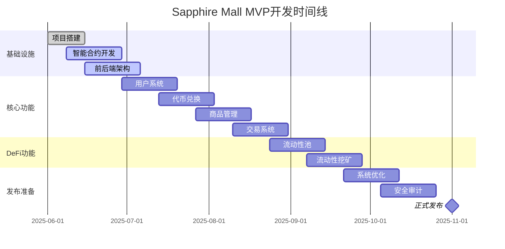

# Sapphire Mall 产品路线图 (Roadmap)

---

| 版本 | 日期 | 修改内容 | 作者 |
|---|---|---|---|
| v0.4.0 | YYYY-MM-DD | 基于 PRD v0.4.0 重构，聚焦社区驱动的虚拟商品交易与治理。 | 产品经理 |

## 1. 路线图概述

本路线图旨在为 Sapphire Mall 的发展规划一条清晰、分阶段的路径，确保团队能够聚焦于在正确的时间交付最高价值的功能。路线图基于 v0.4.0 PRD 中定义的产品愿景，即打造一个由社区驱动的、去中心化的虚拟商品交易与治理平台。

**核心发展理念**：
- **社区驱动**: 平台的核心规则和内容质量由社区通过透明的机制来共同决定。
- **价值共创**: 创作者、消费者和社区贡献者共同分享平台发展的红利。
- **逐步去中心化**: 随着平台成熟，将关键模块的控制权逐步移交给 DAO。
- **开放与互操作性**: 拥抱开放标准，促进平台内外的价值流动。

## 2. 版本规划策略

我们将采用敏捷的、分阶段的版本发布策略，确保每个版本都有明确的目标和交付物。

- **V1.0 (MVP - 核心交易与社区审核)**: 目标是上线一个功能完备的核心产品，验证“虚拟商品交易 + 社区审核”的基本模式，并吸引早期创作者和消费者。
- **V2.0 (增强治理与创作者经济)**: 在 MVP 基础上，深化 DAO 治理功能，引入更复杂的经济模型（如贡献度挖矿），并为创作者提供更丰富的工具和激励，繁荣平台内容生态。
- **V3.0 (生态扩展与互操作性)**: 探索与其他平台的集成，引入更多元化的虚拟商品类型（如可组合 NFT），并增强平台的互操作性，构建更广阔的生态系统。

## 3. 详细版本规划

### 3.1 V1.0: MVP - 核心交易与社区审核 (预计 3-4 个月)

**目标**: 验证核心商业模式，吸引种子用户，建立初步的社区信任。
**北极星指标**: 社区驱动的交易总额 (Community-Driven GMV)。

**Phase 1: 基础设施与核心合约 (Month 1)**
- **功能**: 
  - [ ] 基础技术栈搭建 (前后端、数据库)。
  - [ ] 核心智能合约开发：SAP 代币、商家认证、商品 NFT、双币支付合约。
  - [ ] 钱包连接与用户身份识别。
  - [ ] IPFS 集成，用于去中心化存储商品元数据和文件。
- **交付物**: 一个安全、可扩展的基础架构和经过审计的核心合约。

**Phase 2: 核心交易流程 (Month 2)**
- **功能**:
  - [ ] **商家认证流程**: 创作者提交申请，后台进行初步审核。
  - [ ] **商品发布流程**: 认证商家上架虚拟商品（NFT）。
  - [ ] **商品浏览与发现**: 用户可以浏览、搜索和筛选商品。
  - [ ] **双币支付购买**: 用户可使用 SAP 或指定稳定币购买商品。
- **交付物**: 用户可以完成从商家认证到商品购买的完整闭环。

**Phase 3: 社区治理与仲裁 V1 (Month 3)**
- **功能**:
  - [ ] **社区商品审核**: 新上架商品进入审核池，由社区成员投票决定是否上架。
  - [ ] **基础贡献度系统**: 参与社区审核可获得贡献度积分。
  - [ ] **纠纷仲裁系统**: 买卖双方可发起交易纠纷，由社区仲裁员投票裁决。
  - [ ] **基础 DAO 提案/投票**: 社区可对平台级参数（如手续费）进行投票。
- **交付物**: 社区开始在商品质量和平台治理中发挥实际作用。

**Phase 4: 上线与运营准备 (Month 4)**
- **功能**:
  - [ ] **数据后台与仪表盘**: 监控核心业务和社区指标。
  - [ ] **用户个人中心**: 查看资产、订单、贡献度。
  - [ ] **全面的安全审计和性能测试**。
  - [ ] **准备上线文档和社区指南**。
- **交付物**: 一个经过充分测试、准备好向公众发布的 MVP 产品。

### 3.2 V2.0: 增强治理与创作者经济 (预计 4-6 个月)

**目标**: 提升社区活跃度和平台经济活力，赋能创作者。

- **深化 DAO 治理**: 
  - [ ] 引入基于贡献度的加权投票系统。
  - [ ] 建立更精细化的治理模块（如财务库、社区基金）。
  - [ ] 探索可委托投票等高级治理功能。
- **创作者工具箱**: 
  - [ ] 提供商品模板和批量创建工具。
  - [ ] 开放创作者版税设置功能。
  - [ ] 建立创作者个人主页和粉丝系统。
- **经济模型升级**: 
  - [ ] **贡献度挖矿**: 将平台部分收入分配给高贡献度的社区成员。
  - [ ] **SAP 代币应用场景拓展**: 如用于推广商品、参与独家活动等。
  - [ ] 探索版税聚合和二次销售市场。
- **社交与通知**: 
  - [ ] 增加商品评论和社区讨论区。
  - [ ] 建立完善的站内通知系统。

### 3.3 V3.0: 生态扩展与互操作性 (长期规划)

**目标**: 打破平台壁垒，成为更广泛 Web3 生态的一部分。

- **多链部署**: 将 Sapphire Mall 扩展到其他兼容 EVM 的高性能公链。
- **可组合性 NFT**: 支持 ERC-998/1155 等标准，实现更复杂的虚拟资产组合。
- **第三方集成**: 
  - [ ] 与其他元宇宙或游戏项目合作，使其虚拟道具可在 Sapphire Mall 交易。
  - [ ] 提供 API/SDK，允许第三方应用集成 Sapphire Mall 的交易功能。
- **去中心化身份 (DID)**: 集成 DID 解决方案，增强用户数据主权和信誉系统。
- **AI 赋能**: 利用 AI 技术进行商品推荐、内容审核辅助和数据分析。

**v1.2 - 社交功能与社区建设** (Month 8)
- [ ] 用户关注和粉丝系统
- [ ] 商品分享和推荐
- [ ] 社区讨论和评论 (多语言支持)
- [ ] 创作者工具增强
- [ ] 用户等级和徽章系统

**关键交付物**:
- 社区功能活跃
- 用户参与度提升
- 支持中英文社区互动

**v1.3 - 数据分析与运营工具** (Month 9)
- [ ] 用户行为分析面板
- [ ] 商品销售统计和趋势分析
- [ ] 治理与贡献激励分析工具
- [ ] 平台数据仪表板
- [ ] A/B测试框架

**关键交付物**:
- 完整的数据分析体系
- 运营决策数据支持
- 个性化推荐系统上线

#### 3.2.2 Phase 6: 高级治理与生态扩展 (Month 10-12)

**v1.4 - 高级DAO治理** (Month 10)
- [ ] 委托投票功能
- [ ] 子DAO和专项治理
- [ ] 治理激励机制
- [ ] 多签治理执行
- [ ] 治理参与度分析

**关键交付物**:
- DAO参与率达到30%+
- 治理机制成熟稳定

**v1.5 - 网络扩展与优化** (Month 11)
- [ ] Polygon网络支持
- [ ] BSC网络集成
- [ ] 跨链资产管理
- [ ] 网络切换优化
- [ ] 多链数据聚合

**关键交付物**:
- 支持3个主要区块链网络
- 跨链用户体验良好

**v2.0 - 平台升级与国际化** (Month 12)
- [ ] 架构优化和重构
- [ ] 性能提升 (50%+)
- [ ] 完整国际化支持
- [ ] 全球用户运营
- [ ] 企业服务模块

**关键交付物**:
- 月度活跃贡献者数达到8,000+
- 中英文用户各占40%+
- 平台性能显著提升

### 3.3 扩展阶段 (v2.1 - v3.0) | 目标时间: 12-18个月

#### 3.3.1 Phase 7: 生态完善 (Month 13-15)

**v2.1 - 高级商品功能**
- [ ] NFT商品支持
- [ ] 商品订阅服务
- [ ] 会员制商品
- [ ] 商品预售功能
- [ ] 创作者版税系统

**v2.2 - 企业服务**
- [ ] 企业账户管理
- [ ] 批量采购功能
- [ ] 企业级API
- [ ] 定制化解决方案
- [ ] 企业合规工具

**v2.3 - 移动端应用**
- [ ] iOS/Android原生应用
- [ ] 移动端专属功能
- [ ] 推送通知系统
- [ ] 移动支付集成
- [ ] 离线功能支持

#### 3.3.2 Phase 8: 全球化与生态扩展 (Month 16-18)

**v2.4 - 多语言扩展**
- [ ] 更多语言支持 (日语、韩语、西班牙语)
- [ ] 本地化运营
- [ ] 地区化商品推荐
- [ ] 多时区治理
- [ ] 全球客服体系

**v2.5 - 第三方集成**
- [ ] 开发者API平台
- [ ] 第三方应用市场
- [ ] 合作伙伴生态
- [ ] 插件系统
- [ ] 开放治理协议

**v3.0 - 生态成熟**
- [ ] 完整生态系统
- [ ] 自治DAO运营
- [ ] 全球用户基础
- [ ] 行业标准制定
- [ ] 可持续发展机制

**关键交付物**:
- 月度活跃贡献者数达到12,000+
- 全球多语言用户覆盖
- 成为行业领导者

## 4. 功能优先级矩阵

### 4.1 优先级定义

| 优先级 | 定义 | 标准 |
|--------|------|------|
| **P0** | 必须有 (Must Have) | 没有此功能产品无法正常运行 |
| **P1** | 应该有 (Should Have) | 重要功能，显著影响用户体验 |
| **P2** | 可以有 (Could Have) | 改善功能，提升竞争力 |
| **P3** | 未来有 (Future Have) | 长期规划，暂不开发 |

### 4.2 MVP阶段功能优先级

#### 4.2.1 P0 (Must Have) - 核心功能

| 功能模块 | 具体功能 | 理由 |
|----------|----------|------|
| **用户系统** | 钱包连接、用户注册 | 平台使用的基础 |
| **代币兑换** | USDT/ETH兑换SAP | 支付的前提条件 |
| **商品管理** | 商品发布、浏览、搜索 | 电商平台核心 |
| **交易系统** | 订单、支付、交付 | 完成交易闭环 |
| **基础安全** | 智能合约安全、数据加密 | 用户资产安全 |

#### 4.2.2 P1 (Should Have) - 重要功能

| 功能模块 | 具体功能 | 理由 |
|----------|----------|------|
| **社区激励** | 贡献积分、奖励分发 | 核心差异化功能 |
| **用户体验** | 响应式设计、多语言 | 用户留存关键 |
| **商品审核** | 内容审核、质量控制 | 平台信誉保障 |
| **数据统计** | 基础数据埋点、监控 | 产品迭代依据 |

#### 4.2.3 P2 (Could Have) - 改善功能

| 功能模块 | 具体功能 | 理由 |
|----------|----------|------|
| **社交功能** | 关注、分享、评论 | 提升用户粘性 |
| **高级搜索** | 筛选、排序、推荐 | 改善用户体验 |
| **移动端优化** | PWA、移动端适配 | 扩大用户群体 |

### 4.3 成长阶段功能优先级

#### 4.3.1 P0 (Must Have)

| 功能模块 | 具体功能 | 理由 |
|----------|----------|------|
| **DAO治理** | 投票、提案、治理代币 | 去中心化承诺 |
| **多链支持** | Polygon、BSC集成 | 降低使用成本 |
| **API开放** | 第三方集成接口 | 生态扩展基础 |

#### 4.3.2 P1 (Should Have)

| 功能模块 | 具体功能 | 理由 |
|----------|----------|------|
| **NFT功能** | NFT创作、交易 | 拓展商品类型 |
| **企业服务** | 企业账户、批量采购 | 商业价值提升 |
| **高级DeFi** | 复合挖矿、策略优化 | 竞争优势强化 |

## 5. 详细时间线计划

### 5.1 MVP阶段时间线 (Month 1-6)

### 5.2 主要里程碑

| 里程碑 | 日期 | 关键交付物 | 成功标准 |
|--------|------|------------|----------|
| **M1: 基础完成** | 2025-07-15 | 基础架构、用户系统 | 用户可以连接钱包并注册 |
| **M2: 交易上线** | 2025-08-30 | 代币兑换、商品交易 | 用户可以完成端到端交易 |
| **M3: DeFi集成** | 2025-09-30 | 流动性挖矿功能 | 用户可以参与流动性挖矿 |
| **M4: MVP发布** | 2025-11-01 | 完整产品上线 | 满足所有MVP验收标准 |
| **M5: 用户增长** | 2026-02-01 | 1000+注册用户 | 日活用户>100 |
| **M6: 生态发展** | 2026-05-01 | DAO治理、多链 | 治理社区活跃，多链TVL>$500K |

### 5.3 关键风险和缓解措施

#### 5.3.1 技术风险

| 风险 | 影响 | 概率 | 缓解措施 |
|------|------|------|----------|
| 智能合约漏洞 | 高 | 中 | 多轮代码审计、渐进式发布 |
| 前端性能问题 | 中 | 中 | 性能监控、代码优化 |
| 第三方服务不稳定 | 中 | 低 | 备选方案、降级策略 |

#### 5.3.2 市场风险

| 风险 | 影响 | 概率 | 缓解措施 |
|------|------|------|----------|
| 加密货币市场波动 | 高 | 高 | 多元化代币支持、稳定币优先 |
| 竞争对手快速跟进 | 中 | 中 | 技术壁垒建设、用户粘性提升 |
| 监管政策变化 | 高 | 低 | 合规优先、政策跟踪 |

#### 5.3.3 团队风险

| 风险 | 影响 | 概率 | 缓解措施 |
|------|------|------|----------|
| 关键人员离职 | 高 | 低 | 文档完善、知识共享 |
| 开发进度延迟 | 中 | 中 | 缓冲时间、优先级调整 |
| 团队协作问题 | 中 | 低 | 敏捷流程、定期沟通 |

## 6. 资源规划

### 6.1 团队配置建议

#### 6.1.1 MVP阶段团队 (Month 1-6)

| 角色 | 人数 | 关键职责 |
|------|------|----------|
| **产品经理** | 1 | 需求管理、进度协调 |
| **前端工程师** | 2 | Web3前端开发、UI实现 |
| **后端工程师** | 2 | API开发、数据库设计 |
| **智能合约工程师** | 1 | 合约开发、安全审计 |
| **UI/UX设计师** | 1 | 界面设计、用户体验 |
| **测试工程师** | 1 | 质量保证、自动化测试 |
| **DevOps工程师** | 1 | 基础设施、部署运维 |

**总计**: 9人团队

#### 6.1.2 成长阶段团队扩展 (Month 7-12)

新增角色:
- **市场运营** (1人): 社区运营、用户增长
- **商务拓展** (1人): 合作伙伴、商家招募
- **数据分析师** (1人): 数据分析、业务洞察
- **客服专员** (1人): 用户支持、问题处理

### 6.2 技术栈成本估算

#### 6.2.1 开发工具和服务

| 服务类型 | 提供商 | 月成本 (USD) | 说明 |
|----------|--------|--------------|------|
| **云服务** | AWS/阿里云 | $2,000 | 服务器、CDN、存储 |
| **区块链节点** | Infura/Alchemy | $500 | 以太坊节点服务 |
| **文件存储** | IPFS/Pinata | $200 | 去中心化存储 |
| **监控服务** | DataDog | $300 | 系统监控、日志 |
| **安全审计** | 第三方公司 | $20,000 | 一次性费用 |
| **其他工具** | 各类SaaS | $500 | 开发工具、协作软件 |

**月度运营成本**: ~$3,500
**一次性成本**: ~$20,000

#### 6.2.2 人力成本估算 (月薪)

| 角色 | 薪资范围 (USD) | MVP阶段总成本 |
|------|----------------|---------------|
| 产品经理 | $8,000-12,000 | $60,000 |
| 前端工程师 (2人) | $6,000-9,000 | $90,000 |
| Go后端工程师 (2人) | $7,000-10,000 | $102,000 |
| 智能合约工程师 | $10,000-15,000 | $75,000 |
| UI/UX设计师 | $5,000-8,000 | $39,000 |
| 测试工程师 | $5,000-7,000 | $36,000 |
| DevOps工程师 | $7,000-10,000 | $51,000 |

**MVP阶段总人力成本**: ~$453,000 (6个月)

### 6.3 融资需求和使用计划

#### 6.3.1 资金需求分解

| 用途 | 金额 (USD) | 占比 |
|------|------------|------|
| **人力成本** | $453,000 | 70% |
| **技术基础设施** | $50,000 | 8% |
| **市场推广** | $80,000 | 13% |
| **法律合规** | $30,000 | 5% |
| **运营储备** | $25,000 | 4% |

**总融资需求**: $638,000

#### 6.3.2 代币众筹计划

**SAP代币分配方案**:
- 公开众筹: 30% (3,000,000 SAP)
- 团队激励: 20% (2,000,000 SAP)
- 生态发展: 25% (2,500,000 SAP)
- 流动性挖矿: 20% (2,000,000 SAP)
- 储备资金: 5% (500,000 SAP)

**众筹目标**: 筹集300-500 ETH

## 7. 风险管理

### 7.1 技术风险管理

#### 7.1.1 智能合约风险
**风险**: 合约漏洞导致资金损失
**缓解措施**:
- 多轮代码审计 (内部+外部)
- 渐进式功能发布
- 多重签名管理
- 紧急暂停机制
- Bug赏金计划

#### 7.1.2 性能风险
**风险**: 高并发下系统性能不足
**缓解措施**:
- 负载测试和压力测试
- 数据库优化和缓存策略
- CDN加速和边缘计算
- 自动扩缩容机制

### 7.2 市场风险管理

#### 7.2.1 竞争风险
**风险**: 大型平台快速跟进
**缓解措施**:
- 建立技术壁垒
- 培养用户忠诚度
- 快速迭代和创新
- 专注细分市场

#### 7.2.2 监管风险
**风险**: 政策变化影响运营
**缓解措施**:
- 主动合规咨询
- 多地区法律研究
- 灵活的技术架构
- 应急预案制定

### 7.3 运营风险管理

#### 7.3.1 用户增长风险
**风险**: 用户增长不达预期
**缓解措施**:
- 多渠道用户获取
- 用户留存优化
- 产品体验持续改进
- 社区运营加强

#### 7.3.2 资金风险
**风险**: 开发资金不足
**缓解措施**:
- 分阶段融资
- 成本严格控制
- 收入多元化
- 储备资金管理

## 8. 成功指标和评估

### 8.1 阶段性目标

#### 8.1.1 MVP阶段目标 (Month 6)
- 注册用户: 1,000+
- 日活用户: 50+
- 月交易量: 10,000 SAP
- 商品数量: 100+
- 流动性池TVL: $50,000

#### 8.1.2 成长阶段目标 (Month 12)
- 注册用户: 10,000+
- 日活用户: 500+
- 月交易量: 100,000 SAP
- 商品数量: 1,000+
- 流动性池TVL: $500,000

### 8.2 持续监控指标

#### 8.2.1 产品指标
- 用户注册转化率
- 交易成功率
- 用户留存率
- 平均会话时长
- 功能使用率

#### 8.2.2 业务指标
- 总交易额(GMV)
- 平台收入
- 用户获取成本(CAC)
- 用户生命周期价值(LTV)
- 净推荐值(NPS)

### 8.3 迭代决策机制

#### 8.3.1 数据驱动决策
- 每周数据回顾会议
- A/B测试验证假设
- 用户反馈收集分析
- 竞品动态跟踪

#### 8.3.2 版本调整机制
- 基于数据的功能优先级调整
- 用户需求变化的快速响应
- 市场机会的敏捷抓取
- 技术债务的定期清理

---

*本路线图将根据实际开发进度、市场反馈和用户需求进行动态调整，确保产品始终符合市场需求和用户期望。*