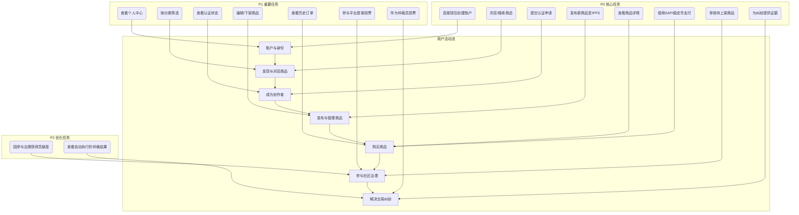

# Sapphire Mall 用户故事地图 (User Story Map)

---

| 版本 | 日期 | 修改内容 | 作者 |
|---|---|---|---|
| v0.4.0 | YYYY-MM-DD | 基于 PRD v0.4.0 和 Roadmap v0.4.0 创建，聚焦社区驱动的价值创造。 | 产品经理 |

## 1. 用户故事地图概述

本用户故事地图旨在将产品功能分解为以用户为中心的任务和故事，并将其映射到产品的发布版本中。它是连接产品愿景（PRD）和开发计划（Roadmap）的桥梁，确保开发团队始终围绕为用户创造价值的核心来组织工作。

**地图结构**: 
- **横向轴 (用户活动流)**: 代表用户为实现其目标而执行的一系列高阶活动。
- **纵向轴 (用户任务分解)**: 将每个高阶活动分解为具体的、可执行的用户任务。
- **版本映射**: 将用户故事（任务）分配到具体的发布版本（V1.0 MVP, V2.0 等），明确功能交付的优先级和顺序。

---

## 2. 核心用户角色

- **普通用户/消费者**: 平台的主要使用者，浏览和购买虚拟商品，参与社区活动。
- **创作者/认证商家**: 经过认证的虚拟商品提供者，发布和管理自己的商品。
- **社区贡献者**: 积极参与社区治理（审核、仲裁、投票）的活跃用户。
- **平台管理员**: 负责平台日常运营、内容监督和系统维护。

---

## 3. 用户故事地图

### V1.0 (MVP) - 核心交易与社区审核

**目标**: 验证核心模式，实现从商品发布到交易、再到社区治理的完整闭环。

| 用户活动 | P0 核心故事 (必须完成) | P1 重要故事 (提升体验) | P2 优化故事 (后续完善) |
|---|---|---|---|
| **账户与身份** | 作为新用户，我想要连接我的钱包，以便快速创建平台账户。 | 作为用户，我想要在个人中心查看我的账户信息和资产。 | |
| **发现与浏览** | 作为用户，我想要浏览、搜索我感兴趣的商品。 | 作为用户，我想要按分类、价格范围筛选商品。 | |
| **成为创作者** | 作为创作者，我想要提交我的认证资料以供平台审核。 | 作为创作者，我想要查看我的认证申请状态。 | |
| **发布与管理** | 作为认证商家，我想要发布一个新的虚拟商品，并将其文件存储在 IPFS 上。 | 作为认证商家，我想要编辑或下架我已发布的商品。 | |
| **购买商品** | 作为用户，我想要查看商品详情，并使用 SAP 或稳定币完成支付。 | 作为用户，我想要在我的账户中看到我购买的 NFT，并查看历史订单。 | |
| **参与社区治理** | 作为社区成员，我想要对一个待审核商品投赞成或反对票。 | 作为社区成员，我想要参与平台级的参数修改提案投票。 | 作为社区成员，我想要在投票后看到我的贡献度有所增加。 |
| **解决交易纠纷** | 作为买/卖方，我想要发起纠纷并提交证据。 | 作为社区仲裁员，我想要查看证据并对纠纷进行投票。 | 作为用户，我想要在裁决后看到纠纷结果被自动执行。 |

---

### V2.0 - 增强治理与创作者经济

**目标**: 提升社区活跃度和经济活力，为创作者提供更强大的工具。

| 用户活动 | 核心故事 | 
|---|---|
| **深化社区治理** | 作为社区贡献者，我想要我的投票权重能根据我的贡献度动态调整。 | 
| | 作为社区成员，我想要向社区金库提案，申请资金用于生态发展。 | 
| | 作为 SAP 持有者，我想要将我的投票权委托给信赖的社区代表。 | 
| **赋能创作者** | 作为创作者，我想要使用平台提供的模板快速创建一系列风格相似的商品。 | 
| | 作为创作者，我想要为我的商品设置一个二次销售的版税比例。 | 
| | 作为创作者，我想要拥有一个个人主页，展示我所有的作品和个人介绍。 | 
| **增强经济激励** | 作为高贡献度用户，我想要根据我的贡献度排名获得平台的部分收入分红（贡献度挖矿）。| 
| | 作为 SAP 持有者，我想要使用 SAP 代币来推广我的商品，使其获得更好的曝光。 | 
| **提升社交体验** | 作为用户，我想要在商品页面下发表我的评论并与他人讨论。 | 
| | 作为用户，我想要关注我喜欢的创作者，并收到他们的最新动态通知。 | 

---

### V3.0 - 生态扩展与互操作性 (规划中)

| 用户活动 | 核心故事 |
|---|---|
| **跨链与多平台** | 作为用户，我想要在其他公链（如 Polygon, BSC）上使用 Sapphire Mall。 |
| | 作为元宇宙玩家，我想要在我的虚拟土地上展示我在 Sapphire Mall 购买的 NFT 艺术品。 |
| **资产可组合性** | 作为用户，我想要将多个不同的 NFT 组合成一个更复杂的“捆绑包”资产。 |
| **开放集成** | 作为游戏开发者，我想要将我的游戏内道具作为 NFT 在 Sapphire Mall 上架交易。 |
| | 作为第三方 DApp，我想要通过 API 集成 Sapphire Mall 的搜索和交易功能。 |

**等待审核**
- 作为商家，我想要了解审核进度，以便预估上线时间
- 作为创作者，我想要获得审核反馈，以便改进商品质量
- 作为商家，我想要快速响应审核要求，以便加速上线

#### 3.2.4 销售阶段任务

**商品上线**
- 作为商家，我想要商品成功上线销售，以便开始获得收益
- 作为创作者，我想要推广我的商品，以便提高销量
- 作为商家，我想要监控商品表现，以便优化销售策略

**客户服务**
- 作为商家，我想要为客户提供优质服务，以便获得好评
- 作为创作者，我想要及时回复用户问题，以便维护品牌形象
- 作为商家，我想要处理售后问题，以便提升用户满意度

**参与质押**
- 作为商家，我想要将销售收益进行质押，以便获得额外收益
- 作为认证用户，我想要参与流动性提供，以便支持平台发展
- 作为商家，我想要平衡销售收益和质押收益，以便最大化总收益

#### 3.2.5 优化阶段任务

**查看数据**
- 作为商家，我想要查看详细的销售数据，以便分析商品表现
- 作为创作者，我想要了解用户偏好，以便创作更受欢迎的内容
- 作为商家，我想要对比不同商品表现，以便优化产品组合

**优化商品**
- 作为商家，我想要根据数据优化商品，以便提高销售表现
- 作为创作者，我想要更新商品内容，以便保持竞争力
- 作为商家，我想要调整价格策略，以便适应市场变化

**参与治理**
- 作为认证用户，我想要参与商家专属治理，以便影响平台商家政策
- 作为商家，我想要提出商家相关提案，以便改善商家体验
- 作为创作者，我想要参与平台发展决策，以便推动平台改进

### 3.3 管理员任务分解

#### 3.3.1 系统仪表板任务

**平台概览**
- 作为管理员，我想要在仪表板看到平台核心数据（实时用户数、交易量、TVL、收入、健康度），以便快速了解平台状况
- 作为管理员，我想要监控关键指标趋势（用户增长、质押参与率、DAO活跃度），以便把握发展方向
- 作为管理员，我想要接收异常告警（系统异常、交易异常、安全风险），以便及时处理问题

#### 3.3.2 用户管理任务

**用户列表管理**（标签页1）
- 作为管理员，我想要查看所有用户信息和状态，以便进行用户管理
- 作为管理员，我想要通过钱包地址或用户ID搜索用户，以便快速定位问题用户
- 作为管理员，我想要批量禁用或启用用户，以便高效处理违规行为

**KYC审核**（标签页2）
- 作为管理员，我想要处理KYC审核队列，以便确保商家合规性
- 作为管理员，我想要跟踪审核进度和历史，以便优化审核流程
- 作为管理员，我想要分配审核任务给不同审核员，以便提高审核效率

**权限管理**（标签页3）
- 作为超级管理员，我想要定义角色权限，以便确保系统安全
- 作为管理员，我想要查看权限变更日志，以便追踪权限变化
- 作为管理员，我想要授予特殊权限，以便处理特殊情况

#### 3.3.3 商品管理任务

**商品审核**（标签页1）
- 作为管理员，我想要高效处理商品审核队列，以便保证平台内容质量
- 作为管理员，我想要使用审核标准checklist，以便标准化审核流程
- 作为管理员，我想要批量审核操作，以便提高审核效率

**违规处理**（标签页2）
- 作为管理员，我想要处理商品举报和违规申诉，以便维护平台秩序
- 作为管理员，我想要下架违规商品并处罚用户，以便执行平台规则
- 作为管理员，我想要记录违规处理历史，以便建立信用体系

**质量监控**（标签页3）
- 作为管理员，我想要监控商品质量和用户评价，以便持续改善内容质量
- 作为管理员，我想要分析商品数据和趋势，以便优化平台策略

#### 3.3.4 交易管理任务

**交易监控**（标签页1）
- 作为管理员，我想要监控实时交易流和异常交易，以便及时发现问题
- 作为管理员，我想要跟踪大额交易，以便防范风险
- 作为管理员，我想要监控交易成功率，以便优化系统性能

**财务管理**（标签页2）
- 作为管理员，我想要管理平台收入和手续费分配，以便确保财务正常
- 作为管理员，我想要生成财务报表，以便进行财务分析
- 作为管理员，我想要设置分成比例，以便调整激励机制

#### 3.3.5 流动性管理任务

**质押监控**（标签页1）
- 作为管理员，我想要监控质押状态和用户行为，以便确保质押系统正常
- 作为管理员，我想要检测异常质押操作，以便防范攻击
- 作为管理员，我想要分析质押数据，以便优化质押机制

**收益分配**（标签页2）
- 作为管理员，我想要管理收益分配规则，以便确保分配公平
- 作为管理员，我想要验证分配准确性，以便维护用户信任
- 作为管理员，我想要查看分配历史，以便追踪分配记录

**风险控制**（标签页3）
- 作为管理员，我想要监控风险指标，以便及时发现风险
- 作为管理员，我想要设置风险预警，以便提前应对问题
- 作为管理员，我想要执行应急处理，以便保护用户资产

#### 3.3.6 系统管理任务

**系统配置**（标签页1）
- 作为技术管理员，我想要配置基础参数和手续费，以便调整系统运行
- 作为管理员，我想要管理网络配置，以便支持多链部署
- 作为管理员，我想要控制功能开关，以便灵活管理功能

**安全中心**（标签页2）
- 作为安全管理员，我想要监控安全状态，以便保护平台安全
- 作为管理员，我想要查看访问日志，以便追踪异常行为
- 作为管理员，我想要执行权限审计，以便确保权限安全

**运维管理**（标签页3）
- 作为技术管理员，我想要监控服务状态，以便确保系统稳定
- 作为管理员，我想要查看系统日志，以便诊断问题
- 作为管理员，我想要管理备份和版本发布，以便保障数据安全

**应急响应**（标签页4）
- 作为超级管理员，我想要执行紧急暂停操作，以便应对严重问题
- 作为管理员，我想要执行应急预案，以便快速响应危机
- 作为管理员，我想要记录应急操作，以便总结经验教训

## 4. 故事优先级与版本映射

### 4.1 优先级分级标准

| 优先级 | 定义 | 用户价值 | 开发复杂度 |
|--------|------|----------|------------|
| **P0** | 必须有 | 核心价值创造 | 中等 |
| **P1** | 应该有 | 重要价值提升 | 中等 |
| **P2** | 可以有 | 体验改善 | 低等 |
| **P3** | 未来有 | 长期价值 | 高等 |

### 4.2 MVP阶段 (v0.1-v1.0) 用户故事优先级

#### 4.2.1 P0级别故事 (MVP核心)

**用户管理相关**
- 作为新用户，我想要连接MetaMask钱包，以便安全地访问平台 [v0.2]
- 作为用户，我想要注册并创建个人资料，以便使用平台功能 [v0.2]
- 作为创作者，我想要完成KYC认证，以便发布商品 [v0.2]

**代币兑换相关**
- 作为用户，我想要将USDT兑换为SAP，以便购买商品 [v0.3]
- 作为用户，我想要看到实时汇率，以便了解兑换成本 [v0.3]
- 作为用户，我想要一键完成兑换，以便简化操作流程 [v0.3]

**商品管理相关**
- 作为创作者，我想要发布虚拟商品，以便开始销售 [v0.4]
- 作为用户，我想要浏览商品列表，以便发现感兴趣的商品 [v0.4]
- 作为用户，我想要搜索特定商品，以便快速找到目标 [v0.4]

**交易系统相关**
- 作为用户，我想要使用SAP购买商品，以便获得虚拟商品 [v0.5]
- 作为用户，我想要立即获得数字商品访问权限，以便开始使用 [v0.5]
- 作为创作者，我想要自动获得销售收益，以便获得收入 [v0.5]

**DeFi功能相关**
- 作为用户，我想要添加SAP/USDT流动性，以便参与挖矿 [v0.6]
- 作为用户，我想要质押LP代币，以便获得挖矿奖励 [v0.7]
- 作为用户，我想要随时领取奖励，以便实现收益 [v0.7]

#### 4.2.2 P1级别故事 (MVP重要)

**用户体验相关**
- 作为新用户，我想要获得操作指导，以便快速学会使用平台 [v0.8]
- 作为用户，我想要在移动端正常使用，以便随时访问平台 [v0.8]
- 作为国际用户，我想要使用英文界面，以便理解操作内容 [v0.8]

**商品功能相关**
- 作为用户，我想要查看商品详细信息，以便做出购买决策 [v0.4]
- 作为用户，我想要看到用户评价，以便参考他人经验 [v0.5]
- 作为创作者，我想要管理商品库存，以便控制销售 [v0.4]

**安全功能相关**
- 作为用户，我想要看到交易确认信息，以便验证交易正确性 [v0.5]
- 作为用户，我想要查看交易历史，以便追踪我的活动 [v0.5]

#### 4.2.3 P2级别故事 (MVP改善)

**社交功能相关**
- 作为用户，我想要关注喜欢的创作者，以便获得更新通知 [v1.2]
- 作为用户，我想要分享商品给朋友，以便推荐好商品 [v1.2]
- 作为创作者，我想要与粉丝互动，以便建立社区 [v1.2]

**高级功能相关**
- 作为用户，我想要收藏感兴趣的商品，以便后续购买 [v1.1]
- 作为用户，我想要比较不同商品，以便选择最合适的 [v1.1]
- 作为用户，我想要获得个性化推荐，以便发现更多商品 [v1.3]

### 4.3 成长阶段 (v1.1-v2.0) 用户故事规划

#### 4.3.1 高级交易功能 [v1.1]

**批量操作**
- 作为用户，我想要批量购买多个商品，以便提高效率
- 作为用户，我想要设置定时购买，以便在特定时间自动购买
- 作为创作者，我想要批量管理商品，以便提高运营效率

**智能功能**
- 作为用户，我想要获得智能推荐，以便发现更符合需求的商品
- 作为用户，我想要价格提醒，以便在降价时及时购买
- 作为创作者，我想要智能定价建议，以便优化收益

#### 4.3.2 社交功能 [v1.2]

**社区互动**
- 作为用户，我想要加入商品讨论，以便与其他用户交流
- 作为用户，我想要创建评测内容，以便分享使用体验
- 作为创作者，我想要建立社区，以便与用户深度互动

**内容分享**
- 作为用户，我想要分享购买体验，以便帮助其他用户
- 作为用户，我想要参与话题讨论，以便获得更多信息
- 作为创作者，我想要发布动态，以便宣传新商品

#### 4.3.3 DeFi功能扩展 [v1.4-v1.5]

**高级DeFi**
- 作为投资者，我想要参与多种挖矿池，以便分散投资风险
- 作为投资者，我想要自动复投收益，以便实现复利增长
- 作为投资者，我想要使用DeFi策略，以便最大化收益

**DAO治理**
- 作为SAP持有者，我想要参与平台治理投票，以便影响平台发展
- 作为社区成员，我想要发起提案，以便推动平台改进
- 作为长期用户，我想要获得治理奖励，以便激励参与

### 4.4 扩展阶段 (v2.1-v3.0) 用户故事规划

#### 4.4.1 多链扩展功能

**跨链操作**
- 作为用户，我想要在Polygon上使用更低的Gas费，以便降低交易成本
- 作为用户，我想要跨链转移资产，以便在不同网络间灵活操作
- 作为创作者，我想要选择发布网络，以便触达不同用户群体

#### 4.4.2 企业服务功能

**企业用户**
- 作为企业用户，我想要批量采购虚拟商品，以便满足团队需求
- 作为企业用户，我想要获得专属服务，以便获得更好的支持
- 作为企业用户，我想要定制化解决方案，以便适应业务需求

#### 4.4.3 NFT功能扩展

**NFT创作**
- 作为艺术家，我想要创作NFT作品，以便进入数字艺术市场
- 作为收藏家，我想要交易NFT，以便建立数字收藏
- 作为投资者，我想要投资NFT，以便获得升值收益

## 5. 用户故事验收标准

### 5.1 故事验收标准模板

每个用户故事都应该包含以下验收标准：

**功能标准**
- 功能正常运行
- 界面友好易用
- 错误处理完善

**性能标准**
- 响应时间符合要求
- 并发处理能力达标
- 资源使用优化

**安全标准**
- 数据传输加密
- 权限验证正确
- 异常情况处理

### 5.2 核心用户故事详细验收标准

#### 5.2.1 代币兑换故事

**用户故事**: 作为用户，我想要将USDT兑换为SAP，以便购买商品

**验收标准**:
- [ ] 用户可以选择USDT作为输入代币
- [ ] 系统显示实时汇率和预估兑换数量
- [ ] 用户可以设置滑点容忍度
- [ ] 系统显示预估Gas费用
- [ ] 兑换成功后更新用户SAP余额
- [ ] 兑换历史记录正确保存
- [ ] 兑换失败时提供明确错误信息
- [ ] 兑换过程中显示进度状态
- [ ] 支持取消待确认的兑换交易

#### 5.2.2 商品购买故事

**用户故事**: 作为用户，我想要使用SAP购买商品，以便获得虚拟商品

**验收标准**:
- [ ] 用户可以浏览商品列表
- [ ] 用户可以查看商品详细信息
- [ ] 用户可以选择商品并添加到购物车
- [ ] 系统检查用户SAP余额是否足够
- [ ] 用户确认订单信息后可以提交
- [ ] 支付成功后立即获得商品访问权限
- [ ] 订单状态实时更新
- [ ] 用户可以查看订单历史
- [ ] 支持7天内申请退款

#### 5.2.3 流动性挖矿故事

**用户故事**: 作为用户，我想要质押LP代币，以便获得挖矿奖励

**验收标准**:
- [ ] 用户可以添加SAP/USDT流动性
- [ ] 系统正确计算LP代币数量
- [ ] 用户可以质押LP代币参与挖矿
- [ ] 系统实时计算挖矿奖励
- [ ] 用户可以随时查看奖励余额
- [ ] 用户可以领取挖矿奖励
- [ ] 用户可以取消质押并移除流动性
- [ ] 显示年化收益率(APR/APY)
- [ ] 提供无常损失计算器

## 6. 用户故事迭代计划

### 6.1 Sprint规划 (2周一个Sprint)

#### Sprint 1-2 (Week 1-4): 基础架构
- 用户注册和钱包连接
- 基础智能合约部署
- 前后端架构搭建

#### Sprint 3-4 (Week 5-8): 用户系统
- 用户资料管理
- KYC认证流程
- 权限管理系统

#### Sprint 5-6 (Week 9-12): 代币兑换
- Uniswap集成
- 兑换界面开发
- 价格获取和显示

#### Sprint 7-8 (Week 13-16): 商品管理
- 商品发布功能
- 商品浏览界面
- 搜索和筛选功能

#### Sprint 9-10 (Week 17-20): 交易系统
- 订单管理系统
- 支付处理流程
- 商品交付机制

#### Sprint 11-12 (Week 21-24): 流动性池
- 流动性池合约
- 添加/移除流动性
- 流动性数据展示

#### Sprint 13-14 (Week 25-28): 流动性挖矿
- 挖矿奖励合约
- 质押界面开发
- 奖励计算和分发

#### Sprint 15-16 (Week 29-32): 系统优化
- 性能优化
- 安全加固
- 用户体验改进

#### Sprint 17-18 (Week 33-36): 预发布
- 完整功能测试
- 压力测试
- 用户验收测试

#### Sprint 19-20 (Week 37-40): 正式发布
- 主网部署
- 市场推广
- 运营支持

### 6.2 用户故事完成定义 (Definition of Done)

每个用户故事被认为完成需要满足：

**开发完成**
- [ ] 功能代码开发完成
- [ ] 单元测试通过
- [ ] 集成测试通过
- [ ] 代码审查通过

**质量保证**
- [ ] 功能测试通过
- [ ] 性能测试通过
- [ ] 安全测试通过
- [ ] 兼容性测试通过

**用户验收**
- [ ] 产品经理验收通过
- [ ] 用户体验符合要求
- [ ] 文档更新完成
- [ ] 部署到测试环境

**发布准备**
- [ ] 监控指标配置
- [ ] 错误处理完善
- [ ] 回滚方案准备
- [ ] 用户支持准备

---

*本用户故事地图将根据用户反馈和市场变化持续更新，确保产品开发始终以用户价值为中心。*