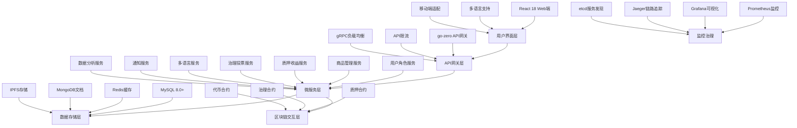
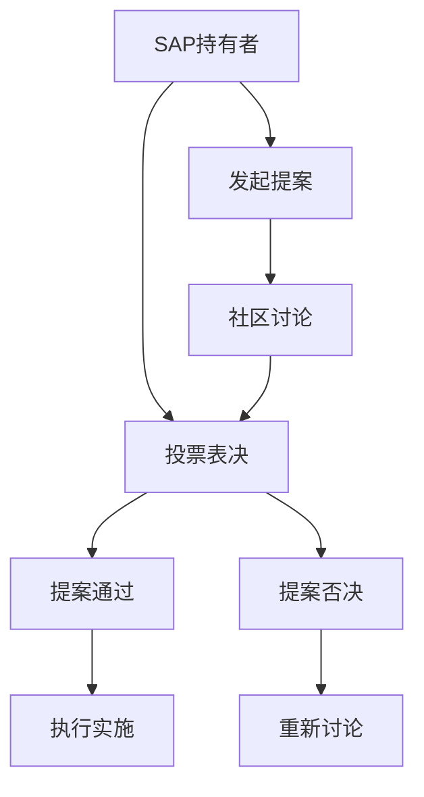

# Sapphire Mall 产品白皮书

## 项目概述

### 项目简介

Sapphire Mall（蓝宝石区块链电商系统，简称Sapphire Mall）是一个专注于虚拟商品交易的创新型区块链电商平台。平台以自发行的ERC20代币SAP为核心流通媒介，通过流动性池提供便捷的代币兑换服务，引入流动性质押收益机制，并建立DAO治理系统，打造集购物、资产流通、收益获取、社区治理于一体的Web3虚拟商品生态。

**核心创新**:
- **用户角色分层**: 普通用户、认证用户、管理员三层权限体系，满足不同用户需求
- **质押收益机制**: 流动性提供者可获得平台手续费分成的持续收益（70%分配给用户）
- **多语言国际化**: 原生支持中英文双语，面向全球用户提供本地化体验
- **DAO社区治理**: SAP持有者可参与平台重大决策投票，实现社区自治

**业务背景**:
随着区块链技术和Web3理念的快速发展，数字资产和虚拟商品的交易需求日益增长。传统电商平台在虚拟商品流通、资产确权、交易透明度等方面存在诸多局限，难以满足新一代用户对数字经济的高效、安全和去中心化的需求。

当前虚拟商品交易市场面临的主要挑战包括：
- **收益机制单一**: 用户资产无法获得持续收益，缺乏激励机制
- **角色权限混乱**: 缺乏清晰的用户权限体系，难以保障平台秩序
- **国际化程度不足**: 语言障碍限制了平台的全球化发展
- **治理参与缺失**: 用户无法参与平台重大决策，缺乏社区治理机制

在此背景下，Sapphire Mall应运而生，致力于构建一个专注虚拟商品交易的Web3平台，通过创新的质押收益机制为用户创造持续价值，通过多语言支持拓展全球市场，通过DAO治理实现社区自治。

### 愿景与使命

**愿景**: 成为全球领先的Web3虚拟商品交易平台，通过DAO治理实现社区自治，通过质押收益激励生态参与，推动数字经济创新发展。

**使命**: 为用户提供安全、透明、高效的虚拟商品交易环境，通过区块链技术实现资产确权，通过流动性池机制提升资产流动性，通过质押收益机制激励生态建设。

### 核心价值主张

- **实用虚拟商品交易**: 区别于OpenSea的纯NFT交易，提供实际可用的虚拟商品
- **流动性质押收益**: 用户可通过提供流动性获得平台手续费分成的持续收益
- **一键兑换支付**: 支持主流ERC20代币一键兑换SAP完成支付
- **DAO治理参与**: SAP持有者可参与平台重大决策投票
- **透明链上结算**: 所有交易记录不可篡改，保障交易透明度
- **多语言体验**: 中英文双语支持，面向全球用户
- **分层用户体系**: 支持不同角色用户的差异化功能和权限

## 市场分析与痛点

### 行业现状

当前数字经济正在快速发展，虚拟商品市场预计2024年将达到1950亿美元规模。同时，DeFi质押市场总锁仓价值超过500亿美元，用户对被动收益的需求持续增长。然而，传统虚拟商品交易和DeFi产品存在诸多问题：

1. **缺乏持续收益机制**: 用户购买商品后无法获得额外收益，资产利用效率低
2. **用户权限体系混乱**: 缺乏清晰的角色权限管理，普通用户和商家权限不分
3. **国际化程度不足**: 75%的消费者更愿意用母语购物，但多数平台缺乏本地化支持
4. **治理参与度低**: 80%的Web3用户关注治理参与，但现有平台缺乏有效机制
5. **收益分配不透明**: 平台收益分配机制不公开，用户无法分享平台成长价值
6. **质押产品缺乏实用性**: 现有DeFi质押产品与实际应用场景结合度低

### 目标用户群体

**主要用户群体1: 全球加密货币投资者**
- 人群特征: 25-45岁，中高收入，全球分布
- 核心需求: 获得稳定的质押收益，参与平台治理，使用加密货币消费
- 痛点: 缺乏安全可靠的质押收益机会，语言障碍影响使用体验

**主要用户群体2: 多元化内容创造者**
- 人群特征: 20-40岁，设计师、程序员、课程讲师，国际化背景
- 核心需求: 扩大全球销售渠道，获得透明收益，降低平台抽成
- 痛点: 传统平台抽成高，缺乏多语言支持，无法触达全球用户

**主要用户群体3: 质押收益追求者**
- 人群特征: DeFi熟练用户，追求稳定收益
- 核心需求: 在保持流动性的同时获得稳定的手续费分成收益
- 痛点: 现有质押产品收益率波动大，缺乏与实际应用结合的产品

### 市场机会

1. **质押收益市场增长**: DeFi质押市场年增长率25%+，用户需求强烈
2. **多语言电商需求**: 全球化平台需要本地化支持，市场空间巨大
3. **DAO治理普及**: Web3项目普遍引入社区治理机制，用户参与度提升
4. **用户体验重视度提升**: Web3应用更注重易用性和新手友好度
5. **虚拟商品市场扩展**: 年增长率超过25%，从纯收藏向实用功能转变

## 解决方案

### 技术创新

**1. 流动性质押收益系统**
- 集成AMM流动性池，支持SAP/ETH、SAP/USDT、SAP/USDC交易对
- 创新收益分配机制：平台手续费70%分配给流动性提供者，30%归平台运营
- 实时APY计算和收益分配，用户可随时提取或复投收益
- 质押无锁定期，保持资金灵活性

**2. 三层用户角色权限系统**
- **普通用户**: 钱包连接即可使用基础功能，拥有4个后台管理模块
  - 个人中心：个人信息、账户设置、安全中心、通知设置
  - 我的资产：代币余额、质押管理、交易记录
  - 交易管理：收货地址、我的订单、退款/售后
  - DAO治理：提案列表、我的投票、治理代币、社区活动
- **认证商户**: 通过KYC认证后获得商品发布权限，拥有5个后台管理模块
  - 继承普通用户的4个模块
  - 商家中心：商品管理、订单管理、评价管理、交易数据
- **系统管理员**: 平台指定管理人员，拥有最高权限的5个管理模块
  - 个人中心：管理员个人信息和权限管理
  - 平台管理：用户管理、商户管理、商品管理、订单管理、分类管理、评价管理、举报处理
  - 合约管理：智能合约、代币管理、链上监控、合约升级
  - DAO治理管理：提案管理、投票管理、治理代币管理、社区管理、治理参数设置、治理统计
  - 系统管理：系统设置、参数配置、操作日志、数据分析、权限管理
- 智能合约级别的权限控制，确保权限管理准确无误

**3. 多语言国际化架构**
- 前端使用react-i18next实现完整的中英文双语支持
- 商品信息支持多语言描述，创作者可用不同语言触达全球用户
- 数字格式本地化，根据用户语言调整数字、日期、货币格式
- DAO治理提案支持多语言，确保全球用户参与

### 产品功能

**核心功能模块**:

1. **流动性质押收益**: 用户提供流动性获得LP代币，质押LP代币获得平台手续费分成
2. **虚拟商品交易**: 认证用户发布商品，普通用户使用SAP购买
3. **一键兑换支付**: 主流ERC20代币通过流动性池一键兑换SAP
4. **DAO社区治理**: SAP持有者参与提案投票，投票权重基于持有量
5. **多语言用户体验**: 完整的中英文双语支持，本地化用户体验
6. **官网数据展示**: 实时展示平台核心数据，增强用户信任

**差异化优势**:

| 特性 | Sapphire Mall | OpenSea | Magic Eden | Uniswap |
|------|---------------|---------|------------|---------|
| 虚拟商品交易 | ✅ 专注实用商品 | ❌ 纯NFT艺术品 | ❌ 纯NFT | ❌ 无商品 |
| 流动性质押收益 | ✅ 手续费分成 | ❌ 无质押 | ❌ 无质押 | ✅ 有质押 |
| DAO治理 | ✅ SAP持有者投票 | ❌ 无治理 | ❌ 无治理 | ✅ UNI治理 |
| 多语言支持 | ✅ 中英文完整支持 | ⚠️ 有限支持 | ⚠️ 有限支持 | ⚠️ 有限支持 |
| 用户角色分层 | ✅ 三层权限体系 | ❌ 无分层 | ❌ 无分层 | ❌ 无分层 |
| 收益机制 | ✅ 质押+商品销售 | ❌ 仅交易 | ❌ 仅交易 | ✅ 仅交易费 |
| 新手友好 | ✅ 多语言引导 | ⚠️ 一般 | ⚠️ 一般 | ❌ 复杂 |

### 经济模型设计

**SAP代币机制**:
- **发行方式**: 平台官方发行，非挖矿产出
- **流通机制**: 通过流动性池提供代币兑换服务
- **收益分配**: 平台手续费70%分配给质押用户，30%归平台运营
- **治理功能**: 持有SAP即可参与DAO投票，投票权重基于持有量

**收益来源与分配**:
1. **代币兑换手续费**: 0.3%兑换手续费，70%分配给LP质押者
2. **商品上架费**: 商品价值5%的上架费，归平台运营
3. **治理参与激励**: DAO投票参与者获得额外SAP奖励

**质押收益机制**:
- 用户提供流动性获得LP代币
- 质押LP代币开始获得收益
- 收益来源：平台所有手续费的70%
- 收益分配：按质押LP代币比例实时分配
- 年化收益率：动态调整，目标维持8-15%

## 技术架构

### 整体架构设计



### 技术选型

**前端技术栈**:
- **核心框架**: React 18 + TypeScript
- **状态管理**: Redux Toolkit + RTK Query
- **UI框架**: Tailwind CSS + Headless UI
- **国际化**: react-i18next + 自定义翻译管理
- **Web3集成**: Wagmi + Viem + TanStack Query
- **钱包连接**: Web3Modal v3 + ConnectKit
- **图表可视化**: Recharts + Chart.js
- **数据格式化**: date-fns + numeral.js

**后端微服务技术栈**:
- **微服务框架**: Go + go-zero框架
- **服务间通信**: gRPC + etcd服务发现
- **数据库**: MySQL 8.0+ + Redis + MongoDB
- **任务队列**: asynq + Redis
- **监控体系**: Prometheus + Grafana + Jaeger
- **区块链交互**: go-ethereum + 自定义RPC客户端
- **文件存储**: IPFS + Pinata + 阿里云OSS

**智能合约技术**:
- **开发框架**: Hardhat + TypeScript
- **合约语言**: Solidity 0.8.19+
- **测试框架**: Waffle + Chai + Hardhat Network
- **部署工具**: Hardhat Deploy + Hardhat Verify
- **安全工具**: Slither + Mythril + OpenZeppelin
- **升级机制**: OpenZeppelin Upgrades
- **多签管理**: Gnosis Safe

### 智能合约架构

**核心合约设计**:

1. **SAP代币合约 (SapphireToken.sol)**
```solidity
contract SapphireToken is ERC20, Ownable {
    uint256 public constant TOTAL_SUPPLY = 100_000_000 * 10**18;
    
    constructor() ERC20("Sapphire Mall Token", "SAP") {
        _mint(msg.sender, TOTAL_SUPPLY);
    }
}
```

2. **流动性质押合约 (LiquidityStaking.sol)**
```solidity
contract LiquidityStaking {
    struct StakingInfo {
        uint256 amount;
        uint256 rewardDebt;
        uint256 startTime;
    }
    
    mapping(address => StakingInfo) public stakingInfo;
    uint256 public totalStaked;
    uint256 public rewardPerToken;
    
    function stake(uint256 amount) external;
    function unstake(uint256 amount) external;
    function claimRewards() external;
}
```

3. **DAO治理合约 (GovernanceDAO.sol)**
```solidity
contract GovernanceDAO {
    struct Proposal {
        string title;
        string description;
        uint256 votesFor;
        uint256 votesAgainst;
        uint256 endTime;
        bool executed;
    }
    
    mapping(uint256 => Proposal) public proposals;
    mapping(uint256 => mapping(address => bool)) public hasVoted;
    
    function createProposal(string memory title, string memory description) external;
    function vote(uint256 proposalId, bool support) external;
    function executeProposal(uint256 proposalId) external;
}
```

## 代币经济模型

### SAP代币基本信息

**代币标准**: ERC-20
**代币名称**: Sapphire Mall Token
**代币符号**: SAP
**总供应量**: 100,000,000 SAP
**精度**: 18位小数
**合约地址**: [部署后公布]
**代币类型**: 功能型代币（Utility Token）

### 代币分配方案

| 分配对象 | 数量 | 比例 | 锁仓期 | 释放机制 | 用途说明 |
|----------|------|------|--------|----------|----------|
| **公开众筹** | 30,000,000 SAP | 30% | 无 | 众筹结束后立即流通 | 平台初期融资，建立初始流动性 |
| **团队激励** | 20,000,000 SAP | 20% | 12个月 | 线性释放24个月 | 团队长期激励，确保项目持续发展 |
| **生态发展** | 25,000,000 SAP | 25% | 6个月 | 根据生态需要释放 | 合作伙伴激励、市场推广、生态建设 |
| **流动性挖矿** | 20,000,000 SAP | 20% | 无 | 根据挖矿算法释放 | 激励用户提供流动性，建立交易深度 |
| **储备资金** | 5,000,000 SAP | 5% | 18个月 | 应急和发展储备 | 应对市场波动、技术升级、紧急情况 |

### 代币价值支撑

**1. 平台实用价值**
- SAP是平台唯一支付媒介，所有虚拟商品必须用SAP购买
- 商品上架需要支付SAP作为上架费
- 参与平台治理需要持有SAP代币

**2. DeFi收益机制**
- 用户提供SAP流动性获得挖矿奖励
- 交易手续费回购销毁SAP，减少供应量
- 收益分享机制激励长期持有

**3. 通缩机制**
- 每笔交易的一定比例用于回购销毁SAP
- 商品上架费的50%用于销毁
- 设置年度销毁上限，保持代币稀缺性

### 代币价值支撑机制详解

#### 3.1 平台实用价值
**唯一支付媒介**: SAP是平台唯一支付媒介，所有虚拟商品必须用SAP购买
**商家保证金**: 认证商家需要缴纳100 SAP作为保证金
**商品上架费**: 商品上架需要支付SAP作为上架费（商品价格的5%）
**治理参与权**: 参与平台DAO治理需要持有SAP代币
**平台服务费**: 代币兑换手续费（0.3%）以SAP形式收取

#### 3.2 流动性收益机制
**流动性提供奖励**: 用户提供SAP流动性获得挖矿奖励
**手续费分成**: 平台手续费的70%分配给流动性提供者
**质押收益**: 长期质押SAP获得额外收益加成
**复投机制**: 收益可自动复投，实现复利增长

#### 3.3 通缩销毁机制
**交易销毁**: 每笔商品交易额的2%用于回购销毁SAP
**上架费销毁**: 商品上架费的50%用于销毁SAP
**手续费销毁**: 平台手续费的10%用于销毁SAP
**年度销毁上限**: 设置年度销毁上限为总供应量的5%，保持代币稀缺性

### 流动性挖矿机制

**挖矿池设计**:

| 交易对 | 分配权重 | 年化收益率 | 风险等级 | 锁仓要求 |
|--------|----------|------------|----------|----------|
| SAP/USDT | 40% | 8-12% | 低 | 无 |
| SAP/ETH | 35% | 10-15% | 中 | 无 |
| SAP/USDC | 25% | 6-10% | 低 | 无 |

**奖励计算公式**:
```
用户奖励 = (用户LP代币数量 / 总LP代币数量) × 池子每日奖励 × 天数 × 质押系数
```

**质押系数机制**:
- 质押1-30天: 1.0x
- 质押31-90天: 1.2x
- 质押91-180天: 1.5x
- 质押181-365天: 2.0x
- 质押365天以上: 2.5x

**挖矿奖励释放计划**:
- 第1年: 800,000 SAP (40%年化)
- 第2年: 600,000 SAP (30%年化)
- 第3年: 400,000 SAP (20%年化)
- 第4年: 200,000 SAP (10%年化)
- 第5年及以后: 100,000 SAP (5%年化)

### 代币流通模型

**代币流通路径**:
1. **初始分配**: 通过公开众筹和生态发展基金进入市场
2. **用户获取**: 通过流动性挖矿、商品销售、平台奖励获得
3. **平台使用**: 购买虚拟商品、支付上架费、参与治理
4. **收益分配**: 流动性提供者获得手续费分成
5. **销毁机制**: 通过交易、上架费、手续费销毁减少供应
6. **价值提升**: 供需关系变化推动代币价值增长

**代币经济循环**:
```
用户购买SAP → 提供流动性 → 获得挖矿奖励 → 购买商品 → 商家获得SAP → 商家消费或兑换 → 市场流通
    ↓
平台收入 → 回购销毁 → 减少供应量 → 价值提升 → 用户持有SAP
```

### 治理机制

**DAO治理框架**:
1. **提案门槛**: 持有10,000 SAP可发起提案
2. **投票权重**: 1 SAP = 1票，支持委托投票
3. **通过标准**: 参与率>25%，赞成票>60%
4. **执行时效**: 通过后48小时时间锁保护

**治理范围**:
- 平台手续费率调整
- 新功能开发优先级
- 代币经济参数修改
- 合作伙伴准入标准
- 紧急事件响应

**治理参与激励**:
- **投票奖励**: 参与治理投票获得SAP奖励
- **提案奖励**: 成功提案的发起者获得额外奖励
- **委托奖励**: 委托投票的委托人获得部分奖励分成

### 风险控制机制

#### 价格稳定机制
**动态调整**: 根据市场情况动态调整挖矿奖励
**紧急暂停**: 异常情况下可暂停挖矿和交易
**储备金使用**: 储备资金用于市场稳定和应急情况

#### 流动性保护
**最小流动性要求**: 确保关键交易对的最小流动性
**滑点保护**: 大额交易滑点保护机制
**价格预言机**: 集成Chainlink价格预言机防止价格操纵

#### 安全机制
**多签管理**: 关键操作需要多签确认
**时间锁**: 重要参数修改有时间锁保护
**审计机制**: 定期进行智能合约安全审计

### 代币经济指标监控

#### 关键指标
- **流通市值**: 实时监控代币流通市值变化
- **交易量**: 监控日交易量和交易活跃度
- **流动性深度**: 监控各交易对的流动性深度
- **质押率**: 监控代币质押比例和质押分布
- **销毁量**: 监控代币销毁进度和效果
- **治理参与度**: 监控DAO治理参与情况

#### 目标指标
- **流通市值目标**: 首年达到1000万美元
- **日交易量目标**: 首年达到50万美元
- **质押率目标**: 维持30-50%的健康质押率
- **治理参与率目标**: 达到20%以上的参与率

### 代币经济模型优势

#### 1. 多重价值支撑
- **实用价值**: 作为平台唯一支付媒介
- **收益价值**: 通过流动性挖矿获得持续收益
- **治理价值**: 参与平台重大决策
- **稀缺价值**: 通过销毁机制保持稀缺性

#### 2. 可持续激励机制
- **长期质押奖励**: 鼓励长期持有和参与
- **复投机制**: 实现收益的复利增长
- **治理参与**: 增强用户粘性和参与度

#### 3. 风险控制完善
- **多层级安全机制**: 保护用户资产安全
- **价格稳定措施**: 减少市场波动风险
- **流动性保护**: 确保交易顺畅进行

#### 4. 透明可验证
- **链上记录**: 所有操作透明可查
- **智能合约执行**: 自动化执行，减少人为干预
- **实时监控**: 关键指标实时监控和报告

## 路线图

### 发展阶段规划

**第一阶段: MVP上线 (2025 Q2 - 2025 Q4)**
- 核心功能开发完成（代币兑换、商品交易、基础DeFi）
- Sepolia测试网部署和测试
- 安全审计和漏洞修复
- 主网正式发布
- 初期用户获取和社区建设

**第二阶段: 生态建设 (2025 Q4 - 2026 Q2)**
- DAO治理机制上线
- 移动端APP发布
- 高级DeFi功能（复合挖矿、策略优化）
- 用户增长和商品生态完善
- 品牌建设和市场推广

**第三阶段: 多链扩展 (2026 Q2 - 2026 Q4)**
- Polygon网络部署
- BSC网络集成
- 跨链桥接功能
- 移动端APP发布
- 全球化运营

**第四阶段: 生态成熟 (2026 Q4 - 2027 Q2)**
- API开放平台
- 企业级服务
- AI功能集成
- 合作伙伴生态
- 可持续发展

### 详细里程碑

| 时间节点 | 主要里程碑 | 关键指标 | 核心功能 |
|----------|------------|----------|----------|
| **2025 Q3** | MVP发布 | 1000+用户，$50K GMV | 完整平台功能 |
| **2025 Q4** | 用户增长 | 5000+用户，$200K GMV | 移动端优化 |
| **2026 Q1** | DeFi完善 | $500K TVL，DAO启动 | 治理机制 |
| **2026 Q2** | 多链部署 | 10000+用户，$1M GMV | Polygon集成 |
| **2026 Q3** | 生态扩展 | $2M GMV，企业服务 | API平台 |
| **2026 Q4** | 全球化 | 50000+用户，$5M GMV | 全球运营 |

## 团队与顾问

### 核心团队

**产品负责人**
- 10年+互联网产品经验
- 曾参与多个千万级用户产品
- Web3和DeFi深度理解

**技术负责人**
- 区块链开发5年+经验
- 智能合约安全专家
- 曾负责多个DeFi项目技术架构

**运营负责人**
- 电商运营8年+经验
- 社区建设和用户增长专家
- 熟悉加密货币市场

### 顾问团队

**区块链技术顾问**
- 知名DeFi协议核心开发者
- 智能合约安全审计专家

**商业发展顾问**
- 传统电商高管背景
- 丰富的商务拓展经验

**法律合规顾问**
- 专业区块链法律事务所
- 多国监管政策专家

### 合作伙伴

**技术合作伙伴**:
- Uniswap Labs: DEX协议集成
- Chainlink: 价格预言机服务
- IPFS: 去中心化存储

**生态合作伙伴**:
- 多家创作者平台
- 虚拟商品供应商
- Web3钱包服务商

## 社区与治理

### 社区建设

**社区构成**:
- 普通用户: 虚拟商品消费者
- 创作者: 内容和商品提供者
- 投资者: DeFi参与者和代币持有者
- 开发者: 生态建设者

**社区激励**:
- 早期用户空投奖励
- 活跃用户等级权益
- 创作者扶持计划
- 开发者贡献奖励

### DAO治理机制

**治理结构**:


**治理流程**:
1. **提案发起**: 持有10,000 SAP的用户可发起提案
2. **社区讨论**: 7天讨论期，收集社区意见
3. **投票表决**: 7天投票期，SAP持有者参与投票
4. **结果执行**: 通过提案进入48小时时间锁，然后执行

**治理范围**:
- 平台参数调整（手续费率、挖矿奖励等）
- 新功能开发优先级
- 生态基金使用
- 合作伙伴准入
- 紧急事件处理

### 激励机制

**用户激励**:
- 交易即挖矿: 每笔交易获得SAP奖励
- 推荐奖励: 推荐新用户获得代币奖励
- 社区贡献: 高质量内容和反馈获得奖励

**创作者激励**:
- 新人扶持: 新创作者前10个商品免上架费
- 爆款奖励: 热销商品创作者获得额外奖励
- 长期合作: 优质创作者获得平台股权

## 合规与法律

### 法律框架

**代币性质声明**:
SAP代币是平台功能型代币（Utility Token），主要用途包括：
- 平台商品和服务支付
- 参与平台治理决策
- 获得DeFi收益分成
- 享受平台特权服务

SAP代币不构成证券，不承诺投资回报，价值波动风险由持有者自担。

### 合规措施

**KYC/AML合规**:
- 商家必须完成身份认证
- 大额交易需要额外验证
- 可疑交易自动监控报告
- 配合监管部门调查

**数据保护**:
- 严格遵循GDPR等数据保护法规
- 用户数据加密存储
- 最小化数据收集原则
- 用户数据删除权利

**税务合规**:
- 提供交易记录导出功能
- 配合各国税务申报要求
- 透明的收入和支出记录
- 专业税务顾问指导

### 监管适应性

**全球化合规策略**:
- 跟踪各国监管政策变化
- 建立合规法律团队
- 制定应急响应预案
- 与监管机构积极沟通

**风险控制**:
- 建立风控模型识别异常交易
- 设置交易限额防范洗钱
- 定期合规审查和改进
- 应急资金冻结机制

## 风险提示

### 技术风险

**智能合约风险**:
- 合约代码可能存在未知漏洞
- 区块链网络拥堵影响交易
- 私钥丢失导致资产损失
- 第三方协议风险传导

**系统风险**:
- 平台技术故障或宕机
- 数据丢失或泄露风险
- 网络攻击和安全威胁
- 依赖服务商稳定性

### 市场风险

**价格波动风险**:
- SAP代币价格可能大幅波动
- 加密货币市场整体风险
- 流动性不足影响交易
- 市场操纵风险

**竞争风险**:
- 大型平台快速跟进
- 新技术替代威胁
- 用户偏好变化
- 监管政策影响

### 政策风险

**监管风险**:
- 各国监管政策不确定性
- 代币可能被认定为证券
- 平台业务受限或禁止
- 税务政策变化影响

**合规成本**:
- 合规要求增加运营成本
- 跨境业务法律复杂性
- 用户隐私保护要求
- 反洗钱合规压力

### 运营风险

**用户接受度风险**:
- Web3用户教育成本高
- 传统用户习惯难改变
- 竞品分流用户注意力
- 生态发展不及预期

**团队风险**:
- 关键人员离职风险
- 团队协作和执行力
- 资金管理和使用效率
- 长期激励机制设计

## 联系方式与社交媒体

### 官方联系方式

**官方网站**: [待发布]
**技术文档**: [待发布]
**GitHub代码库**: [待发布]

### 社交媒体

**Twitter**: [@SapphireMall_]
**Telegram社区**: [t.me/SapphireMallCommunity]
**Discord服务器**: [discord.gg/sapphiremall]
**Medium博客**: [medium.com/@sapphiremall]

### 商务合作

**商务邮箱**: business@sapphiremall.com
**媒体联系**: media@sapphiremall.com
**技术支持**: support@sapphiremall.com
**投资者关系**: investor@sapphiremall.com

---

## 免责声明

本白皮书仅供信息目的，不构成投资建议。SAP代币的价值可能会波动，投资者应自行承担风险。请在参与前仔细阅读所有相关文档并咨询专业建议。

**版本**: v1.0
**发布日期**: 2025年6月1日
**最后更新**: 2025年6月1日

---

*Sapphire Mall团队保留在不事先通知的情况下修改本白皮书内容的权利。请关注官方渠道获取最新信息。* 