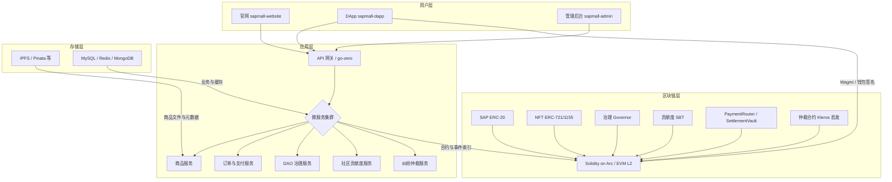

# Sapphire Mall 产品白皮书 (v0.5.0)

> 本文档描述 Sapphire Mall 的产品定位、解决方案、技术架构与经济模型。实现细节与运营指标可参阅仓库 [README.md](../README.md)、[PRD.md](./PRD.md)、[Tokenomics_Detailed.md](./Tokenomics_Detailed.md) 与 [Roadmap.md](./Roadmap.md)。

---

## 1. 项目简介 (Abstract / Introduction)

**Sapphire Mall** 是一个**去中心化社区自驱动**的虚拟商品交易平台。平台基于区块链构建，以 **DAO 社区治理**为核心组织决策；采用 **ERC-20 代币 SAP** 作为生态通证，结合社区任务与治理激励，形成可审计、可参与的 Web3 虚拟商品交易与共治叙事。

我们致力于解决数字商品市场中的**信任缺失、价值分配不公、治理中心化**，以及传统电商中**结算不透明、跨境支付成本高、创作者权益难保障**等问题。通过 **社区贡献度证明（Proof of Contribution）**、**去中心化纠纷仲裁**、**DAO 驱动治理**，以及以 **[Arc](https://docs.arc.io/)** 为核心的**多稳定币结算**，Sapphire Mall 旨在构建由用户共同拥有、建设与管理的价值创造生态。

**愿景**：打造公平、透明、高效的 Web3 虚拟商品市场，让消费者、创作者与社区贡献者的价值都能被准确衡量并合理回报。

### 1.1 核心定位一句话

> 在 Arc 结算层上完成多稳定币结账，在 SAP / DAO 叙事下完成社区共治与激励，服务数字内容、软件工具、在线服务等**虚拟商品**交易场景。

### 1.2 当前产品形态（与工程实现对齐）

| 应用 | 职责 |
|------|------|
| **sapmall-dapp** | 用户端 DApp：商城、兑换、生态活动、DAO、帮助中心 |
| **sapmall-website** | 项目官网：品牌、白皮书、平台介绍与文档入口 |
| **sapmall-admin** | 平台 / 商家运营后台：商品、订单、用户与配置灌流至前台 |
| **backend_service** | Go + go-zero 微服务、订单与链上事件对齐 |
| **智能合约** | SAP、支付路由与结算金库等（Hardhat / Solidity） |

---

## 2. 市场分析与痛点 (Market Analysis & Problem Statement)

随着数字经济与元宇宙相关业态发展，虚拟商品交易规模持续扩大。现有中心化平台与「伪 Web3」商城仍普遍存在：

### 2.1 用户与信任侧

- **信任成本高**：虚假宣传、质量不符、交易欺诈频发，缺乏可验证的信任机制。
- **纠纷不公正**：纠纷依赖平台单方规则与信誉背书，过程与结果难以被用户验证。
- **跨境与多币种摩擦**：跨境支付成本高、路径复杂；用户难以用熟悉的稳定币或跨链资产一次性完成结账。

### 2.2 商家与创作者侧

- **费用与结算不透明**：入驻费、保证金、营销预算流向难审计；平台与商家结算周期长且模糊，占用流动资金。
- **确权与分账不清**：虚拟商品确权、版权与分账规则常不透明，创作者收益保障不足。
- **用户资产被垄断**：用户数据完全由平台掌控，商家难以沉淀自有用户资产。

### 2.3 治理与价值分配侧

- **中心化审核与仲裁**：上架与纠纷最终决定权集中于平台，过程不透明。
- **价值分配不均**：创作者与社区贡献难量化，平台攫取大部分价值。
- **治理缺失**：用户对费率、规则与发展方向缺乏发言权，社区与平台利益易脱节。

---

## 3. 解决方案 (Solution)

Sapphire Mall 以「**链上可审计的支付与结算** + **社区可参与的治理与激励**」重塑虚拟商品交易：

### 3.1 交易与支付

- **Arc 深度集成的稳定币支付**：结账对接 **Arc Testnet**，支持 **USDC、EURC、cirBTC** 等稳定币 / 链上资产及 **SAP**；商品以 **USDC 统一标价**，链上按所选代币实时换算划转。依托 Arc **近秒级确认与低 Gas**，用户可在单链完成「选品—授权—支付—确认」。
- **基于 Arc 的跨链支付体验**：多来源资产在 Arc 结算层统一承接，用户无需在多条链之间手动桥接后再支付。后端 **PaymentRouter** 与 **SettlementVault** 统一路由支付 intent 与资金流，订单状态与链上 `PaymentPaid` 事件对齐，降低多资产支付与对账成本。
- **SAP 支付激励**：使用 SAP 支付可享受手续费减免等策略，形成「交易—激励—治理」闭环。

### 3.2 社区与治理

- **社区驱动的商品审核**：上架商品经社区公开审核投票，从源头保障质量。
- **去中心化纠纷仲裁（Kleros 启发模型）**：由随机抽选的高贡献度成员组成仲裁庭，过程公正透明。
- **社区贡献度证明（CP）**：审核、仲裁、成功提案等有效行为量化为不可交易的声誉凭证 **Contribution Point（CP）**，作为影响力与收益权重依据。
- **DAO 驱动治理**：费率、审核规则、仲裁机制、金库用途等由社区提案与投票决定。

### 3.3 产品体验与运营

- **商城与活动解耦**：`/marketplace` 专注选品与下单；生态活动与奖励聚合在 `/rewards`，避免商城「活动化」干扰交易主路径。
- **DAO 议事空间**：`/dao` 聚合提案 / 讨论 / 活动，支持分类标签、富文本与参与统计，连接钱包后可发起讨论与提案。
- **后台灌流冷启动**：admin 承担商品、类目、商家 / KYC、订单与看板；审核通过的商品灌流至 DApp，支撑冷启动期货架与内容供给。
- **全球化与多语言**：DApp / 官网中英文界面与文档策略一致，降低全球用户参与门槛。

---

## 4. 产品角色与价值流 (Roles & Value Flow)

| 角色 | 主要行为 | 价值获得 |
|------|----------|----------|
| **普通用户 / 买家** | 浏览、购买虚拟商品；参与治理投票、审核、仲裁与任务 | 商品使用权；SAP / 权益激励；治理话语权 |
| **创作者 / 认证商家** | 认证后上架（元数据与文件可走 IPFS 等）；经营店铺 | 销售收入（平台按规则收取手续费）；品牌与用户沉淀 |
| **社区贡献者 / 陪审员** | 商品审核、纠纷裁决、提案共建 | 按规则获得 SAP 等激励；陪审资格与保证金等与 SAP / CP 关联 |
| **平台 / DAO 金库** | 接收手续费等收入 | 由 DAO 决定回购销毁、生态激励或建设投入 |

**北极星指标（产品）**：月度活跃贡献者数——反映治理、仲裁与社区任务的活跃度（详见 [Metrics_Framework.md](./Metrics_Framework.md)）。

---

## 5. 技术架构 (Technical Architecture)

### 5.1 逻辑分层

```mermaid
graph TD
    subgraph 用户层
        A1[官网 sapmall-website]
        A2[DApp sapmall-dapp]
        A3[管理后台 sapmall-admin]
    end

    subgraph 应用层
        B[API 网关 / go-zero] --> C{微服务集群}
        C --> C1[商品服务]
        C --> C2[订单与支付服务]
        C --> C3[DAO 治理服务]
        C --> C4[社区贡献度服务]
        C --> C5[纠纷仲裁服务]
    end

    subgraph 区块链层
        D[Solidity on Arc / EVM L2]
        D1[SAP ERC-20] --> D
        D2[NFT ERC-721/1155] --> D
        D3[治理 Governor] --> D
        D4[贡献度 SBT] --> D
        D5[PaymentRouter / SettlementVault] --> D
        D6[仲裁合约 Kleros 启发] --> D
    end

    subgraph 存储层
        E[IPFS / Pinata 等] -- 商品文件与元数据 --> C1
        F[MySQL / Redis / MongoDB] -- 业务与缓存 --> C
    end

    A1 --> B
    A2 --> B
    A3 --> B
    A2 -- Wagmi / 钱包签名 --> D
    C -- 合约与事件索引 --> D
```

### 5.2 技术选型（与仓库一致）

| 层级 | 技术 |
|------|------|
| 前端 | React 18 + TypeScript；DApp 使用 Wagmi + Viem、Web3Modal / ConnectKit；react-i18next |
| 后端 | Go + go-zero + gRPC；MySQL 8 + Redis；etcd 服务发现；链上交互 go-ethereum |
| 合约 | Hardhat + Solidity 0.8.19+；OpenZeppelin；Slither / Mythril 等安全工具；升级与多签（Gnosis Safe）规划 |
| 支付 | Arc Testnet：**PaymentRouter** / **SettlementVault**；多代币 intent；`PaymentPaid` 事件与订单状态机对齐 |
| 存储 | 业务库 + IPFS（商品文件）+ 可选云存储 |

### 5.3 安全性原则

- 智能合约计划多轮审计与形式化 / 自动化扫描相结合。
- 用户私钥自持；交易、投票等核心操作需签名确认。
- 支付路径链上可审计；订单状态与链上事件双向可对账。
- 运营后台与 DApp 权限分离，商家发布经审核后灌流前台。

---

## 6. 代币经济模型 (Tokenomics)

> 完整参数、释放曲线与激励公式见 [Tokenomics_Detailed.md](./Tokenomics_Detailed.md)。以下为白皮书摘要。

| 项目 | 说明 |
|------|------|
| 名称 | Sapphire Token（**SAP**） |
| 标准 | **ERC-20** |
| 类型 | 功能型实用代币（Utility Token） |
| 总供应量 | **100,000,000 SAP** |

### 6.1 核心作用

- **治理**：参与 DAO 提案与投票的凭证。
- **激励**：贡献度挖矿及审核、仲裁、成功提案等社区行为的奖励载体。
- **支付**：平台内支付手段之一；使用 SAP 可享手续费折扣等策略。

### 6.2 分配结构（规划）

| 用途 | 占比 | 说明 |
|------|------|------|
| 社区激励 / 生态基金 | 60% | 贡献度挖矿、社区活动等线性释放 |
| 团队与顾问 | 15% | 锁仓约 2 年，分期解锁 |
| 早期投资者 | 15% | 锁仓约 1 年，分期解锁 |
| 市场与流动性 | 10% | 上市流动性与市场拓展 |

### 6.3 价值捕获

平台交易手续费的一部分可用于 **回购并销毁 SAP**，形成通缩支撑，使代币持有者与平台交易活跃度对齐。业务目标示例（规划期）：SAP 支付订单占比 ≥ 总订单 25% 等（见 README 项目指标）。

---

## 7. 路线图 (Roadmap)

> 详细里程碑见 [Roadmap.md](./Roadmap.md)。工程状态当前为 **Development**。

### 7.1 已落地与进行中（对齐当前仓库）

- 官网、DApp、管理后台三端骨架与中英文 i18n。
- 商城浏览 / 下单主路径；**Arc 多稳定币支付** intent 与事件对齐设计。
- DAO 提案 / 讨论 / 活动界面；生态活动 `/rewards` 聚合。
- 后台商品、订单、用户等运营能力与前台灌流。

### 7.2 V1.0（MVP）：核心交易与社区审核

- 虚拟商品（含 NFT 形态）创建、发布、浏览与购买。
- 社区驱动的上架审核；基础 DAO 参数提案。
- 初版 CP 记录；稳定币 + SAP 双轨支付闭环加固。

### 7.3 V2.0：治理增强与创作者经济

- 去中心化纠纷仲裁；基于 CP 的贡献度挖矿。
- 创作者主页、版税等；投票委托提升治理效率。

### 7.4 V3.0：生态扩展与互操作性

- 更广义多链资产与跨域互操作；开放 API / SDK。
- 资产可组合性；社区金库由 DAO 资助生态项目。

---

## 8. 团队与顾问 (Team & Advisors)

核心团队由来自科技与区块链行业的产品、工程与设计人员组成，覆盖 DApp、微服务、合约、社区运营与经济模型设计。我们相信愿景一致、执行扎实的团队是长期交付的基础。具体成员与顾问名单将随项目进展在官网与社区渠道更新。

---

## 9. 社区与治理 (Community & Governance)

最终目标是 **Sapphire DAO** 下的社区自治。SAP 持有者可参与的范围包括但不限于：

- 智能合约升级与安全相关决策
- 平台关键参数（手续费率、贡献度算法、支付策略等）
- 社区金库资金用途（回购、激励、建设）
- 生态发展方向与合作伙伴策略

产品侧通过 `/dao` 的提案、讨论与活动承载日常议事；链上投票进度、规则与结果可展示，并与 SAP 持仓权重叙事一致（详见 [PRD.md](./PRD.md) 治理章节）。

沟通渠道：论坛 / Discussions、社交网络与定期线上会议，保持开放、包容的全球社区。

---

## 10. 合规与法律声明 (Legal & Compliance)

本项目在设计上积极寻求合规路径。**SAP 旨在作为功能性实用代币**，用于治理、激励与平台内支付，**并非证券发行要约**。用户应在充分了解管辖地法规、风险并咨询专业人士后参与。文档内容不构成投资建议。

---

## 11. 风险提示 (Risk Disclosure)

参与本项目可能面临包括但不限于：

- **技术风险**：智能合约漏洞、客户端或后端故障、跨链 / 结算路径异常。
- **市场风险**：代币价格波动、流动性不足、稳定币脱锚等。
- **运营与合规风险**：政策变化、牌照与支付合规要求、第三方服务中断。
- **治理风险**：投票参与不足、利益冲突或恶意提案。

请务必自行研究（**DYOR**），仅投入可承受损失范围内的资金与时间。

---

## 12. 联系方式与相关文档 (Contact & References)

### 12.1 链接

- **官网**: [https://sapmall.xyz](https://sapmall.xyz)
- **DApp**: [https://dapp.sapmall.xyz](https://dapp.sapmall.xyz)
- **GitHub**: [https://github.com/mingdw/sapmall](https://github.com/mingdw/sapmall)
- **问题反馈**: [GitHub Issues](https://github.com/mingdw/sapmall/issues)
- **社区讨论**: [Discord](https://discord.com/channels/1502219033611862026/1502223675334856704)
- **Twitter / X**: [https://x.com/MingDw_1992](https://x.com/MingDw_1992)

### 12.2 延伸阅读

| 文档 | 说明 |
|------|------|
| [README.md](../README.md) | 工程结构、快速开始与效果图 |
| [PRD.md](./PRD.md) | 产品需求与功能优先级 |
| [Tokenomics_Detailed.md](./Tokenomics_Detailed.md) | 代币经济细节 |
| [Roadmap.md](./Roadmap.md) | 里程碑计划 |
| [User_Story_Map.md](./User_Story_Map.md) | 用户故事 |
| [Metrics_Framework.md](./Metrics_Framework.md) | 指标框架 |

---

*文档版本：v0.5.0 · 与仓库 README 核心产品叙事对齐 · 随实现迭代更新*
